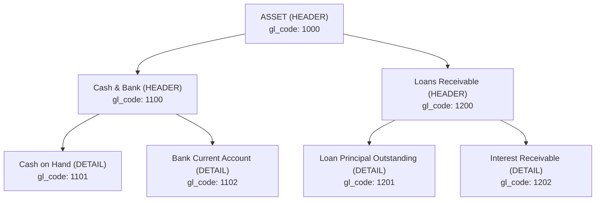

Apache Fineract implements a full double-entry General Ledger (GL) as the accounting backbone for all loan, savings, share, and client charge transactions. The chart of accounts is managed through the `GLAccount` entity and exposed via `GLAccountsApiResource`. Product-to-GL mappings tell the journal-entry engine which accounts to debit or credit for each financial event; `FinancialActivityAccount` provides a separate mechanism to map system-wide activities (e.g., fund transfer liability) to specific GL accounts. All core GL types are in `fineract-core`; the API resources and write services are in `fineract-accounting`.

## Core Classes and Locations

| Class | Module | Table |
|---|---|---|
| `GLAccount` | `fineract-core` `...accounting.glaccount.domain` | `acc_gl_account` |
| `GLAccountType` | `fineract-core` `...accounting.glaccount.domain` | — enum |
| `GLAccountUsage` | `fineract-core` `...accounting.glaccount.domain` | — enum |
| `FinancialActivityAccount` | `fineract-accounting` `...financialactivityaccount.domain` | `acc_gl_financial_activity_account` |
| `ProductToGLAccountMapping` | `fineract-accounting` `...producttoaccountmapping.domain` | `acc_product_mapping` |
| `GLAccountsApiResource` | `fineract-accounting` `...glaccount.api` | — JAX-RS |
| `GLAccountWritePlatformServiceJpaRepositoryImpl` | `fineract-accounting` `...glaccount.service` | — |

## GLAccount Entity

```java
// fineract-core/.../accounting/glaccount/domain/GLAccount.java
@Entity
@Table(name = "acc_gl_account",
    uniqueConstraints = @UniqueConstraint(columnNames = {"gl_code"}, name = "acc_gl_code"))
public class GLAccount extends AbstractPersistableCustom<Long> {

    @ManyToOne(fetch = FetchType.LAZY)
    @JoinColumn(name = "parent_id")
    private GLAccount parent;           // null for root accounts

    @Column(name = "hierarchy", nullable = true, length = 50)
    private String hierarchy;           // e.g. "1.2.5." — materialised path

    @OneToMany(fetch = FetchType.LAZY)
    @JoinColumn(name = "parent_id")
    private List<GLAccount> children;

    @Column(name = "name", nullable = false, length = 45)
    private String name;

    @Column(name = "gl_code", nullable = false, length = 100)
    private String glCode;              // e.g. "10100" — must be unique

    @Column(name = "disabled", nullable = false)
    private boolean disabled;

    @Column(name = "manual_journal_entries_allowed", nullable = false)
    private boolean manualEntriesAllowed;

    @Column(name = "classification_enum", nullable = false)
    private Integer type;               // GLAccountType.value

    @Column(name = "account_usage", nullable = false)
    private Integer usage;              // GLAccountUsage.value

    @Column(name = "description", nullable = true, length = 500)
    private String description;

    @ManyToOne(fetch = FetchType.LAZY)
    @JoinColumn(name = "tag_id")
    private CodeValue tagId;            // Optional tag for reporting
}
```

## Account Type Enum

`GLAccountType` (in `fineract-core`) classifies every account into one of five standard types:

```java
// fineract-core/.../accounting/glaccount/domain/GLAccountType.java
public enum GLAccountType {
    ASSET(1, "accountType.asset"),
    LIABILITY(2, "accountType.liability"),
    EQUITY(3, "accountType.equity"),
    INCOME(4, "accountType.income"),
    EXPENSE(5, "accountType.expense");
}
```

<AccordionGroup>
  <Accordion title="ASSET (1)">
    Represents resources owned by the institution — cash, loans outstanding, interest receivable. Normal balance: **debit**. Increased by debits.
  </Accordion>
  <Accordion title="LIABILITY (2)">
    Obligations to external parties — savings deposits, borrowings, tax payable. Normal balance: **credit**. Increased by credits.
  </Accordion>
  <Accordion title="EQUITY (3)">
    Owners' equity / share capital. Normal balance: **credit**.
  </Accordion>
  <Accordion title="INCOME (4)">
    Revenue accounts — interest income, fee income, penalty income. Normal balance: **credit**. Increased by credits.
  </Accordion>
  <Accordion title="EXPENSE (5)">
    Cost accounts — interest expense, provisioning expense. Normal balance: **debit**. Increased by debits.
  </Accordion>
</AccordionGroup>

## Account Usage Enum

`GLAccountUsage` controls whether an account can receive direct journal entries:

```java
// fineract-core/.../accounting/glaccount/domain/GLAccountUsage.java
public enum GLAccountUsage {
    DETAIL(1, "accountUsage.detail"), // Leaf — can receive journal entries
    HEADER(2, "accountUsage.header"); // Parent — aggregation only, no direct postings
}
```

Only `DETAIL` accounts can be referenced on `JournalEntry` rows. Attempting to post to a `HEADER` account throws `GLAccountInvalidUsageException`.

## Parent-Child Hierarchy

`GLAccount` supports arbitrary tree depth via the `parent_id` self-referential foreign key and a materialised-path `hierarchy` column (e.g. `"1.4.12."`). The hierarchy is maintained by `GLAccountWritePlatformServiceJpaRepositoryImpl.updateGLAccountHierarchy()` whenever a parent is changed.



Deleting a parent account is blocked (`GLAccountInvalidDeleteException`) unless all children are removed first. Disabling (`disabled=true`) prevents new journal entries but preserves history.

## FinancialActivityAccount

`FinancialActivityAccount` maps system-level financial activities to specific GL accounts. This is used for transfers between accounts (where a generic fund-source or fund-destination account is needed):

```java
// fineract-accounting/.../financialactivityaccount/domain/FinancialActivityAccount.java
@Entity
@Table(name = "acc_gl_financial_activity_account")
public class FinancialActivityAccount extends AbstractPersistableCustom<Long> {

    @ManyToOne(fetch = FetchType.EAGER)
    @JoinColumn(name = "gl_account_id")
    private GLAccount glAccount;

    @Column(name = "financial_activity_type", nullable = false)
    private Integer financialActivityType;
}
```

The `financialActivityType` integer maps to activities such as `ASSET_TRANSFER` and `LIABILITY_TRANSFER`. The `FinancialActivityAccountsApiResource` (path `/v1/financialactivityaccounts`) provides CRUD for these mappings, and `FinancialActivityAccountWritePlatformServiceImpl` enforces that only one mapping per activity type can exist.

## ProductToGLAccountMapping

Every loan product, savings product, and share product carries a set of `ProductToGLAccountMapping` rows in `acc_product_mapping` that tell the journal-entry engine which GL accounts to use:

```java
@Entity
@Table(name = "acc_product_mapping")
public class ProductToGLAccountMapping extends AbstractPersistableCustom<Long> {

    @ManyToOne
    @JoinColumn(name = "gl_account_id")
    private GLAccount glAccount;

    @Column(name = "product_id")
    private Long productId;

    @Column(name = "product_type")
    private int productType;   // 1=LOAN, 2=SAVINGS, 4=SHARES, etc.

    @Column(name = "financial_account_type")
    private int financialAccountType; // e.g. FUND_SOURCE, LOAN_PORTFOLIO, etc.

    @ManyToOne
    @JoinColumn(name = "payment_type")
    private PaymentType paymentType;  // Optional: payment-type-specific mapping

    @ManyToOne
    @JoinColumn(name = "charge_id")
    private Charge charge;            // Optional: charge-specific GL override
}
```

<Tip>
When `paymentType` is non-null, the mapping applies only to transactions of that payment type — enabling different GL accounts for cash payments vs. mobile money vs. cheque.
</Tip>

### Example Savings Product Mappings

A typical savings product configured for **cash-based accounting** requires these mappings:

| `financialAccountType` | Direction | GL Account Type |
|---|---|---|
| `SAVINGS_REFERENCE` | Credit on deposit | LIABILITY |
| `SAVINGS_CONTROL` | Main savings balance | LIABILITY |
| `INTEREST_ON_SAVINGS` | Debit on interest expense | EXPENSE |
| `INCOME_FROM_FEES` | Credit on fee collection | INCOME |
| `INCOME_FROM_PENALTIES` | Credit on penalty collection | INCOME |
| `TRANSFERS_SUSPENSE` | Intermediary on transfers | LIABILITY |

## AccountingRuleType

Each product specifies its accounting rule via `AccountingRuleType` (in `fineract-core`):

```java
public enum AccountingRuleType {
    NONE(1, "accountingRuleType.none", "No accounting"),
    CASH_BASED(2, "accountingRuleType.cash", "Cash based accounting"),
    ACCRUAL_PERIODIC(3, "accountingRuleType.accrual.periodic", "Periodic accrual accounting"),
    ACCRUAL_UPFRONT(4, "accountingRuleType.accrual.upfront", "Upfront accrual accounting");
}
```

The `JournalEntryWritePlatformServiceJpaRepositoryImpl` checks the product's `AccountingRuleType` to decide which GL entries to generate. For `NONE`, no entries are written.

## REST API

`GLAccountsApiResource` (`fineract-accounting/.../glaccount/api/GLAccountsApiResource.java`) handles:

| Method | Path | Description |
|---|---|---|
| `POST` | `/v1/glaccounts` | Create GL account |
| `GET` | `/v1/glaccounts` | List all accounts (filterable by type, usage, disabled) |
| `GET` | `/v1/glaccounts/{glAccountId}` | Retrieve single account |
| `PUT` | `/v1/glaccounts/{glAccountId}` | Update account |
| `DELETE` | `/v1/glaccounts/{glAccountId}` | Delete (only if no journal entries reference it) |
| `GET` | `/v1/glaccounts/template` | Fetch dropdown options for the form |

The `GLAccountCommandFromApiJsonDeserializer` validates and parses the JSON payload into a `GLAccountCommand` before it reaches the write service.

## Trial Balance

`TrialBalance` (mapped to `acc_gl_journal_entry_trial_balance`) stores the pre-computed running balance per GL account. The `UpdateTrialBalanceDetailsTasklet` batch job keeps this table current:

```
fineract-accounting/.../glaccount/jobs/updatetrialbalancedetails/
    UpdateTrialBalanceDetailsConfig.java
    UpdateTrialBalanceDetailsTasklet.java
```

## Related Pages

- [Journal Entries](/accounting/journal-entries) — how `GLAccount` references are used in debit/credit rows
- [Accrual Accounting and Provisioning](/accounting/accrual-provisioning) — accrual-specific GL account usage
- [Charges, Fees, and Tax Configuration](/portfolio/charges-taxes) — tax component GL accounts (`debitAccount`, `creditAccount`)
