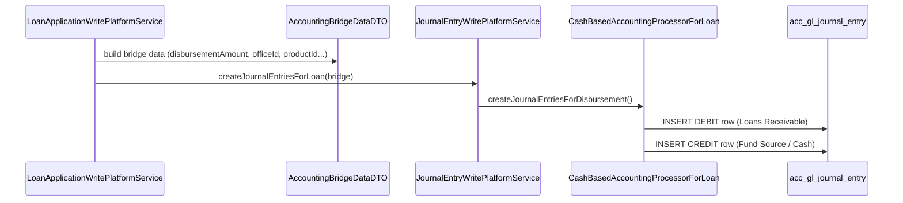

Every monetary event in Apache Fineract that touches a product with accounting enabled produces one or more rows in `acc_gl_journal_entry`. The system is a strict double-entry ledger: for each financial event, the sum of all debits must equal the sum of all credits in the same transaction group. Journal entries are created automatically via event-driven service calls (the "accounting bridge") after loan, savings, share, and client charge transactions are persisted; they can also be entered manually through the REST API.

## Entity Structure

`JournalEntry` is defined in `fineract-accounting`:

```java
// fineract-accounting/.../journalentry/domain/JournalEntry.java
@Entity
@Table(name = "acc_gl_journal_entry")
public class JournalEntry extends AbstractAuditableWithUTCDateTimeCustom<Long> {

    @ManyToOne
    @JoinColumn(name = "office_id", nullable = false)
    private Office office;

    @ManyToOne
    @JoinColumn(name = "account_id", nullable = false)
    private GLAccount glAccount;           // Which GL account is affected

    @Column(name = "currency_code", length = 3, nullable = false)
    private String currencyCode;

    @Column(name = "transaction_id", nullable = false, length = 50)
    private String transactionId;          // Groups related debit/credit pairs

    @Column(name = "loan_transaction_id")
    private Long loanTransactionId;        // FK to loan transaction (nullable)

    @Column(name = "savings_transaction_id")
    private Long savingsTransactionId;     // FK to savings transaction (nullable)

    @Column(name = "client_transaction_id")
    private Long clientTransactionId;

    @Column(name = "share_transaction_id")
    private Long shareTransactionId;

    @Column(name = "reversed", nullable = false)
    private boolean reversed;              // True if this entry has been reversed

    @Column(name = "manual_entry", nullable = false)
    private boolean manualEntry;

    @Column(name = "entry_date")
    private LocalDate transactionDate;

    @Column(name = "type_enum", nullable = false)
    private Integer type;                  // JournalEntryType: 1=CREDIT, 2=DEBIT

    @Column(name = "amount", scale = 6, precision = 19, nullable = false)
    private BigDecimal amount;

    @ManyToOne(fetch = FetchType.LAZY)
    @JoinColumn(name = "reversal_id")
    private JournalEntry reversalJournalEntry; // Points to the reversal entry
}
```

### JournalEntryType

```java
// fineract-core/.../journalentry/domain/JournalEntryType.java
public enum JournalEntryType {
    CREDIT(1, "journalEntryType.credit"),
    DEBIT(2, "journalEntrytType.debit");
}
```

## The Accounting Bridge Pattern

Rather than constructing GL entries inline with business logic, Fineract uses an "accounting bridge": after a loan or savings transaction is committed, the service layer assembles a map of data (the bridge DTO) and passes it to `JournalEntryWritePlatformService`. This decouples the business logic from the accounting engine and allows the accounting rule type (`NONE`, `CASH_BASED`, `ACCRUAL_PERIODIC`, `ACCRUAL_UPFRONT`) to determine what — if anything — is posted.

The bridge entry points on `JournalEntryWritePlatformService`:

```java
// fineract-provider/.../journalentry/service/JournalEntryWritePlatformService.java
void createJournalEntriesForLoan(AccountingBridgeDataDTO accountingBridgeData);
void createJournalEntriesForSavings(Map<String, Object> accountingBridgeData);
void createJournalEntriesForClientTransactions(Map<String, Object> accountingBridgeData);
void createJournalEntriesForShares(Map<String, Object> accountingBridgeData);
```

The implementation (`JournalEntryWritePlatformServiceJpaRepositoryImpl`) delegates to product-type-specific accounting processors (`CashBasedAccountingProcessorForLoan`, `AccrualBasedAccountingProcessorForSavings`, etc.) based on the product's `AccountingRuleType`.

## Loan Disbursement: Entry Flow



For a $10,000 disbursement under cash-based accounting:

| `transaction_id` | `type_enum` | `gl_account` | `amount` |
|---|---|---|---|
| `L-1001` | `DEBIT (2)` | Loan Portfolio (ASSET) | 10,000.00 |
| `L-1001` | `CREDIT (1)` | Fund Source (LIABILITY or ASSET) | 10,000.00 |

## Savings Deposit: Entry Flow

When a savings deposit is processed by `SavingsAccountWritePlatformService.deposit()`, the service ultimately calls `createJournalEntriesForSavings()` with a map containing the transaction type, amount, office, and product-to-GL mappings:

| `transaction_id` | `type_enum` | `gl_account` | `amount` |
|---|---|---|---|
| `S-2001` | `DEBIT (2)` | Cash on Hand / Bank (ASSET) | 500.00 |
| `S-2001` | `CREDIT (1)` | Savings Control (LIABILITY) | 500.00 |

For interest posting (`INTEREST_POSTING`):

| `transaction_id` | `type_enum` | `gl_account` | `amount` |
|---|---|---|---|
| `S-2005` | `DEBIT (2)` | Interest on Savings Expense (EXPENSE) | 12.50 |
| `S-2005` | `CREDIT (1)` | Savings Control (LIABILITY) | 12.50 |

## Manual Journal Entries

Users with the appropriate permission can post manual entries through the API. Manual entries have `manual_entry = true` and require at least one debit and one credit that balance:

```json
POST /v1/journalentries
{
  "officeId": 1,
  "transactionDate": "01 Aug 2024",
  "dateFormat": "dd MMM yyyy",
  "locale": "en",
  "debits":  [{ "glAccountId": 101, "amount": 1000 }],
  "credits": [{ "glAccountId": 502, "amount": 1000 }],
  "comments": "Adjustment for miscellaneous income"
}
```

The `JournalEntryCommandFromApiJsonDeserializer` validates balance and the `JournalEntryDataValidator` ensures all referenced accounts are `DETAIL` accounts with `manual_journal_entries_allowed = true`.

## Reversal Entries

To reverse a transaction group (identified by `transaction_id`), post:

```
POST /v1/journalentries/{transactionId}?command=reverse
```

The `JournalEntryWritePlatformService.revertJournalEntry()` method:
1. Loads all entries with the given `transactionId`.
2. Creates mirror-image entries (debits become credits and vice versa) on the current business date.
3. Sets `reversed = true` on the original entries and sets `reversal_id` on the originals to point to the new entries.

<Warning>
Reversal only sets `reversed = true` on the **original** entries; the reversal entries themselves are new active rows. Both sets remain visible in queries unless you filter on `reversed = false`.
</Warning>

## JournalEntryWritePlatformService Interface

```java
// fineract-provider/.../journalentry/service/JournalEntryWritePlatformService.java
CommandProcessingResult createJournalEntry(JsonCommand command);
CommandProcessingResult revertJournalEntry(JsonCommand command);
CommandProcessingResult defineOpeningBalance(JsonCommand command);
String revertProvisioningJournalEntries(LocalDate reversalDate, Long entityId, Integer entityType);
String createProvisioningJournalEntries(ProvisioningEntry entry);
void revertShareAccountJournalEntries(ArrayList<Long> transactionIds, LocalDate date);
void createJournalEntriesForLoanTransaction(LoanTransaction loanTransaction,
    boolean isAccountTransfer, boolean isLoanToLoanTransfer);
void createJournalEntriesForExternalOwnerTransfer(Loan loan,
    ExternalAssetOwnerTransfer transfer, ExternalAssetOwner previousOwner);
```

## Running Balance Update Job

`JournalEntryRunningBalanceUpdateService` recomputes the running balance for every GL account in the system:

```
fineract-accounting/.../journalentry/service/
    JournalEntryRunningBalanceUpdateService.java
```

The corresponding batch job `UpdateTrialBalanceDetailsTasklet` in `fineract-accounting` calls this service and updates the `acc_gl_journal_entry_trial_balance` table.

## REST API (JournalEntriesApiResource)

The resource is at `/v1/journalentries` (path `@Path("/v1/journalentries")`):

| Method | Path | Description |
|---|---|---|
| `POST` | `/v1/journalentries` | Create manual journal entry |
| `GET` | `/v1/journalentries` | Search/list entries (filter by office, date range, account, type) |
| `GET` | `/v1/journalentries/{journalEntryId}` | Retrieve single entry |
| `POST` | `/v1/journalentries/{transactionId}?command=reverse` | Reverse a transaction group |
| `POST` | `/v1/journalentries/openingbalance` | Post office opening balances |

The `JournalEntryReadPlatformService` supports pagination via `SearchParameters` and `Page<JournalEntryData>` response, with optional `transactionDetails` parameter to include the originating loan/savings transaction in the response.

## Related Pages

- [GL Accounts](/accounting/gl-accounts) — the `GLAccount` entity each entry references
- [Accrual Accounting and Provisioning](/accounting/accrual-provisioning) — accrual entries and provisioning entries
- [Savings Module](/savings/savings-module) — savings transactions that trigger GL entries
