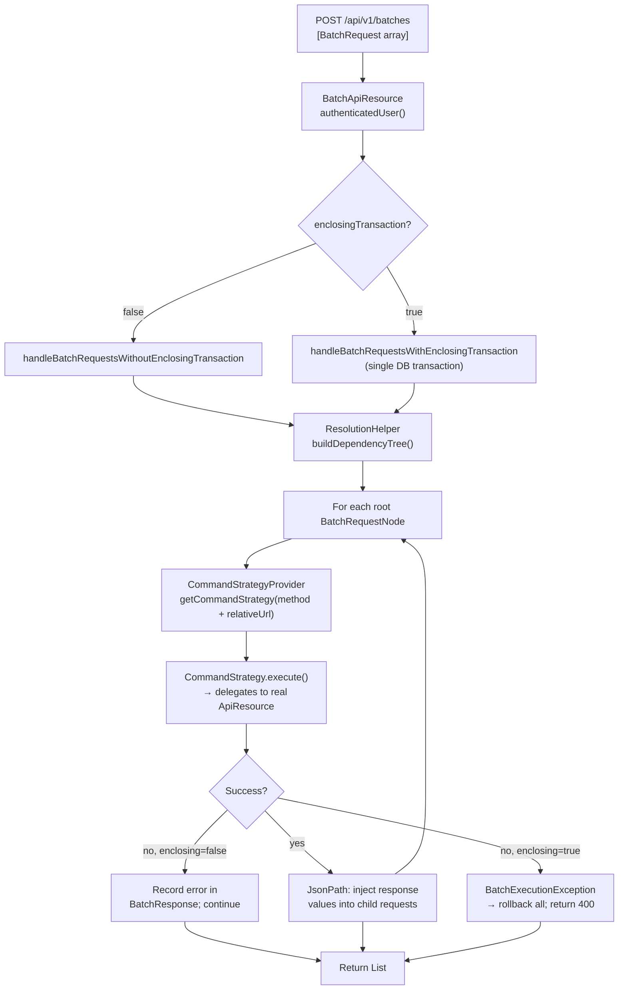

The Fineract Batch API allows a caller to submit an array of logical HTTP sub-requests in a single HTTP POST and receive an array of logical HTTP responses back in one reply. This eliminates the round-trip cost of sequences like create-client → apply-loan → approve-loan → disburse-loan, which would otherwise require four separate network calls. Sub-requests can declare dependencies on each other, and the API uses JsonPath expressions to substitute values from earlier responses into later requests. All of this is implemented in `fineract-core/src/main/java/org/apache/fineract/batch/`.

## Endpoint

```
POST /fineract-provider/api/v1/batches
     ?enclosingTransaction=false   (default)
```

The only query parameter is `enclosingTransaction`. When `true`, all sub-requests execute inside a single database transaction; any failure rolls back all preceding operations in the batch.

`BatchApiResource` (`fineract-core/src/main/java/org/apache/fineract/batch/api/BatchApiResource.java`) is the JAX-RS entry point:

```java
@Path("/v1/batches")
@Component
@Tag(name = "Batch API", description = "The Apache Fineract Batch API enables a consumer
    to access significant amounts of data in a single call...")
public class BatchApiResource {

    private final PlatformSecurityContext context;
    private final BatchApiService service;
    private final FineractProperties fineractProperties;

    @POST
    @Consumes({ MediaType.APPLICATION_JSON })
    @Produces({ MediaType.APPLICATION_JSON })
    public List<BatchResponse> handleBatchRequests(
        @DefaultValue("false") @QueryParam("enclosingTransaction")
            final boolean enclosingTransaction,
        @Parameter(hidden = true) List<BatchRequest> requestList,
        @Context UriInfo uriInfo) {

        this.context.authenticatedUser();
        validateRequestMethodsAllowedOnInstanceType(requestList);

        return enclosingTransaction
            ? service.handleBatchRequestsWithEnclosingTransaction(requestList, uriInfo)
            : service.handleBatchRequestsWithoutEnclosingTransaction(requestList, uriInfo);
    }
}
```

If the Fineract instance is running in read-only mode (`fineract.mode.write-enabled=false`), any non-GET sub-request in the list will trigger `InvalidInstanceTypeMethodException` before execution begins.

## BatchRequest and BatchResponse Models

Both models are defined in `fineract-core/src/main/java/org/apache/fineract/batch/domain/`:

```java
// BatchRequest.java
@Data @NoArgsConstructor @Accessors(chain = true)
public class BatchRequest {
    private Long requestId;      // unique identifier within the batch
    private String relativeUrl;  // e.g., "v1/clients" or "v1/loans/42?fields=id,status"
    private String method;       // "GET", "POST", "PUT", "DELETE"
    private Set<Header> headers; // optional per-request headers
    private Long reference;      // requestId of the parent request (for dependency)
    private String body;         // JSON string for POST/PUT payloads
}

// BatchResponse.java
@Data @NoArgsConstructor @Accessors(chain = true)
public class BatchResponse {
    private Long requestId;      // echoes the BatchRequest.requestId
    private Integer statusCode;  // HTTP status code of the sub-request
    private Set<Header> headers;
    private String body;         // JSON-encoded response string
}
```

`Header` is a simple `name`/`value` pair. The `relativeUrl` field may be either versioned (starting with `v1/`) or non-versioned (for backward compatibility, `CommandStrategyProvider` prepends `v1/` automatically).

## Dependency Resolution and JSON Path Substitution

When `BatchRequest.reference` is set to another request's `requestId`, the Batch API resolves the dependency graph before execution using `ResolutionHelper` (`fineract-core/src/main/java/org/apache/fineract/batch/service/ResolutionHelper.java`). The resolver builds a tree of `BatchRequestNode` objects:

```java
public static class BatchRequestNode {
    private BatchRequest request;
    private final List<BatchRequestNode> childRequests = new ArrayList<>();
}
```

Before executing a child request, the resolver scans its `body` and `relativeUrl` for `$.parameterName` placeholders and substitutes them with values extracted from the parent's `body` using the [Jayway JsonPath](https://github.com/json-path/JsonPath) library (`com.jayway.jsonpath`). For example:

```json
[
  {
    "requestId": 1,
    "method": "POST",
    "relativeUrl": "v1/clients",
    "body": "{\"officeId\":1,\"firstname\":\"Alice\",\"lastname\":\"Doe\",\"dateFormat\":\"dd MMMM yyyy\",\"locale\":\"en\",\"activationDate\":\"01 January 2024\"}"
  },
  {
    "requestId": 2,
    "reference": 1,
    "method": "POST",
    "relativeUrl": "v1/loans",
    "body": "{\"clientId\":\"$.resourceId\",\"productId\":1,\"principal\":5000,\"loanTermFrequency\":12,\"loanTermFrequencyType\":2,\"locale\":\"en\",\"dateFormat\":\"dd MMMM yyyy\",\"expectedDisbursementDate\":\"01 January 2024\"}"
  },
  {
    "requestId": 3,
    "reference": 2,
    "method": "POST",
    "relativeUrl": "v1/loans/$.resourceId?command=approve",
    "body": "{\"approvedOnDate\":\"01 January 2024\",\"locale\":\"en\",\"dateFormat\":\"dd MMMM yyyy\"}"
  }
]
```

In request 2, `"$.resourceId"` is replaced with the `resourceId` field from request 1's response body. In request 3, the `relativeUrl` itself contains `$.resourceId` which is replaced with the loan ID returned by request 2.

## CommandStrategy Dispatch

`BatchApiServiceImpl` (`fineract-core/src/main/java/org/apache/fineract/batch/service/BatchApiServiceImpl.java`) orchestrates execution. For each `BatchRequest` in the dependency-resolved order, it builds a `CommandContext` from the request's `method` and `relativeUrl`, then asks `CommandStrategyProvider` for the matching strategy bean:

```java
@Component
public class CommandStrategyProvider {

    private static final Map<CommandContext, String> commandStrategies = new ConcurrentHashMap<>();

    static void init() {
        commandStrategies.put(
            CommandContext.resource("v1\\/clients").method(POST).build(),
            "createClientCommandStrategy");
        commandStrategies.put(
            CommandContext.resource("v1\\/loans").method(POST).build(),
            "applyLoanCommandStrategy");
        commandStrategies.put(
            CommandContext.resource("v1\\/loans\\/" + NUMBER_REGEX + "\\?command=approve").method(POST).build(),
            "approveLoanCommandStrategy");
        // ... ~60+ strategies registered similarly
    }

    public CommandStrategy getCommandStrategy(final CommandContext commandContext) {
        // exact match first, then regex matching
        ...
        return new UnknownCommandStrategy(); // 501 if no match found
    }
}
```

Strategy beans are resolved from the Spring `ApplicationContext` by name. Each `CommandStrategy` implementation delegates to the real JAX-RS resource class:

```java
// CreateClientCommandStrategy.java
@Component @RequiredArgsConstructor
public class CreateClientCommandStrategy implements CommandStrategy {

    private final ClientsApiResource clientsApiResource;

    @Override
    public BatchResponse execute(final BatchRequest request, UriInfo uriInfo) {
        final BatchResponse response = new BatchResponse();
        response.setRequestId(request.getRequestId());
        response.setHeaders(request.getHeaders());

        String responseBody = clientsApiResource.create(request.getBody());

        response.setStatusCode(HttpStatus.SC_OK);
        response.setBody(responseBody);
        return response;
    }
}
```

This means each batch sub-request goes through the **identical** authentication, validation, and command-processing pipeline as a standalone request—there is no special-casing for batch mode in the business logic.

## Batch Processing Flow



## Transactional vs. Non-Transactional Mode

### Non-transactional (default)

Each root request (and its dependency subtree) runs in its own transaction via `TransactionTemplate`. A failure in one subtree produces an error `BatchResponse` for that subtree but does not affect other root requests. The final list may contain a mix of `200` and `4xx`/`5xx` status codes.

### Transactional (`enclosingTransaction=true`)

All sub-requests execute inside a single `TransactionTemplate`. `BatchApiServiceImpl` uses `callInTransaction()` which wraps the execution in a transaction configured at `PROPAGATION_REQUIRED`. If any sub-request raises an exception, `BatchExecutionException` is thrown, the transaction is rolled back, and a single error response (HTTP 400) is returned for the entire batch. The error body contains details from the first failing request.

`BatchExecutionException` (`fineract-core/src/main/java/org/apache/fineract/batch/service/BatchExecutionException.java`) carries the `BatchResponse` of the failed step so callers can identify which sub-request caused the rollback.

Retry logic is present for the enclosing-transaction path: `RetryConfigurationAssembler.getRetryConfigurationForBatchApiWithEnclosingTransaction()` configures Resilience4j retry for `ConcurrencyFailureException` (e.g., deadlocks at `REPEATABLE_READ` isolation).

## Error Handling Within a Batch

When a `CommandStrategy.execute()` call throws, `ErrorHandler.getMappable(exception)` converts it to an `ErrorInfo`:

```java
// ErrorInfo.java
@AllArgsConstructor
public final class ErrorInfo {
    private Integer statusCode;
    private Integer errorCode;
    private String message;
    private Set<Header> headers;
}
```

The `BatchApiServiceImpl` catches this and sets the `statusCode` and `body` on the affected `BatchResponse`. In non-transactional mode, execution continues with remaining requests.

`BatchReferenceInvalidException` (`fineract-core/src/main/java/org/apache/fineract/batch/exception/BatchReferenceInvalidException.java`) is thrown when a `reference` field in a `BatchRequest` points to a non-existent `requestId`:

```java
public class BatchReferenceInvalidException extends AbstractPlatformDomainRuleException {
    public BatchReferenceInvalidException(Long reference) {
        super("validation.msg.batch.reference.invalid", "Referenced request not found", reference);
    }
}
```

## Available CommandStrategy Implementations

The `fineract-provider` module registers ~60+ strategies in `CommandStrategyProvider.init()`. A representative sample:

| Pattern | Method | Strategy Bean |
|---|---|---|
| `v1/clients` | POST | `createClientCommandStrategy` |
| `v1/clients/{id}` | PUT | `updateClientCommandStrategy` |
| `v1/loans` | POST | `applyLoanCommandStrategy` |
| `v1/loans/{id}?command=approve` | POST | `approveLoanCommandStrategy` |
| `v1/loans/{id}?command=disburse` | POST | `disburseLoanCommandStrategy` |
| `v1/loans/{id}/transactions?command=*` | POST | `createTransactionLoanCommandStrategy` |
| `v1/loans/{id}/charges` | POST | `createChargeCommandStrategy` |
| `v1/loans/external-id/{uuid}/...` | POST/GET | External-ID variants |
| `v1/savingsaccounts/{id}/transactions` | POST | `savingsAccountTransactionCommandStrategy` |
| `v1/datatables/{name}/{id}` | POST/PUT/DELETE/GET | Datatable CRUD strategies |
| `v1/rescheduleloans` | POST | `createLoanRescheduleRequestCommandStrategy` |
| `v1/accounttransfers` | POST | `createAccountTransferCommandStrategy` |

Any `relativeUrl` that matches no registered pattern is handled by `UnknownCommandStrategy`, which returns a `BatchResponse` with `statusCode = 501`.

## Complete Batch Request Example

The following example creates a client (request 1), immediately applies a loan using the returned client ID (request 2), and approves it using the returned loan ID (request 3), all in a single HTTP call with `?enclosingTransaction=true`:

```json
POST /fineract-provider/api/v1/batches?enclosingTransaction=true

[
  {
    "requestId": 1,
    "method": "POST",
    "relativeUrl": "v1/clients",
    "headers": [{ "name": "Content-Type", "value": "application/json" }],
    "body": "{\"officeId\":1,\"firstname\":\"John\",\"lastname\":\"Doe\",\"dateFormat\":\"dd MMMM yyyy\",\"locale\":\"en\",\"active\":true,\"activationDate\":\"01 January 2024\"}"
  },
  {
    "requestId": 2,
    "reference": 1,
    "method": "POST",
    "relativeUrl": "v1/loans",
    "headers": [{ "name": "Content-Type", "value": "application/json" }],
    "body": "{\"clientId\":\"$.resourceId\",\"productId\":1,\"principal\":10000,\"loanTermFrequency\":12,\"loanTermFrequencyType\":2,\"interestRatePerPeriod\":15,\"expectedDisbursementDate\":\"01 February 2024\",\"locale\":\"en\",\"dateFormat\":\"dd MMMM yyyy\"}"
  },
  {
    "requestId": 3,
    "reference": 2,
    "method": "POST",
    "relativeUrl": "v1/loans/$.resourceId?command=approve",
    "headers": [{ "name": "Content-Type", "value": "application/json" }],
    "body": "{\"approvedOnDate\":\"01 February 2024\",\"locale\":\"en\",\"dateFormat\":\"dd MMMM yyyy\"}"
  }
]
```

Expected response (all `statusCode: 200`):

```json
[
  { "requestId": 1, "statusCode": 200, "body": "{\"resourceId\":101,...}" },
  { "requestId": 2, "statusCode": 200, "body": "{\"resourceId\":202,...}" },
  { "requestId": 3, "statusCode": 200, "body": "{\"resourceId\":202,...}" }
]
```

<Tip>
Request IDs must be unique within a single batch array but have no relationship to the order in which requests must execute—the dependency tree is determined solely by `reference` fields. Root requests (no `reference`) can execute in any order.
</Tip>

## Related Pages

- [REST API Design: Jersey Resources and OpenAPI Spec](/api/rest-api-overview) — JAX-RS conventions, authentication headers, and error format used by every batch sub-request
- [Datatables, Dynamic Queries, and Report Execution](/api/datatables-reports) — datatable strategies are among the most-used batch operations
