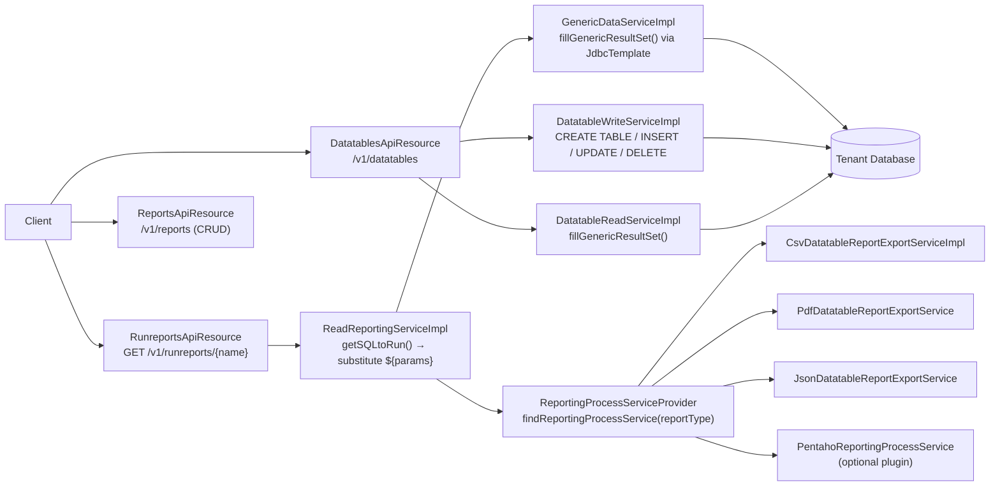

Fineract provides two complementary extensibility mechanisms for data persistence and retrieval that operate outside the fixed relational schema: **datatables** (dynamic extension tables registered against core entities) and **reports** (named SQL or Pentaho queries stored in the database and executed on demand). Both are exposed through the `fineract-provider` module under the `org.apache.fineract.infrastructure.dataqueries` package, and both route their read path through `ReadReportingServiceImpl` and `GenericDataServiceImpl`.

## Datatables

A datatable is a MySQL/PostgreSQL table that the Fineract administrator creates dynamically via the API. It is then registered in the `x_registered_table` system table with a foreign-key relationship to one of the permitted core application tables (e.g., `m_client`, `m_loan`). This allows implementers to capture institution-specific fields (e.g., KYC answers, collateral details) without modifying the base schema.

### Permitted Application Tables

The set of tables a datatable may reference is defined by the `EntityTables` enum (`fineract-core/src/main/java/org/apache/fineract/infrastructure/dataqueries/data/EntityTables.java`):

```java
public enum EntityTables {
    CLIENT("m_client",          "client_id",             "id", CREATE, ACTIVATE, CLOSE),
    GROUP("m_group",            "group_id",              "id", CREATE, ACTIVATE, CLOSE),
    CENTER("m_center",          "m_group", "center_id",  "id"),
    OFFICE("m_office",          "office_id",             "id"),
    LOAN_PRODUCT("m_product_loan", "product_loan_id",    "id"),
    LOAN("m_loan",              "loan_id",               "id", CREATE, APPROVE, DISBURSE, WITHDRAWN, REJECTED, WRITE_OFF),
    SAVINGS_PRODUCT("m_savings_product", "savings_product_id", "id"),
    SAVINGS("m_savings_account","savings_account_id",    "id", CREATE, APPROVE, ACTIVATE, WITHDRAWN, REJECTED, CLOSE),
    SAVINGS_TRANSACTION("m_savings_account_transaction", "savings_transaction_id", "id"),
    SHARE_PRODUCT("m_share_product", "share_product_id", "id"),
    WC_LOAN_PRODUCT("m_wc_loan_product", "wc_product_loan_id", "id"),
    WC_LOAN("m_wc_loan",        "wc_loan_id",            "id"),
}
```

### Column Types

When creating a datatable, each column must declare a `type` from a fixed set:

| API Type | Notes |
|---|---|
| `Boolean` | Stored as `TINYINT(1)` |
| `Date` | Stored as `DATE` |
| `DateTime` | Stored as `DATETIME` |
| `Decimal` | `DECIMAL(19,6)` |
| `Dropdown` | Requires a `code` pointing to an `m_code` entry; column name becomes `code_cd_<name>` |
| `Number` | `BIGINT` |
| `String` | `VARCHAR(length)` — `length` is mandatory |
| `Text` | `TEXT` — for long-form content |

`DatatableWriteServiceImpl` (`fineract-provider/src/main/java/org/apache/fineract/infrastructure/dataqueries/service/DatatableWriteServiceImpl.java`) translates the JSON column definitions into DDL statements (`CREATE TABLE`, `ALTER TABLE ADD COLUMN`, `ALTER TABLE DROP COLUMN`) that are executed directly against the tenant's database via JDBC. `DatabaseSpecificSQLGenerator` abstracts MySQL vs. PostgreSQL syntax differences.

### Multirow vs. One-to-One

The `multiRow` flag on datatable creation controls the cardinality:

- **`multiRow = false`** (default): The datatable has a primary key that is also a unique FK into the application table (one-to-one). Only one row is allowed per application-entity instance.
- **`multiRow = true`**: The datatable has an auto-increment `id` PK and a non-unique `application_table_id` FK, allowing multiple rows per entity.

### DatatablesApiResource

`DatatablesApiResource` (`fineract-provider/src/main/java/org/apache/fineract/infrastructure/dataqueries/api/DatatablesApiResource.java`) at `@Path("/v1/datatables")` handles all schema management and data CRUD:

```java
@Path("/v1/datatables")
@Component
@Tag(name = "Data Tables", description = "The datatables API allows you to plug-in your own
    tables (MySql) that have a relationship to a Apache Fineract core table...")
public class DatatablesApiResource {

    private final DatatableReadService datatableReadService;
    private final DatatableWriteService datatableWriteService;
    private final GenericDataService genericDataService;
    private final PortfolioCommandSourceWritePlatformService commandsSourceWritePlatformService;
    ...
}
```

#### Schema Management Endpoints

| Method | Path | Description |
|---|---|---|
| `GET` | `/v1/datatables` | List all registered datatables; `?apptable=m_client` to filter |
| `POST` | `/v1/datatables` | Create and register a new datatable |
| `PUT` | `/v1/datatables/{datatableName}` | Add/remove/rename columns or re-associate to a new `apptableName` |
| `DELETE` | `/v1/datatables/{datatableName}` | Deregister and drop the table |

#### Data CRUD Endpoints

| Method | Path | Description |
|---|---|---|
| `POST` | `/v1/datatables/{datatableName}/{appTableId}` | Create a row for entity `appTableId` |
| `GET` | `/v1/datatables/{datatableName}/{appTableId}` | Read all rows for entity `appTableId` |
| `GET` | `/v1/datatables/{datatableName}/{appTableId}/{datatableId}` | Read single row (multiRow) |
| `GET` | `/v1/datatables/{datatableName}/query` | Query with arbitrary filter params |
| `PUT` | `/v1/datatables/{datatableName}/{appTableId}` | Update one-to-one row |
| `PUT` | `/v1/datatables/{datatableName}/{appTableId}/{datatableId}` | Update specific multiRow entry |
| `DELETE` | `/v1/datatables/{datatableName}/{appTableId}` | Delete one-to-one row |
| `DELETE` | `/v1/datatables/{datatableName}/{appTableId}/{datatableId}` | Delete specific multiRow entry |

The data operations return `GenericResultsetData`, a generic column-header + row-data structure produced by `GenericDataServiceImpl.fillGenericResultSet()`.

### Creating a Datatable: Example

```json
POST /fineract-provider/api/v1/datatables

{
  "datatableName": "m_client_kyc",
  "apptableName": "m_client",
  "multiRow": false,
  "columns": [
    { "name": "national_id",      "type": "String",  "length": 50,  "mandatory": true },
    { "name": "date_of_birth",    "type": "Date",    "mandatory": true },
    { "name": "income_band",      "type": "Dropdown","code": "IncomeBand", "mandatory": false },
    { "name": "annual_income",    "type": "Decimal", "mandatory": false }
  ]
}
```

This issues `CREATE TABLE m_client_kyc (id BIGINT NOT NULL, client_id BIGINT NOT NULL, national_id VARCHAR(50) NOT NULL, date_of_birth DATE NOT NULL, code_cd_income_band INT, annual_income DECIMAL(19,6), PRIMARY KEY (id), FOREIGN KEY (client_id) REFERENCES m_client(id))` plus an insert into `x_registered_table`.

## Batch API Integration

Datatable operations are first-class citizens in the [Batch API](/api/batch-api). `CommandStrategyProvider` registers the following strategies for datatable sub-requests:

- `createDatatableEntryCommandStrategy` — `POST v1/datatables/{name}/{id}`
- `updateDatatableEntryOneToOneCommandStrategy` — `PUT v1/datatables/{name}/{id}`
- `updateDatatableEntryOneToManyCommandStrategy` — `PUT v1/datatables/{name}/{id}/{rowId}`
- `deleteDatatableEntryOneToOneCommandStrategy` — `DELETE v1/datatables/{name}/{id}`
- `deleteDatatableEntryOneToManyCommandStrategy` — `DELETE v1/datatables/{name}/{id}/{rowId}`
- `getDatatableEntryByAppTableIdCommandStrategy` — `GET v1/datatables/{name}/{id}`
- `getDatatableEntryByAppTableIdAndDataTableIdCommandStrategy` — `GET v1/datatables/{name}/{id}/{rowId}`
- `getDatatableEntryByQueryCommandStrategy` — `GET v1/datatables/{name}/query?...`

## Reports

Reports in Fineract are named queries stored in the `m_report` database table. A report has a `reportType` (`"Table"`, `"Chart"`, `"SMS"`, `"Pentaho"`) and a `reportSql` field containing the parameterised SQL or a reference to a Pentaho `.prpt` file.

### Report Registration and Administration

`ReportsApiResource` (`fineract-provider/src/main/java/org/apache/fineract/infrastructure/dataqueries/api/ReportsApiResource.java`) at `@Path("/v1/reports")` provides CRUD for report definitions:

```java
@Path("/v1/reports")
@Tag(name = "Reports", description = "Non-core reports can be added, updated and deleted.")
public class ReportsApiResource {

    private static final Set<String> RESPONSE_DATA_PARAMETERS = new HashSet<>(Arrays.asList(
        "id", "reportName", "reportType", "reportSubType", "reportCategory",
        "description", "reportSql", "coreReport", "useReport", "reportParameters"));
    ...
}
```

| Method | Path | Description |
|---|---|---|
| `GET` | `/v1/reports` | List all reports with parameters |
| `GET` | `/v1/reports/{id}` | Retrieve single report definition |
| `GET` | `/v1/reports/template` | Report creation template (parameter types, categories) |
| `POST` | `/v1/reports` | Create a new non-core report |
| `PUT` | `/v1/reports/{id}` | Update report definition |
| `DELETE` | `/v1/reports/{id}` | Delete (non-core only) |

Core reports (`coreReport = true`) are shipped with Fineract's liquibase changesets and cannot be deleted via the API, only read.

### Running Reports: RunreportsApiResource

`RunreportsApiResource` (`fineract-provider/src/main/java/org/apache/fineract/infrastructure/dataqueries/api/RunreportsApiResource.java`) at `@Path("/v1/runreports")` is the execution endpoint:

```java
@GET
@Path("{reportName}")
@Produces({ MediaType.APPLICATION_JSON, "text/csv", "application/vnd.ms-excel",
            "application/pdf", "text/html" })
@Timed(value = "fineract.report.execution")
public Response runReport(
    @PathParam("reportName") final String reportName,
    @Context final UriInfo uriInfo,
    @QueryParam("output-type") final String outputType,
    @QueryParam("parameterType") final Boolean parameterType,
    @QueryParam("R_officeId")     final String rOfficeId,
    @QueryParam("R_loanOfficerId")final String rLoanOfficerId,
    @QueryParam("R_fromDate")     final String rFromDate,
    @QueryParam("R_toDate")       final String rToDate,
    @QueryParam("R_currencyId")   final String rCurrencyId,
    @QueryParam("R_accountNo")    final String rAccountNo) {
    ...
}
```

Report parameters are passed as query params prefixed with `R_`. The `AbstractReportingProcessService.getReportParams()` method strips the `R_` prefix and wraps each value as a `${paramName}` placeholder that is substituted into the report SQL:

```java
// AbstractReportingProcessService.java
public Map<String, String> getReportParams(final MultivaluedMap<String, String> queryParams) {
    final Map<String, String> reportParams = new HashMap<>();
    for (Map.Entry<String, List<String>> entry : queryParams.entrySet()) {
        if (entry.getKey().startsWith("R_")) {
            String pKey = "${" + entry.getKey().substring(2) + "}";
            String pValue = entry.getValue().get(0);
            sqlValidator.validate(pValue);   // SQL injection prevention
            reportParams.put(pKey, pValue);
        }
    }
    return reportParams;
}
```

`SqlValidator.validate()` is called on each parameter value before substitution. A parameter type request (`?parameterType=true`) fetches the report's declared parameters and their allowed values instead of running the SQL.

### Report Type Whitelist

`ReportType` (`fineract-core/src/main/java/org/apache/fineract/infrastructure/dataqueries/domain/ReportType.java`) is an enum used for SQL injection prevention in the report type column:

```java
public enum ReportType {
    REPORT("report"),
    PARAMETER("parameter");
}
```

Only these two values are accepted in the `type` query parameter.

### ReadReportingServiceImpl

`ReadReportingServiceImpl` (`fineract-provider/src/main/java/org/apache/fineract/infrastructure/dataqueries/service/ReadReportingServiceImpl.java`) implements the core SQL execution pipeline:

1. Looks up the report by name in `m_report` using a `JdbcTemplate` query.
2. Substitutes `${paramName}` placeholders from `queryParams` into `reportSql`.
3. Executes the substituted SQL via `GenericDataService.fillGenericResultSet()`.
4. Delegates formatting to the output handler.

```java
@Override
public StreamingOutput retrieveReportCSV(final String name, final String type,
        final Map<String, String> queryParams) {
    return out -> {
        final GenericResultsetData result = retrieveGenericResultset(name, type, queryParams);
        generateCsvFileBuffer(result, out);
    };
}
```

`GenericResultsetData` is a list of `ResultsetColumnHeaderData` (column metadata) plus a list of `ResultsetRowData` (raw cell values).

## Export Formats and the ReportingProcessService SPI

Output format is controlled by the `output-type` query parameter or the HTTP `Accept` header. The `ReportingProcessServiceProvider` singleton (`fineract-report/src/main/java/org/apache/fineract/infrastructure/report/provider/ReportingProcessServiceProvider.java`) maintains a map from report type string to `ReportingProcessService` implementation, built by scanning all Spring beans annotated with `@ReportService`:

```java
@Component @Scope("singleton")
public class ReportingProcessServiceProvider {

    private final Map<String, ReportingProcessService> reportingProcessServices;

    @Autowired
    public ReportingProcessServiceProvider(List<ReportingProcessService> services) {
        var mapBuilder = ImmutableMap.<String, ReportingProcessService>builder();
        for (ReportingProcessService s : services) {
            String[] reportTypes = s.getClass().getAnnotation(ReportService.class).type();
            for (String type : reportTypes) {
                mapBuilder.put(type, s);
            }
        }
        this.reportingProcessServices = mapBuilder.build();
    }

    public ReportingProcessService findReportingProcessService(final String reportType) {
        return reportingProcessServices.getOrDefault(reportType, null);
    }
}
```

The `@ReportService(type = {"Table"})` annotation on each implementation is the registration mechanism.

### Built-in Export Services

The `DatatableReportExportService` implementations in `service/export/` handle the data-layer formats:

| Service Class | Export Type | Content-Type |
|---|---|---|
| `CsvDatatableReportExportServiceImpl` | `CSV` | `text/csv` |
| `JsonDatatableReportExportService` | `JSON` | `application/json` |
| `PdfDatatableReportExportService` | `PDF` | `application/pdf` |
| `S3DatatableReportExportServiceImpl` | `S3` | Uploads to S3, returns presigned URL |

The PDF service uses `org.openpdf` (a maintained fork of iText) to render tabular reports. `CsvDatatableReportExportServiceImpl` uses Apache Commons CSV:

```java
@Service
public class CsvDatatableReportExportServiceImpl implements DatatableReportExportService {

    @Override
    public ResponseHolder export(String reportName, MultivaluedMap<String, String> queryParams,
            Map<String, String> reportParams, String parameterTypeValue) {
        final StreamingOutput result =
            readExtraDataAndReportingService.retrieveReportCSV(reportName, parameterTypeValue, reportParams);
        return new ResponseHolder(Response.Status.OK)
            .contentType("text/csv")
            .addHeader("Content-Disposition",
                "attachment;filename=" + DatatableExportUtil.generatePlainExportFileName(255, "csv", reportName, reportParams))
            .entity(result);
    }
}
```

### Pentaho Reports

When a report's `reportType = "Pentaho"`, the provider resolves a `ReportingProcessService` implementation annotated `@ReportService(type = {"Pentaho"})`. The Pentaho implementation (typically deployed as a separate module or plugin) reads a `.prpt` file from the file system or classpath, substitutes parameters, and renders to XLS or PDF via the Pentaho Reporting Engine. The `reportSql` field in `m_report` holds the relative path to the `.prpt` file rather than SQL text. If no Pentaho service is registered, `RunreportsApiResource.processReportRequest()` throws `PlatformServiceUnavailableException`.

### Querying Available Export Types

```
GET /fineract-provider/api/v1/runreports/availableExports/{reportName}
```

Returns a list of `ReportExportType` values supported for that report's type. This is used by the UI to populate the format dropdown before the user actually runs the report.

## Architecture Overview



## Related Pages

- [Batch API: Atomic Multi-Request Processing in Fineract](/api/batch-api) — datatable operations are supported as batch sub-requests
- [REST API Design: Jersey Resources and OpenAPI Spec](/api/rest-api-overview) — authentication, error handling, and partial-response patterns used by all resource classes above
- [Offices, Staff, and Organisational Hierarchy](/organisation/offices-staff) — `m_office` is one of the core application tables available for datatable association
