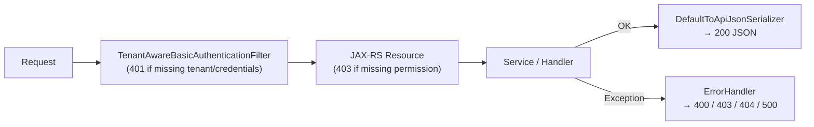

Apache Fineract exposes its entire domain surface through a single JAX-RS application backed by **Eclipse Jersey**. Every functional area (offices, loans, savings, tellers, batch, datatables, etc.) contributes one or more JAX-RS resource classes annotated with `@Path`, `@GET`/`@POST`/etc., and the OpenAPI v3 `@Tag` + `@Operation` annotations. Understanding the conventions shared across all resources is essential for debugging, extending, or building client integrations.

## URL Structure

All API endpoints share the prefix `/api/v1/`. The `springdoc.pathsToMatch` property in `fineract-provider/src/main/resources/application.properties` is set to `/api/**`, which is what gets scanned for OpenAPI documentation:

```properties
springdoc.api-docs.path=${SPRINGDOC_API_DOCS_PATH:/api-docs}
springdoc.api-docs.enabled=${SPRINGDOC_API_DOCS_ENABLED:true}
springdoc.swagger-ui.enabled=${SPRINGDOC_SWAGGER_UI_ENABLED:true}
springdoc.swagger-ui.url=/fineract.json
springdoc.packagesToScan=org.apache.fineract
springdoc.pathsToMatch=/api/**
```

Full example URL: `https://host:8443/fineract-provider/api/v1/offices`

Resource classes declare only the suffix relative to `/v1/`:

```java
// OfficesApiResource.java
@Path("/v1/offices")
@Component
@Tag(name = "Offices", description = "Offices are used to model an MFIs structure...")
public class OfficesApiResource { ... }
```

## Request and Content Negotiation

All endpoints consume and produce `application/json` (`MediaType.APPLICATION_JSON`). File-upload endpoints additionally accept `multipart/form-data`. The `@Produces` and `@Consumes` annotations are declared per-method; the resource class itself usually does not set defaults, allowing methods like the Excel template download endpoint to declare `@Produces("application/vnd.ms-excel")` independently.

Responses are serialised through `DefaultToApiJsonSerializer<T>`, which wraps a Gson-based pipeline. The `ApiRequestParameterHelper.process(uriInfo.getQueryParameters())` call at the start of most GET methods interprets special query parameters before serialisation:

| Query Parameter | Behaviour |
|---|---|
| `fields=id,name,...` | Partial response — only the listed fields are serialised |
| `pretty=true` | Pretty-print the JSON output |
| `template=true` | Signals the resource to augment the response with allowed-value lists |
| `makerchecker=true` | Prepares the response for maker-checker workflow display |

The `ApiRequestParameterHelper` is defined in `fineract-core/src/main/java/org/apache/fineract/infrastructure/core/api/ApiRequestParameterHelper.java`.

## Authentication

Every request must carry two headers:

```http
Authorization: Basic <base64(username:password)>
Fineract-Platform-TenantId: default
```

The `Fineract-Platform-TenantId` header is read by `TenantAwareBasicAuthenticationFilter` (`fineract-security/src/main/java/org/apache/fineract/infrastructure/security/filter/TenantAwareBasicAuthenticationFilter.java`). The constant is:

```java
private static final String TENANT_ID_REQUEST_HEADER = "Fineract-Platform-TenantId";
```

If the header is absent and `EXCEPTION_IF_HEADER_MISSING = true` (the default), an `InvalidTenantIdentifierException` is thrown and a `401` is returned before any resource code executes. The resolved `FineractPlatformTenant` is placed in a `ThreadLocal` via `ThreadLocalContextUtil` and is accessible throughout the request lifecycle.

OAuth2 is also supported; `fineract.security.oauth2.enabled` switches the security filter chain.

## Anatomy of a Resource Class

All resource classes follow the same structural pattern. Here is `OfficesApiResource` as a canonical example:

```java
@Path("/v1/offices")                            // JAX-RS path
@Component                                      // Spring-managed bean
@Tag(name = "Offices", description = "...")    // OpenAPI grouping
@RequiredArgsConstructor                        // Lombok: inject via final fields
public class OfficesApiResource {

    // Fields declared in RESPONSE_DATA_PARAMETERS control ?fields= filtering
    private static final Set<String> RESPONSE_DATA_PARAMETERS = new HashSet<>(
        List.of("id", "name", "nameDecorated", "externalId",
                "openingDate", "hierarchy", "parentId", "parentName", "allowedParents"));

    private static final String RESOURCE_NAME_FOR_PERMISSIONS = "OFFICE";

    private final PlatformSecurityContext context;               // auth check
    private final OfficeReadPlatformService readPlatformService; // reads
    private final DefaultToApiJsonSerializer<OfficeData> toApiJsonSerializer;
    private final ApiRequestParameterHelper apiRequestParameterHelper;
    private final PortfolioCommandSourceWritePlatformService commandsSourceWritePlatformService;
    ...

    @GET
    @Produces({ MediaType.APPLICATION_JSON })
    @Operation(summary = "List Offices", description = "...")
    @ApiResponse(responseCode = "200", description = "OK",
        content = @Content(array = @ArraySchema(
            schema = @Schema(implementation = OfficesApiResourceSwagger.GetOfficesResponse.class))))
    public String retrieveOffices(@Context final UriInfo uriInfo, ...) {
        context.authenticatedUser().validateHasReadPermission(RESOURCE_NAME_FOR_PERMISSIONS);
        ...
        final ApiRequestJsonSerializationSettings settings =
            apiRequestParameterHelper.process(uriInfo.getQueryParameters());
        return toApiJsonSerializer.serialize(settings, offices, RESPONSE_DATA_PARAMETERS);
    }

    @POST
    @Consumes({ MediaType.APPLICATION_JSON })
    @Produces({ MediaType.APPLICATION_JSON })
    @Operation(summary = "Create an Office", description = "...")
    public String createOffice(@Parameter(hidden = true) final String apiRequestBodyAsJson) {
        final CommandWrapper commandRequest = new CommandWrapperBuilder()
            .createOffice()
            .withJson(apiRequestBodyAsJson)
            .build();
        final CommandProcessingResult result =
            commandsSourceWritePlatformService.logCommandSource(commandRequest);
        return toApiJsonSerializer.serialize(result);
    }
}
```

Key observations:
1. **Permission check first**: `context.authenticatedUser().validateHasReadPermission("OFFICE")` throws `NoAuthorizationException` before any business logic.
2. **Writes go through `CommandWrapper`**: This ensures the maker-checker audit trail is captured in `m_portfolio_command_source`.
3. **Reads return plain strings**: Most GET methods return `String` (serialised JSON) rather than POJOs, to allow field filtering.
4. **Swagger types are separate classes**: `OfficesApiResourceSwagger.GetOfficesResponse` is a nested static class used only for OpenAPI schema generation; it does not participate in the actual runtime serialisation.

## Pagination

Resources that return lists accept `limit` and `offset` query parameters, surfaced via `SearchParameters`:

```java
// SearchParameters.java
public static final int DEFAULT_MAX_LIMIT = 200;

private Integer offset;
private Integer limit;

public Integer getLimit() {
    if (limit == null) return DEFAULT_MAX_LIMIT;  // default cap
    if (limit > 0)     return limit;
    return null; // unlimited when 0 or negative
}
```

`SearchParameters` is built using a Lombok `@Builder`. Resources pass it to service methods which append `LIMIT` / `OFFSET` clauses to the underlying JDBC queries via `DatabaseSpecificSQLGenerator`.

## Date Format Conventions

Fineract requires dates in `dd MMMM yyyy` format in request bodies by default (e.g., `"01 January 2024"`), alongside a `locale` and `dateFormat` field:

```json
{
  "openingDate": "01 January 2024",
  "locale": "en",
  "dateFormat": "dd MMMM yyyy"
}
```

`JsonCommand.localDateValueOfParameterNamed()` uses the `locale` and `dateFormat` fields from the same request body to parse the date. ISO-8601 (`yyyy-MM-dd`) also works when `dateFormat` is set accordingly. The teller API is an exception: its `fromdate`/`todate` query params use `BASIC_ISO_DATE` (`yyyyMMdd`) format.

## OpenAPI Spec Generation

OpenAPI documentation is generated at runtime by **springdoc-openapi**. The custom `FineractOperationIdReader` (`fineract-provider/src/main/java/org/apache/fineract/infrastructure/openapi/FineractOperationIdReader.java`) extends `io.swagger.v3.jaxrs2.Reader` to validate that no two endpoints share the same explicit `operationId`:

```java
public final class FineractOperationIdReader extends Reader {

    @Override
    public OpenAPI read(Set<Class<?>> classes, Map<String, Object> resources) {
        ExplicitOperationValidator.validate(classes);  // fails fast on duplicates
        return super.read(classes, resources);
    }
}
```

If duplicate `operationId` values exist across resource classes, the application fails to start with:
```
IllegalStateException: Duplicate explicit OpenAPI operationIds detected: ...
```

The generated spec is served at `/fineract-provider/api-docs` (JSON) and also as `/fineract.json` (the Swagger UI uses the latter via `springdoc.swagger-ui.url=/fineract.json`).

## Swagger Model Classes

Each `*ApiResource.java` has a companion `*ApiResourceSwagger.java` in the same package. These contain nested static classes (e.g., `GetOfficesResponse`, `PostOfficesRequest`) annotated with `@Schema` fields. They are **only** used by OpenAPI scanning—the actual runtime deserialisation of POST bodies is done by Gson on the raw `String apiRequestBodyAsJson`, not by these classes.

## Error Response Format

All exceptions are caught by `ErrorHandler` (`fineract-core/src/main/java/org/apache/fineract/infrastructure/core/exception/ErrorHandler.java`) and converted to `ErrorInfo` or a list of `ApiParameterError` objects. A typical validation error response looks like:

```json
{
  "developerMessage": "The request was invalid.",
  "httpStatusCode": "400",
  "defaultUserMessage": "Validation errors exist.",
  "userMessageGlobalisationCode": "validation.msg.validation.errors.exist",
  "errors": [
    {
      "developerMessage": "The parameter `name` cannot be blank.",
      "defaultUserMessage": "The parameter `name` cannot be blank.",
      "userMessageGlobalisationCode": "validation.msg.office.name.cannot.be.blank",
      "parameterName": "name",
      "value": ""
    }
  ]
}
```

A domain-rule violation returns HTTP 403 with a `PlatformDomainRuleException` body. An entity-not-found returns HTTP 404.



## Read-Only Mode

`fineract.mode.read-enabled` and `fineract.mode.write-enabled` (in `application.properties`) control whether write operations are permitted at the instance level. When `write-enabled=false`, any non-GET request (including batch sub-requests) will throw `InvalidInstanceTypeMethodException` before reaching the resource method body.

## Related Pages

- [Batch API: Atomic Multi-Request Processing in Fineract](/api/batch-api) — how multiple requests are bundled into a single HTTP call
- [Datatables, Dynamic Queries, and Report Execution](/api/datatables-reports) — the dynamic table and reporting layer
- [Offices, Staff, and Organisational Hierarchy](/organisation/offices-staff) — a representative domain resource in detail
