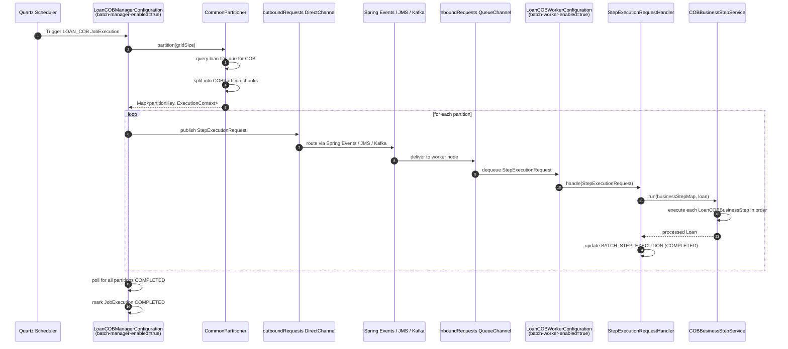

Apache Fineract uses Spring Batch as its batch processing engine for all nightly and periodic background work: interest posting, accrual generation, non-performing asset classification, external event relay, and the critical Loan Close-of-Business (COB) job. The Spring Batch infrastructure is configured in `fineract-provider` via `ScheduledJobRunnerConfig`, wired to the tenant `RoutingDataSource`, and supports both single-node and distributed partitioned execution through Spring Integration channels backed by Spring Events (in-process), JMS (ActiveMQ), or Kafka.

## Spring Batch Core Configuration

`ScheduledJobRunnerConfig` (in `fineract-provider/src/main/java/org/apache/fineract/infrastructure/jobs/ScheduledJobRunnerConfig.java`) provides the foundational Spring Batch beans:

```java
// ScheduledJobRunnerConfig.java
@Configuration(proxyBeanMethods = false)
@EnableBatchProcessing
public class ScheduledJobRunnerConfig {

    @Bean
    public JobRepository jobRepository(RoutingDataSource routingDataSource,
            @Qualifier("batchJdbcTransactionManager") PlatformTransactionManager transactionManager,
            Jackson2ExecutionContextStringSerializer executionContextSerializer,
            DataFieldMaxValueIncrementerFactory incrementerFactory) throws Exception {
        JobRepositoryFactoryBean factory = new JobRepositoryFactoryBean();
        factory.setDataSource(routingDataSource);
        factory.setTransactionManager(transactionManager);
        factory.setIsolationLevelForCreate("ISOLATION_READ_COMMITTED");
        factory.setSerializer(executionContextSerializer);
        factory.setIncrementerFactory(incrementerFactory);
        factory.afterPropertiesSet();
        return factory.getObject();
    }
    // ... JobExplorer, TaskExecutorJobLauncher beans
}
```

The `JobRepository` is backed by the `RoutingDataSource`, which means all Spring Batch metadata tables (`BATCH_JOB_INSTANCE`, `BATCH_JOB_EXECUTION`, `BATCH_STEP_EXECUTION`, etc.) live in the **tenant's** schema. Each tenant maintains its own independent Spring Batch history. A dedicated `batchJdbcTransactionManager` (separate from the JPA `PlatformTransactionManager`) is used to keep Spring Batch metadata writes independent of domain entity transactions.

## Mode Flags

Four boolean properties gate which subsystems activate in a given process:

```properties
# application.properties
fineract.mode.read-enabled=${FINERACT_MODE_READ_ENABLED:true}
fineract.mode.write-enabled=${FINERACT_MODE_WRITE_ENABLED:true}
fineract.mode.batch-worker-enabled=${FINERACT_MODE_BATCH_WORKER_ENABLED:true}
fineract.mode.batch-manager-enabled=${FINERACT_MODE_BATCH_MANAGER_ENABLED:true}
```

`ManagerConfig` activates on `fineract.mode.batch-manager-enabled=true` and creates the `outboundRequests` `DirectChannel` for dispatching partition step requests. `WorkerConfig` activates on `fineract.mode.batch-worker-enabled=true` and creates the `inboundRequests` `QueueChannel` for receiving them. In a single-node deployment both are true. In a distributed deployment, manager nodes have only `batch-manager-enabled=true` and worker nodes have only `batch-worker-enabled=true`.

## Named Scheduled Jobs

All job names are enumerated in `JobName` (in `fineract-core/src/main/java/org/apache/fineract/infrastructure/jobs/service/JobName.java`):

| Enum Constant | Display Name | Description |
|---|---|---|
| `LOAN_COB` | `Loan COB` | Partitioned close-of-business for all active loans |
| `WORKING_CAPITAL_LOAN_COB_JOB` | `Working Capital Loan COB` | COB for working capital loans |
| `UPDATE_LOAN_ARREARS_AGEING` | `Update Loan Arrears Ageing` | Recomputes arrears ageing buckets |
| `APPLY_ANNUAL_FEE_FOR_SAVINGS` | `Apply Annual Fee For Savings` | Posts annual fee charges |
| `APPLY_HOLIDAYS_TO_LOANS` | `Apply Holidays To Loans` | Applies public holiday adjustments to loan schedules |
| `POST_INTEREST_FOR_SAVINGS` | `Post Interest For Savings` | Calculates and posts savings interest |
| `TRANSFER_FEE_CHARGE_FOR_LOANS` | `Transfer Fee For Loans From Savings` | Transfers fee charges for loans from linked savings |
| `ACCOUNTING_RUNNING_BALANCE_UPDATE` | `Update Accounting Running Balances` | Recalculates GL account running balances |
| `PAY_DUE_SAVINGS_CHARGES` | `Pay Due Savings Charges` | Posts due charges on savings accounts |
| `ADD_ACCRUAL_ENTRIES` | `Add Accrual Transactions` | Non-periodic accrual posting |
| `ADD_PERIODIC_ACCRUAL_ENTRIES` | `Add Periodic Accrual Transactions` | Periodic accrual posting |
| `ADD_PERIODIC_ACCRUAL_ENTRIES_FOR_LOANS_WITH_INCOME_POSTED_AS_TRANSACTIONS` | `Add Accrual Transactions For Loans With Income Posted As Transactions` | Accrual posting for income-as-transaction loans |
| `ADD_PERIODIC_ACCRUAL_ENTRIES_FOR_SAVINGS_WITH_INCOME_POSTED_AS_TRANSACTIONS` | `Add Accrual Transactions For Savings` | Accrual posting for savings with income posted as transactions |
| `ACCRUAL_ACTIVITY_POSTING` | `Accrual Activity Posting` | Activity-based accrual posting |
| `UPDATE_NPA` | `Update Non Performing Assets` | Reclassifies loans as NPA/performing |
| `APPLY_CHARGE_TO_OVERDUE_LOAN_INSTALLMENT` | `Apply penalty to overdue loans` | Applies overdue penalty charges |
| `EXECUTE_STANDING_INSTRUCTIONS` | `Execute Standing Instruction` | Processes standing payment orders |
| `RECALCULATE_INTEREST_FOR_LOAN` | `Recalculate Interest For Loans` | Re-runs interest on variable rate loans |
| `GENERATE_RD_SCEHDULE` | `Generate Mandatory Savings Schedule` | Generates recurring deposit instalment schedules |
| `GENERATE_LOANLOSS_PROVISIONING` | `Generate Loan Loss Provisioning` | Computes loan loss provisioning |
| `POST_DIVIDENTS_FOR_SHARES` | `Post Dividends For Shares` | Posts declared dividends for share products |
| `UPDATE_SAVINGS_DORMANT_ACCOUNTS` | `Update Savings Dormant Accounts` | Marks savings accounts as dormant |
| `EXECUTE_REPORT_MAILING_JOBS` | `Execute Report Mailing Jobs` | Runs and emails scheduled reports |
| `UPDATE_TRIAL_BALANCE_DETAILS` | `Update Trial Balance Details` | Refreshes trial balance summary data |
| `SEND_ASYNCHRONOUS_EVENTS` | `Send Asynchronous Events` | Relays `m_external_event` rows to broker |
| `PURGE_EXTERNAL_EVENTS` | `Purge External Events` | Removes old sent external event rows |
| `PURGE_PROCESSED_COMMANDS` | `Purge Processed Commands` | Cleans `m_portfolio_command_source` |
| `INCREASE_BUSINESS_DATE_BY_1_DAY` | `Increase Business Date by 1 day` | Advances the business date (testing/non-production only) |
| `INCREASE_COB_DATE_BY_1_DAY` | `Increase COB Date by 1 day` | Advances the COB date (testing/non-production only) |
| `EXECUTE_DIRTY_JOBS` | `Execute All Dirty Jobs` | Runs jobs that failed and need retry |
| `LOAN_DELINQUENCY_CLASSIFICATION` | `Loan Delinquency Classification` | Assigns delinquency bands to loans |
| `JOURNAL_ENTRY_AGGREGATION` | `Journal Entry Aggregation` | Aggregates granular journal entries |
| `UPDATE_DEPOSITS_ACCOUNT_MATURITY_DETAILS` | `Update Deposit Accounts Maturity details` | Processes maturing fixed deposits |
| `TRANSFER_INTEREST_TO_SAVINGS` | `Transfer Interest To Savings` | Transfers accrued interest to linked savings accounts |

## Scheduler Read and Write Services

`SchedulerJobRunnerReadService` (in `fineract-core/.../infrastructure/jobs/service/`) provides the query-side API for the scheduler:

```java
public interface SchedulerJobRunnerReadService {
    List<JobDetailData> findAllJobDetails();
    JobDetailData retrieveOne(@NonNull IdTypeResolver.IdType idType, String identifier);
    Page<JobDetailHistoryData> retrieveJobHistory(@NonNull IdTypeResolver.IdType idType,
            String identifier, SearchParameters searchParameters);
    @NonNull Long retrieveId(@NonNull IdTypeResolver.IdType idType, String identifier);
    boolean isUpdatesAllowed();
}
```

`SchedulerJobApiResource` (the JAX-RS resource at `GET/PUT /v1/jobs`) uses this service to list jobs, retrieve history, and trigger manual execution by delegating to `JobRegisterService.triggerJobByJobName()`.

## Partitioned LOAN_COB

The most complex job is `LOAN_COB`, which processes every active loan through a configurable pipeline of `LoanCOBBusinessStep` implementations. Because it must process potentially hundreds of thousands of loans within a business day window, it uses Spring Batch's remote partitioning support.



### Manager Configuration

`LoanCOBManagerConfiguration` (`fineract-provider/.../cob/loan/`) is activated by `@Conditional(BatchManagerCondition.class)` (which checks `fineract.mode.batch-manager-enabled=true`). It builds a Spring Batch `Job` using `RemotePartitioningManagerStepBuilderFactory`, registering the `outboundRequests` channel as the partition request output.

### Worker Configuration

`LoanCOBWorkerConfiguration` (`fineract-provider/.../cob/loan/`) is activated by `@Conditional(BatchWorkerCondition.class)` (`fineract.mode.batch-worker-enabled=true`). It builds a remote-partitioning worker `Step` that reads loan IDs from `ExecutionContext`, loads each `Loan` via `LoanRepository`, and runs the loan through `COBBusinessStepService.run()`:

```java
// COBBusinessStepService.java
public interface COBBusinessStepService {
    <T extends COBBusinessStep<S>, S extends AbstractPersistableCustom<Long>>
        S run(TreeMap<Long, String> executionMap, S item);
}
```

The `executionMap` is a `TreeMap<Long, String>` of ordered step names — the ordering determines the execution sequence within a single loan's COB. Each step is a `LoanCOBBusinessStep` bean (which extends `COBBusinessStep<Loan>`):

```java
// LoanCOBBusinessStep.java
public interface LoanCOBBusinessStep extends COBBusinessStep<Loan> {}

// COBBusinessStep.java
public interface COBBusinessStep<T extends AbstractPersistableCustom<Long>> {
    T execute(T input);
    String getEnumStyledName();
    String getHumanReadableName();
}
```

### Remote Message Transports

Three transport options are available for manager → worker partition message delivery:

<Tabs>
  <Tab title="Spring Events (default)">
    The default in-process transport — `SpringEventManagerConfig` and `SpringEventWorkerConfig` — routes `StepExecutionRequest` messages as Spring `ApplicationEvent` objects. This works only when manager and worker run in the same JVM (single-node deployment).

    ```properties
    fineract.remote-job-message-handler.spring-events.enabled=true
    fineract.remote-job-message-handler.jms.enabled=false
    fineract.remote-job-message-handler.kafka.enabled=false
    ```
  </Tab>
  <Tab title="JMS (ActiveMQ)">
    `JmsManagerConfig` connects the `outboundRequests` channel to an ActiveMQ queue. `JmsBatchWorkerMessageListener` on worker nodes receives `StepExecutionRequest` messages from the same queue.

    ```properties
    fineract.remote-job-message-handler.spring-events.enabled=false
    fineract.remote-job-message-handler.jms.enabled=true
    fineract.remote-job-message-handler.jms.request-queue-name=JMS-request-queue
    fineract.remote-job-message-handler.jms.broker-url=tcp://127.0.0.1:61616
    ```
  </Tab>
  <Tab title="Kafka">
    `KafkaManagerConfig` publishes partition requests to a Kafka topic. `KafkaRemoteMessageListener` on worker nodes consumes from the same topic.

    ```properties
    fineract.remote-job-message-handler.spring-events.enabled=false
    fineract.remote-job-message-handler.kafka.enabled=true
    fineract.remote-job-message-handler.kafka.topic.name=job-topic
    fineract.remote-job-message-handler.kafka.bootstrap-servers=localhost:9092
    fineract.remote-job-message-handler.kafka.consumer.group-id=fineract-consumer-group-id
    ```
  </Tab>
</Tabs>

## `StepExecutionRequestHandler`

On worker nodes, every incoming partition request is handled by `StepExecutionRequestHandler` (`fineract-provider/.../springbatch/messagehandler/`):

```java
// StepExecutionRequestHandler.java
@Component
@RequiredArgsConstructor
@ConditionalOnProperty(value = "fineract.mode.batch-worker-enabled", havingValue = "true")
public class StepExecutionRequestHandler {

    public void handle(StepExecutionRequest request) {
        Long jobExecutionId = request.getJobExecutionId();
        Long stepExecutionId = request.getStepExecutionId();
        String stepName = request.getStepName();

        StepExecution stepExecution = jobExplorer.getStepExecution(jobExecutionId, stepExecutionId);
        Step step = stepLocator.getStep(stepName);
        try {
            step.execute(stepExecution);
        } catch (JobInterruptedException e) {
            stepExecution.setStatus(BatchStatus.STOPPED);
        }
    }
}
```

## Stuck Job Recovery

Spring Batch jobs can get stuck in `STARTING` or `STARTED` status if a worker node crashes mid-execution. `StuckJobExecutorService` provides a recovery mechanism:

```java
// StuckJobExecutorServiceImpl.java
@Override
public void resumeStuckJob(String jobName) {
    List<Long> stuckJobIds = getStuckJobIds(jobName);
    if (isPartitionedJob(jobName) && areThereStuckJobs(jobName)) {
        restartPartitionedJobs(jobName, stuckJobIds);
    } else {
        restartTaskletJobs(stuckJobIds);
    }
}
```

`StuckJobListener` calls this at the start of each job run. The threshold for considering a job "stuck" is configured via `fineract.job.stuck-retry-threshold` (default: 5 consecutive failures). For partitioned jobs, stuck individual partition step executions are restarted using `JobOperator.restart(stuckJobId)`.

<Warning>
Stuck job recovery restarts the entire job from the last checkpoint, not just the failed partition. In a partitioned LOAN_COB run, this may cause some loans to be processed twice in the same COB window if account locking is not working correctly. The `AccountLockService` in `fineract-cob` prevents concurrent COB processing on the same loan ID.
</Warning>

## Scheduler API Resource

`SchedulerJobApiResource` is the JAX-RS resource at `/v1/jobs` (registered at `@Path("/v1/jobs")`). It exposes:

- `GET /v1/jobs` — list all scheduled jobs with their current status and cron expression
- `GET /v1/jobs/{jobId}` — retrieve a specific job's details
- `POST /v1/jobs/{jobId}?command=executeJob` — trigger a job manually for the current tenant
- `GET /v1/jobs/{jobId}/runhistory` — paginated execution history for a job
- `PUT /v1/scheduler?command=start|stop` — activate or pause the Quartz scheduler for the tenant

Manual triggers go through `PortfolioCommandSourceWritePlatformService` using `CommandWrapperBuilder`, providing the same audit trail as any other write operation. The scheduler's active/standby status is persisted in the tenant's `m_job_run_history` table and checked by `SchedulerVetoer` before each scheduled execution.

<Note>
The `INCREASE_BUSINESS_DATE_BY_1_DAY` and `INCREASE_COB_DATE_BY_1_DAY` jobs are used in test automation and non-production environments to advance the business date without waiting for real calendar days. They should never be activated in a production deployment.
</Note>
