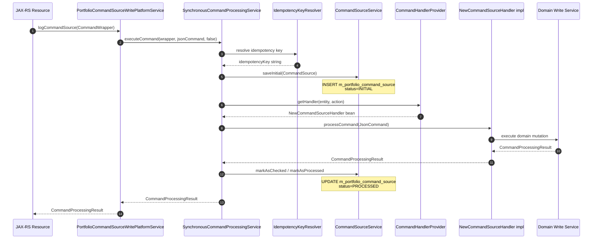

Every mutation in Fineract — creating a client, disbursing a loan, posting a repayment, updating a configuration — is routed through the command pattern rather than called directly on a service. This design provides three guarantees: a complete audit trail in `m_portfolio_command_source`, idempotency via caller-supplied or server-generated keys, and optional maker-checker two-phase approval. Understanding this pipeline is essential before writing any new write functionality.

## Core Types

The command infrastructure lives in `org.apache.fineract.commands` inside `fineract-core`. The main participants are:

| Type | Package | Description |
|---|---|---|
| `CommandWrapper` | `commands.domain` | Immutable VO describing an action: `entity`, `action`, resource IDs, JSON body, idempotency key |
| `CommandSource` | `commands.domain` | JPA entity mapped to `m_portfolio_command_source`; persisted before execution |
| `JsonCommand` | `infrastructure.core.api` | Wraps raw JSON + `CommandWrapper`; used inside handlers |
| `CommandProcessingResult` | `infrastructure.core.data` | Returned by handlers: resource ID, sub-resource ID, changes map |
| `NewCommandSourceHandler` | `commands.handler` | SPI interface implemented by every write handler |
| `CommandType` | `commands.annotation` | Annotation binding a handler class to an `entity` + `action` pair |
| `CommandHandlerProvider` | `commands.provider` | Discovers all `@CommandType`-annotated beans at startup |
| `CommandProcessingService` | `commands.service` | Core interface with `executeCommand()` |
| `SynchronousCommandProcessingService` | `commands.service` | The default synchronous implementation |
| `PortfolioCommandSourceWritePlatformService` | `commands.service` | Entry point called from Jersey resource classes |

## Handler Registration with `@CommandType`

Every write command handler is a `@Service`-annotated Spring bean that implements `NewCommandSourceHandler` and carries `@CommandType`:

```java
// fineract-loan/.../portfolio/loanaccount/handler/LoanRepaymentCommandHandler.java
@Service
@RequiredArgsConstructor
@CommandType(entity = "LOAN", action = "REPAYMENT")
public class LoanRepaymentCommandHandler implements NewCommandSourceHandler {

    private final LoanWritePlatformService writePlatformService;
    private final DataIntegrityErrorHandler dataIntegrityErrorHandler;

    @Transactional
    @Override
    public CommandProcessingResult processCommand(final JsonCommand command) {
        try {
            return this.writePlatformService.makeLoanRepayment(
                LoanTransactionType.REPAYMENT,
                command.getLoanId(),
                command,
                false
            );
        } catch (final JpaSystemException | DataIntegrityViolationException dve) {
            dataIntegrityErrorHandler.handleDataIntegrityIssues(
                command, dve.getMostSpecificCause(), dve, "loan.repayment", "Repayment");
            return CommandProcessingResult.empty();
        }
    }
}
```

At startup, `CommandHandlerProvider.afterPropertiesSet()` calls `applicationContext.getBeansWithAnnotation(CommandType.class)` and registers each handler in a `HashMap<String, String>` keyed on `"entity|action"` (the bean name as the value). At dispatch time, `getHandler(entity, action)` returns the bean name, and the handler is retrieved from the context with `applicationContext.getBean(beanName)`.

```java
// CommandType.java
@Retention(RetentionPolicy.RUNTIME)
@Target(ElementType.TYPE)
@Documented
public @interface CommandType {
    String entity();
    String action();
}
```

## Dispatch Flow



## `CommandWrapper` and `CommandWrapperBuilder`

Resource classes never instantiate `CommandWrapper` directly. Instead they use `CommandWrapperBuilder` (in `commands.service`), which provides a fluent API:

```java
// Example from a loan resource class
final CommandWrapper commandRequest = new CommandWrapperBuilder()
    .loanRepaymentTransaction(loanId)
    .withJson(apiRequestBodyAsJson)
    .build();
final CommandProcessingResult result =
    this.commandsSourceWritePlatformService.logCommandSource(commandRequest);
```

`CommandWrapper` carries the action name (`REPAYMENT`), entity name (`LOAN`), all contextual IDs (loan ID, client ID, office ID, savings ID), the JSON body, and an optional idempotency key.

## Idempotency

Fineract supports caller-supplied idempotency keys via a configurable HTTP header (default: the value of `fineract.idempotencyKeyHeaderName`). The `IdempotencyKeyResolver` checks the `FineractRequestContextHolder` for an incoming key; if none is present it generates one using `IdempotencyKeyGenerator`. The key is stored on the `CommandSource` row.

On execution, `SynchronousCommandProcessingService` checks whether a `CommandSource` with the same idempotency key already exists in `m_portfolio_command_source`:

- **`PROCESSED` status** → throws `IdempotentCommandProcessSucceedException`, which is caught and the original response is returned to the caller.
- **In-flight** → throws `IdempotentCommandProcessUnderProcessingException` (HTTP 409).
- **`ERROR` status** → throws `IdempotentCommandProcessFailedException` (HTTP 409).

This guarantees that a network retry cannot create duplicate transactions.

## `CommandSource` Entity

```java
// CommandSource.java (key fields)
@Entity
@Table(name = "m_portfolio_command_source")
public class CommandSource extends AbstractPersistableCustom<Long> {
    private String actionName;           // e.g. "REPAYMENT"
    private String entityName;           // e.g. "LOAN"
    private Long loanId;
    private Long clientId;
    private String commandAsJson;        // full JSON body
    private AppUser maker;               // who submitted
    private OffsetDateTime madeOnDate;
    private OffsetDateTime checkedOnDate;
    private String idempotencyKey;
    // ... checker, status, result columns
}
```

The `maker` foreign key links to `AppUser`, providing a full user-level audit trail per command.

## Maker-Checker (Two-Phase Approval)

When the system configuration flag `is-maker-checker-enabled` is `true` and the command's permission requires checker approval, `SynchronousCommandProcessingService` saves the command in a `AWAITING_APPROVAL` status and returns immediately without executing the handler. A checker user then calls:

```java
// PortfolioCommandSourceWritePlatformService
CommandProcessingResult approveEntry(Long id);
Long rejectEntry(Long id);
Long deleteEntry(Long makerCheckerId);
```

`approveEntry(id)` re-executes the original command (retrieving its JSON from `commandAsJson`) with `isApprovedByChecker=true`. `SynchronousCommandProcessingService.validateRollbackCommand()` determines whether the current user has checker authority for the command's entity-action pair.

<Warning>
Maker-checker is a system-wide flag, not per-command. If enabled, all commands that are annotated with a permission requiring checker approval will enter the two-phase flow. Be careful enabling this in production without ensuring sufficient checker capacity, as pending commands accumulate in `m_portfolio_command_source`.
</Warning>

## The New `fineract-command` Module

In parallel with the legacy command infrastructure, Fineract ships a newer `fineract-command` Gradle module (`org.apache.fineract.command`) that provides a more generic, type-safe command framework. This module introduces:

- **`Command<T>`** — a generic envelope holding a typed `payload`, idempotency key, timestamps, and actor metadata
- **`CommandHandler<REQ, RES>`** — a type-parameterized interface; implementations match based on `TypeToken` reflection
- **`CommandDispatcher`** — returns `Supplier<RES>` for deferred execution
- **`CommandStore`** — SPI for persisting `Command` objects (implemented by `JdbcCommandStore` in `fineract-command-jdbc`)
- Hook lifecycle: `CommandHookBefore`, `CommandHookAfter`, `CommandHookError` — executed around every dispatch

```java
// fineract-command/.../core/CommandHandler.java
public interface CommandHandler<REQ, RES> {
    RES handle(Command<REQ> command);

    default RES fallback(Command<REQ> command, Throwable t) throws Throwable {
        throw t; // override for custom fallback logic
    }

    default boolean matches(Command<REQ> command) {
        TypeToken<REQ> handlerType = new TypeToken<>(getClass()) {};
        return handlerType.getRawType().isAssignableFrom(command.getPayload().getClass());
    }
}
```

The available dispatcher implementations are:
- **`SynchronousCommandDispatcher`** (in `fineract-command`) — executes inline
- **`AsyncCommandDispatcher`** (in `fineract-command-async`) — submits to a managed thread pool
- **`DisruptorCommandDispatcher`** (in `fineract-command-disruptor`) — routes through an LMAX Disruptor ring buffer for high-throughput scenarios

The audit hooks in `fineract-command-audit` (`AuditCommandHookBefore`, `AuditCommandHookAfter`, `AuditCommandHookError`) integrate with the existing `CommandSource` persistence mechanism.

<Note>
The new `fineract-command` module is not yet the primary dispatch path for REST-triggered writes — that still goes through `PortfolioCommandSourceWritePlatformService` and `SynchronousCommandProcessingService`. The new module is used for specialized internal dispatch scenarios where type safety and the Disruptor are beneficial.
</Note>
