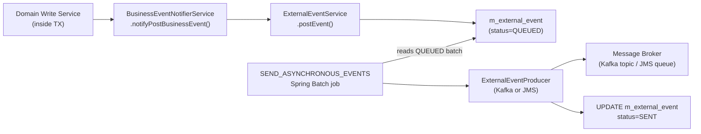

Fineract's event system has two distinct layers. The first is an in-process **business event** mechanism that notifies registered listeners synchronously within the same Spring transaction. The second is an **external event pipeline** that persists event records to an outbox table (`m_external_event`), serializes them as Apache Avro payloads, and delivers them to external message brokers (Kafka or JMS) via a scheduled job. The two layers share a common event object hierarchy but serve different purposes: in-process listeners handle side effects like guarantor fund releases or notification dispatch, while external events feed downstream systems like analytics platforms or mobile apps.

## In-Process Business Events

### Event Interface Hierarchy

All business events originate from a two-class hierarchy defined in `fineract-core`:

```java
// fineract-core/.../infrastructure/event/business/domain/BusinessEvent.java
public interface BusinessEvent<T> {
    T get();
    String getType();
    String getCategory();
    Long getAggregateRootId();
}

// AbstractBusinessEvent.java
@RequiredArgsConstructor
public abstract class AbstractBusinessEvent<T> implements BusinessEvent<T> {
    private final T value;

    @Override
    public T get() {
        return value;
    }
}
```

Domain modules extend `AbstractBusinessEvent` to create typed events. For example, the loan approval event in `fineract-loan`:

```java
// fineract-loan/.../infrastructure/event/business/domain/loan/LoanApprovedBusinessEvent.java
public class LoanApprovedBusinessEvent extends LoanBusinessEvent {
    private static final String TYPE = "LoanApprovedBusinessEvent";

    public LoanApprovedBusinessEvent(Loan value) {
        super(value);
    }

    @Override
    public String getType() { return TYPE; }
}
```

`LoanBusinessEvent` is an intermediate abstract class that provides `getCategory()` → `"Loan"` and `getAggregateRootId()` → `loan.getId()`. This category is stored on the `ExternalEvent` row in the database and used for Kafka partitioning.

### `NoExternalEvent` Marker Interface

Events that should fire in-process listeners but **not** be persisted to the external event outbox implement the `NoExternalEvent` marker interface:

```java
// NoExternalEvent.java
public interface NoExternalEvent {}
```

`BusinessEventNotifierServiceImpl` skips the `ExternalEventService.postEvent()` call for any event that is also a `NoExternalEvent` instance. This is used for internal events like cache invalidation triggers that have no meaning outside the process boundary.

### `BulkBusinessEvent`

`BulkBusinessEvent` groups multiple `BusinessEvent` instances sharing the same aggregate root ID into a single external event row. The `ExternalEventService` detects this type and wraps all child events into a `BulkMessagePayloadV1` Avro structure before persisting:

```java
// BulkBusinessEvent.java
public class BulkBusinessEvent extends AbstractBusinessEvent<List<BusinessEvent<?>>> {
    private static final String CATEGORY = "Bulk";
    public static final String TYPE = "BulkBusinessEvent";
    // validates that all events share the same aggregateRootId
}
```

### `BusinessEventNotifierService`

The central dispatcher is `BusinessEventNotifierService` (interface in `fineract-core`, implementation `BusinessEventNotifierServiceImpl`). It maintains two `Map<Class, List<BusinessEventListener>>` registries (pre and post), plus a `ThreadLocal<Stack<List<BusinessEventWithContext>>>` for transaction-aware event recording.

```java
// BusinessEventNotifierService.java
public interface BusinessEventNotifierService {
    void notifyPreBusinessEvent(BusinessEvent<?> businessEvent);
    void notifyPostBusinessEvent(BusinessEvent<?> businessEvent);
    <T extends BusinessEvent<?>> void addPreBusinessEventListener(Class<T> eventType, BusinessEventListener<T> listener);
    <T extends BusinessEvent<?>> void addPostBusinessEventListener(Class<T> eventType, BusinessEventListener<T> listener);
    void startExternalEventRecording();
    void stopExternalEventRecording();
    void resetEventRecording();
}
```

The `startExternalEventRecording()` / `stopExternalEventRecording()` methods are used by Spring Batch COB jobs to accumulate all events fired during a chunk and then emit them as a single `BulkBusinessEvent` — reducing the number of rows written to `m_external_event` per loan processed.

### Registering a Listener

Implement `BusinessEventListener<T>` and register it programmatically (typically in a `@PostConstruct` block) or via the `@BusinessEventListener` Spring event mechanism:

```java
@Service
@RequiredArgsConstructor
public class GuarantorDomainServiceImpl implements BusinessEventListener<LoanApprovedBusinessEvent> {

    private final BusinessEventNotifierService businessEventNotifierService;

    @PostConstruct
    public void addListeners() {
        businessEventNotifierService.addPreBusinessEventListener(
            LoanApprovedBusinessEvent.class, this);
    }

    @Override
    public void onBusinessEvent(LoanApprovedBusinessEvent event) {
        // block guarantor funds
        Loan loan = event.get();
        // ...
    }
}
```

## External Event Pipeline

The external event pipeline implements the **transactional outbox pattern**: events are written to `m_external_event` within the same database transaction as the domain mutation, then read by a scheduled job and forwarded to the broker. This guarantees at-least-once delivery without distributed transactions.



### `ExternalEventService`

`ExternalEventService` (in `fineract-core/.../infrastructure/event/external/service/`) is called by `BusinessEventNotifierServiceImpl` for every non-`NoExternalEvent` post-business event. It:

1. Calls `entityManager.flush()` to ensure the domain mutation is visible before inserting the event row
2. Looks up the appropriate `BusinessEventSerializer` via `BusinessEventSerializerFactory.create(event)`
3. Serializes the event to an Avro `ByteBuffer` using the matching Avro schema from `fineract-avro-schemas`
4. Generates an idempotency key via `ExternalEventIdempotencyKeyGenerator`
5. Saves an `ExternalEvent` JPA entity to `m_external_event` with `status=QUEUED`

```java
// ExternalEventService.java (simplified)
public <T> void postEvent(BusinessEvent<T> event) {
    entityManager.flush();
    ExternalEvent externalEvent;
    if (event instanceof BulkBusinessEvent) {
        externalEvent = handleBulkBusinessEvent((BulkBusinessEvent) event);
    } else {
        externalEvent = handleRegularBusinessEvent(event);
    }
    repository.save(externalEvent);
}
```

### `ExternalEvent` Entity

```java
// ExternalEvent.java (m_external_event table)
@Entity @Table(name = "m_external_event")
public class ExternalEvent extends AbstractPersistableCustom<Long> {
    private String type;           // "LoanApprovedBusinessEvent"
    private String category;       // "Loan"
    private String schema;         // Avro schema class name
    private byte[] data;           // Avro-encoded payload
    private OffsetDateTime createdAt;
    private ExternalEventStatus status; // QUEUED → SENT
    private OffsetDateTime sentAt;
    private String idempotencyKey;
    private LocalDate businessDate;
    private Long aggregateRootId;  // loan ID, savings ID, etc.
}
```

### Avro Serialization

Every event type has a corresponding Avro schema definition in `fineract-avro-schemas`. The `BusinessEventSerializerFactory` maps each `BusinessEvent` subclass to a `BusinessEventSerializer` implementation that converts the domain object to an Avro-generated DTO and calls `toByteBuffer()`. The `DataEnricherProcessor` can enrich the Avro DTO with additional computed fields before serialization.

### `SendAsynchronousEventsTasklet`

The Spring Batch tasklet that drives the outbox relay is `SendAsynchronousEventsTasklet` in `fineract-core/.../infrastructure/event/external/jobs/`. It runs as the step of the `SEND_ASYNCHRONOUS_EVENTS` scheduled job. On each execution it:

1. Checks whether the downstream channel is enabled (`fineract.events.external.enabled=true`)
2. Loads a page of `QUEUED` events from `m_external_event` (page size = `fineract.events.external.partition-size`)
3. Groups events by `aggregateRootId` into partitions
4. Calls `ExternalEventProducer.sendEvents(partitions)` asynchronously using a `ThreadPoolTaskExecutor`
5. Marks delivered events as `SENT` in a follow-up transaction

### `ExternalEventProducer` Implementations

The `ExternalEventProducer` SPI (in `fineract-core`) has two production implementations, both in `fineract-provider`:

| Class | Module | Activation Property |
|---|---|---|
| `KafkaExternalEventProducer` | `fineract-provider/.../producer/kafka/` | `fineract.events.external.producer.kafka.enabled=true` |
| `JMSMultiExternalEventProducer` | `fineract-provider/.../producer/jms/` | `fineract.events.external.producer.jms.enabled=true` |

```java
// KafkaExternalEventProducer.java (key interface)
@Component
@ConditionalOnProperty(value = "fineract.events.external.producer.kafka.enabled", havingValue = "true")
public class KafkaExternalEventProducer implements ExternalEventProducer {

    @Override
    public void sendEvents(Map<Long, List<byte[]>> partitions) throws AcknowledgementTimeoutException {
        String topicName = fineractProperties.getEvents().getExternal().getProducer().getKafka().getTopic().getName();
        // sends each partition key as a Kafka message key
        // waits for CompletableFuture<SendResult> acknowledgements
    }
}
```

The partitioning by `aggregateRootId` (the map key) ensures that all events for a given loan are delivered in order to the same Kafka partition, preserving event sequence guarantees.

## Event Categories in the Codebase

<Accordion title="Loan Events (fineract-loan)">
Over 100 loan event types grouped under the `"Loan"` category:
`LoanApprovedBusinessEvent`, `LoanDisbursedByDisbursementDetailBusinessEvent`, `LoanTransactionMakeRepaymentPostBusinessEvent`, `LoanChargeAdjustmentPostBusinessEvent`, `LoanBalanceChangedBusinessEvent`, `LoanDelinquencyRangeChangeBusinessEvent`, `LoanAccountSnapshotBusinessEvent`, and many more. All extend `LoanBusinessEvent` → `AbstractBusinessEvent<Loan>`.
</Accordion>

<Accordion title="Savings Events (fineract-provider)">
Savings account events like `SavingsDepositBusinessEvent`, `SavingsPostInterestBusinessEvent`, `FixedDepositAccountCreateBusinessEvent`, `RecurringDepositAccountCreateBusinessEvent`. These use `"Savings"` and `"FixedDeposit"` category values.
</Accordion>

<Accordion title="Client Events (fineract-provider)">
`ClientCreateBusinessEvent`, `ClientActivateBusinessEvent`, `ClientRejectBusinessEvent`. Category: `"Client"`.
</Accordion>

<Accordion title="Datatable Events (fineract-core)">
Generic datatable CRUD events: `DatatableEntryCreatedBusinessEvent`, `DatatableEntryUpdatedBusinessEvent`, `DatatableEntryDeletedBusinessEvent`. Category: `"Datatable"`.
</Accordion>

<Accordion title="Document Events (fineract-document)">
`DocumentCreatedBusinessEvent`, `DocumentDeletedBusinessEvent`. Category: `"Document"`.
</Accordion>

<Accordion title="Journal Entry Events (fineract-accounting)">
`JournalEntryBusinessEvent`, `LoanJournalEntryCreatedBusinessEvent`. Category: `"JournalEntry"`.
</Accordion>

## Configuration Reference

```properties
# Enable external event publishing (disabled by default)
fineract.events.external.enabled=${FINERACT_EXTERNAL_EVENTS_ENABLED:false}

# Batch size for the relay job
fineract.events.external.partition-size=${FINERACT_EXTERNAL_EVENTS_PARTITION_SIZE:5000}

# Thread pool for async sending
fineract.events.external.thread-pool-core-pool-size=${FINERACT_EVENT_TASK_EXECUTOR_CORE_POOL_SIZE:2}
fineract.events.external.thread-pool-max-pool-size=${FINERACT_EVENT_TASK_EXECUTOR_MAX_POOL_SIZE:25}

# Kafka producer (mutually exclusive with JMS)
fineract.events.external.producer.kafka.enabled=${FINERACT_EXTERNAL_EVENTS_KAFKA_ENABLED:false}
fineract.events.external.producer.kafka.topic.name=...

# JMS producer
fineract.events.external.producer.jms.enabled=${FINERACT_EXTERNAL_EVENTS_PRODUCER_JMS_ENABLED:false}
fineract.events.external.producer.jms.event-queue-name=...
```

<Warning>
Only one `ExternalEventProducer` bean should be active at a time. If both `kafka.enabled` and `jms.enabled` are true, two producers will attempt to send the same events. Use exactly one for any given deployment.
</Warning>

<Tip>
External events are disabled by default (`fineract.events.external.enabled=false`). When enabling, also configure which event types should be published using the `ExternalEventConfigurationWritePlatformService` API at `/api/v1/external-event-configurations` — individual event types can be toggled on/off without restarting the application.
</Tip>
