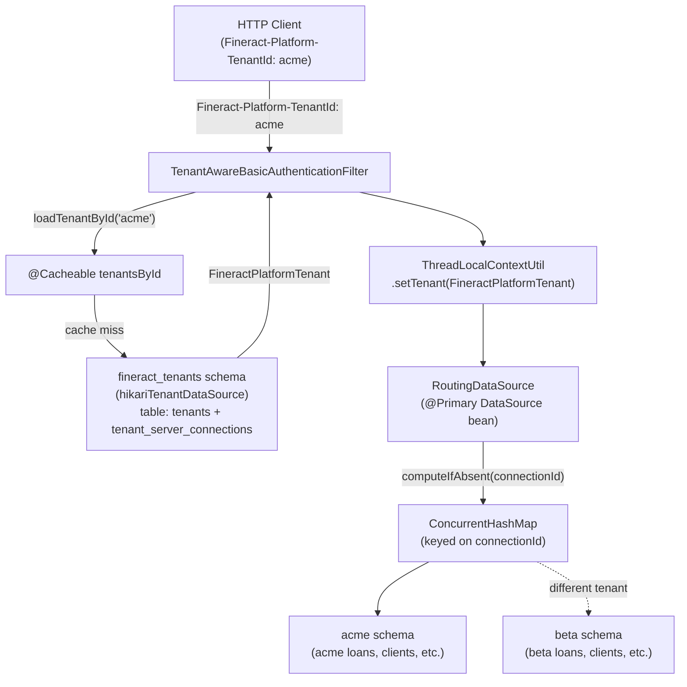

Apache Fineract implements multi-tenancy through complete database-per-schema isolation: every tenant gets its own PostgreSQL schema (or database), its own Liquibase-managed migration history, and its own HikariCP connection pool. There is no row-level tenant discriminator in the data model — tenants are truly isolated at the data layer. The only shared infrastructure is the `fineract_tenants` schema, which acts as a registry mapping tenant identifiers to their database connection details.

This architecture was chosen to make it straightforward to move a tenant to a different database server, to wipe a tenant's data without touching others, and to avoid the accidental data leakage risk that comes with shared-schema approaches.

## Two-Database Model



## Tenant Registry: `fineract_tenants`

The tenant store is a separate PostgreSQL database (`fineract_tenants` by default, configured via `fineract.tenant.host`, `fineract.tenant.port`, `fineract.tenant.username`, and `fineract.tenant.password` in `application.properties`). It is accessed through a dedicated `hikariTenantDataSource` bean that is initialized at application startup — **before** any request processing begins.

The two primary tables are:

- **`tenants`** — one row per tenant: `identifier`, `name`, `timezone_id`, `schema_server`, `schema_server_port`, `schema_name`, `schema_username`, `schema_password`
- **`tenant_server_connections`** — pool configuration parameters per connection entry (initial size, max active, validation interval, etc.)

### Default Tenant Bootstrap

At startup, `application.properties` defines a single default tenant using the `fineract.tenant.*` property group:

```properties
# application.properties (fineract-provider/src/main/resources/)
fineract.tenant.host=${FINERACT_DEFAULT_TENANTDB_HOSTNAME:localhost}
fineract.tenant.port=${FINERACT_DEFAULT_TENANTDB_PORT:5432}
fineract.tenant.identifier=${FINERACT_DEFAULT_TENANTDB_IDENTIFIER:default}
fineract.tenant.name=${FINERACT_DEFAULT_TENANTDB_NAME:fineract_default}
fineract.tenant.username=${FINERACT_DEFAULT_TENANTDB_UID:root}
fineract.tenant.password=${FINERACT_DEFAULT_TENANTDB_PWD:postgres}
fineract.tenant.master-password=${FINERACT_DEFAULT_TENANTDB_MASTER_PASSWORD:fineract}
fineract.tenant.encrytion=${FINERACT_DEFAULT_TENANTDB_ENCRYPTION:"AES/CBC/PKCS5Padding"}
```

If the `default` tenant row does not exist in `fineract_tenants` at startup, the bootstrap process inserts it. The `master-password` and `encrytion` properties control AES encryption of stored schema passwords in the registry — the `DatabasePasswordEncryptor` / `DatabasePasswordDecryptor` classes in `org.apache.fineract.infrastructure.core.service.database` handle the symmetric encryption.

## Domain Objects

### `FineractPlatformTenant`

```java
// fineract-core/.../infrastructure/core/domain/FineractPlatformTenant.java
@Jacksonized @Builder @EqualsAndHashCode @RequiredArgsConstructor @Getter
public class FineractPlatformTenant implements Serializable {
    private final Long id;
    private final String tenantIdentifier;
    private final String name;
    private final String timezoneId;
    private final FineractPlatformTenantConnection connection;
}
```

### `FineractPlatformTenantConnection`

`FineractPlatformTenantConnection` carries every detail needed to build a `DataSource` for the tenant:

```java
// FineractPlatformTenantConnection.java (key fields)
public class FineractPlatformTenantConnection implements Serializable {
    private final Long connectionId;
    private final String schemaServer;
    private final String schemaServerPort;
    private final String schemaName;
    private final String schemaUsername;
    private final String schemaPassword;
    private final String readOnlySchemaServer;
    private final String readOnlySchemaName;
    // ... pool sizing: maxActive, minIdle, maxIdle, timeBetweenEvictionRunsMillis, etc.
    private final String masterPasswordHash;
}
```

The `readOnlySchema*` fields allow configuring a separate read-replica endpoint per tenant. When populated, `RoutingDataSourceServiceFactory` can route read operations to the replica.

## Tenant Resolution per Request

### HTTP Header (Basic Auth / Token)

`TenantAwareBasicAuthenticationFilter` (in `fineract-security/src/main/java/org/apache/fineract/infrastructure/security/filter/`) extends Spring Security's `BasicAuthenticationFilter`. On every inbound request it reads the `Fineract-Platform-TenantId` header:

```java
// TenantAwareBasicAuthenticationFilter.java
private static final String TENANT_ID_REQUEST_HEADER = "Fineract-Platform-TenantId";
```

It then calls `JdbcTenantDetailsService.loadTenantById(tenantId)` and stores the result in `ThreadLocalContextUtil`:

```java
ThreadLocalContextUtil.setTenant(tenant);
ThreadLocalContextUtil.setBusinessDates(businessDates);
```

### OIDC JWT Claim

When OIDC federation is enabled (`fineract.security.oidc-federation.enabled=true`), the tenant identifier is extracted from the JWT instead:

```properties
fineract.security.oidc-federation.tenant-claim-name=${FINERACT_SECURITY_OIDC_TENANT_CLAIM:fineract_tenant}
```

The `FineractJwtAuthenticationTokenConverter` or `FineractOidcJwtAuthenticationConverter` reads this claim and populates the `ThreadLocal` before the request reaches the resource layer.

## `TenantDetailsService` and Caching

```java
// JdbcTenantDetailsService.java
@Service("tenantDetailsService")
public class JdbcTenantDetailsService implements TenantDetailsService {

    @Autowired
    public JdbcTenantDetailsService(@Qualifier("hikariTenantDataSource") DataSource dataSource) {
        this.jdbcTemplate = new JdbcTemplate(dataSource);
    }

    @Override
    @Cacheable(value = "tenantsById")
    public FineractPlatformTenant loadTenantById(final String tenantIdentifier) {
        final TenantMapper rm = new TenantMapper(false);
        final String sql = "select " + rm.schema() + " where t.identifier = ?";
        return this.jdbcTemplate.queryForObject(sql, rm, new Object[] { tenantIdentifier });
    }

    @Override
    public List<FineractPlatformTenant> findAllTenants() {
        final TenantMapper rm = new TenantMapper(false);
        return this.jdbcTemplate.query("select " + rm.schema(), rm);
    }
}
```

`loadTenantById` is annotated `@Cacheable("tenantsById")`, so repeated requests for the same tenant identifier return the in-process cached `FineractPlatformTenant` without hitting the `fineract_tenants` database. `findAllTenants()` is used by batch jobs that need to iterate over all tenants.

## Per-Tenant Connection Pool

`TomcatJdbcDataSourcePerTenantService` (despite the class name, it now uses HikariCP) maintains a `ConcurrentHashMap<Long, DataSource>` where the key is `FineractPlatformTenantConnection.connectionId`. On a cache miss it delegates to `DataSourcePerTenantServiceFactory.createNewDataSourceFor()`, which instantiates a `HikariDataSource` using the connection parameters from `FineractPlatformTenantConnection` and pool sizing from `FineractProperties.getTenant().getConfig()`.

```properties
# Pool sizing (applied to all tenant pools)
fineract.tenant.config.min-pool-size=${FINERACT_CONFIG_MIN_POOL_SIZE:-1}
fineract.tenant.config.max-pool-size=${FINERACT_CONFIG_MAX_POOL_SIZE:-1}
fineract.tenant.config.leak-detection-threshold=${FINERACT_CONFIG_LEAK_DETECTION_THRESHOLD:0}
```

<Warning>
With many tenants, each holding their own HikariCP pool, total database connections can scale linearly. Monitor PostgreSQL's `pg_stat_activity` and tune `max-pool-size` conservatively (e.g., 5–10 per tenant) when running more than 20 tenants on a single Fineract node.
</Warning>

## Liquibase Migrations per Tenant

Fineract excludes Spring Boot's `LiquibaseAutoConfiguration` and manages Liquibase programmatically. On startup (and when a new tenant is added), a Liquibase changelog is executed against each tenant's schema. The tenant's `autoUpdateEnabled` flag in `FineractPlatformTenantConnection` controls whether schema migrations run automatically at startup.

The `TenantDataSourceFactory` in `fineract-core/src/main/java/org/apache/fineract/infrastructure/core/service/migration/` creates a transient `DataSource` per tenant solely for running the Liquibase changeset, then discards it. The regular HikariCP pool for that tenant is created separately by `TomcatJdbcDataSourcePerTenantService`.

## Read-Only Schema Support

The `readOnlySchema*` fields in `FineractPlatformTenantConnection` enable a per-tenant read replica. The `RoutingDataSourceServiceFactory` checks `ThreadLocalContextUtil.getDataSourceContext()` to determine whether to return the read-only or read-write `DataSource`. Setting the data source context to `"ro"` routes the query to the read replica — this is used internally by read services when `fineract.mode.read-enabled=true` and a read-only schema is configured.

```properties
fineract.tenant.read-only-host=${FINERACT_DEFAULT_TENANTDB_RO_HOSTNAME:}
fineract.tenant.read-only-port=${FINERACT_DEFAULT_TENANTDB_RO_PORT:}
fineract.tenant.read-only-username=${FINERACT_DEFAULT_TENANTDB_RO_UID:}
fineract.tenant.read-only-password=${FINERACT_DEFAULT_TENANTDB_RO_PWD:}
fineract.tenant.read-only-parameters=${FINERACT_DEFAULT_TENANTDB_RO_CONN_PARAMS:}
fineract.tenant.read-only-name=${FINERACT_DEFAULT_TENANTDB_RO_NAME:}
```

<Tip>
Leave the `read-only-*` properties empty to disable replica routing. When empty, `RoutingDataSource` falls back to the primary schema for all queries, which is the default behavior for new deployments.
</Tip>
