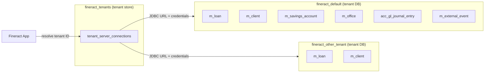

Fineract uses a **two-database architecture** that separates cluster-level tenant metadata from each tenant's full operational schema. A single `fineract_tenants` database (the *tenant store*) holds one record per registered tenant, including the JDBC connection parameters for that tenant's dedicated database. At runtime, the platform resolves the active tenant from the HTTP `fineract-Platform-TenantId` header or OAuth2 claim, looks up its connection details in the tenant store, and switches all subsequent JPA and JDBC operations to that tenant's own PostgreSQL database. This design means schemas grow or change independently for each tenant, and a bad migration on one tenant never touches another.

## Tenant Store vs. Tenant Database

<CardGroup cols={2}>
  <Card title="fineract_tenants (tenant store)" icon="database">
    Contains `tenant_server_connections` and associated tables that record hostnames, ports, credentials, and encryption keys for every registered tenant. Migrations are managed by the `tenant-store` Liquibase context.
  </Card>
  <Card title="fineract_default (per-tenant DB)" icon="table">
    Contains hundreds of business tables (`m_loan`, `m_client`, `acc_gl_account`, etc.). Each tenant database is migrated independently under the `tenant_db` Liquibase context.
  </Card>
</CardGroup>

Tenant connection details are encapsulated by `FineractPlatformTenant` and `FineractPlatformTenantConnection` in `fineract-core/src/main/java/org/apache/fineract/infrastructure/core/domain/`. The tenant store's `initial-switch-changelog-tenant-store.xml` and `changelog-tenant-store.xml` (under `fineract-provider/src/main/resources/db/changelog/tenant-store/`) govern schema changes to the tenant store itself. The parts directory currently contains 12 numbered changesets (0001–0012), covering the initial schema, password encryption, read-only connection fields, datetime precision, and OIDC configuration.

## Table Naming Conventions

Every business table in a tenant database is prefixed with `m_` (for "model"). Lookup/reference tables use `r_`, general-ledger tables use `acc_`, Spring Batch tables use `BATCH_`, and interoperation tables use `interop_`. This convention has been in place since the initial MySQL schema and is preserved across the PostgreSQL migration.

```
m_*          – core domain entities (loans, clients, savings, charges, etc.)
r_*          – reference / enum value tables
acc_*        – accounting / general ledger tables
BATCH_*      – Spring Batch metadata tables
interop_*    – interoperation identifier and transaction tables
```

## Key Table Groups by Domain

### Portfolio / Lending

| Table | Purpose |
|---|---|
| `m_loan` | Core loan entity; stores disbursed amount, status, product, and business dates |
| `m_loan_transaction` | Individual loan cash-flow events (repayment, disbursement, accrual, etc.) |
| `m_loan_repayment_schedule` | Per-installment repayment schedule with principal/interest breakdown |
| `m_loan_charge` | Charges attached to a loan |
| `m_loan_arrears_aging` | Aging snapshot for delinquency reporting |
| `m_product_loan` | Loan product definitions |

### Savings & Deposits

| Table | Purpose |
|---|---|
| `m_savings_account` | Savings account header with balance, status, and activation date |
| `m_savings_account_transaction` | Individual savings transactions (deposit, withdrawal, interest posting, etc.) |
| `m_savings_product` | Savings product definitions |
| `m_deposit_account_term_and_preclosure` | Fixed/recurring deposit term details |

### Clients, Groups & Offices

| Table | Purpose |
|---|---|
| `m_client` | Individual or corporate client record |
| `m_group` | Group or center entity |
| `m_group_client` | Many-to-many mapping of clients to groups |
| `m_office` | Office/branch hierarchy node |
| `m_staff` | Loan officer and staff records |

### General Ledger & Accounting

| Table | Purpose |
|---|---|
| `acc_gl_account` | Chart of accounts entry |
| `acc_gl_journal_entry` | Double-entry journal entry lines |
| `acc_product_mapping` | Accounting product-to-GL-account mapping |
| `acc_gl_journal_entry_annual_summary` | Pre-aggregated annual summary for reporting (added in part 0158) |

### Security & Configuration

| Table | Purpose |
|---|---|
| `m_appuser` | Platform user with hashed credentials and role assignments |
| `m_role` | Named role entity |
| `m_permission` | Named permission string |
| `c_configuration` | Global platform configuration key-value store |
| `m_external_event_configuration` | Per-event-type enabled flag for the outbox publisher |

### Events & Jobs

| Table | Purpose |
|---|---|
| `m_external_event` | Outbox table for serialized domain events awaiting Kafka/JMS dispatch |
| `m_loan_account_locks` | COB lock records; prevents concurrent processing of a loan |
| `BATCH_JOB_EXECUTION` | Spring Batch job execution metadata |
| `BATCH_STEP_EXECUTION` | Spring Batch step execution metadata |

## Schema Diagram (Two-Database Model)



## Read-Only Datasource

Since part `0004_readonly_database_connection.xml` in the tenant-store migration, each `tenant_server_connections` record can carry a separate read-only host, port, username, password, and database name. The application properties expose these as:

```properties
fineract.tenant.read-only-host=${FINERACT_DEFAULT_TENANTDB_RO_HOSTNAME:}
fineract.tenant.read-only-port=${FINERACT_DEFAULT_TENANTDB_RO_PORT:}
fineract.tenant.read-only-username=${FINERACT_DEFAULT_TENANTDB_RO_UID:}
fineract.tenant.read-only-password=${FINERACT_DEFAULT_TENANTDB_RO_PWD:}
fineract.tenant.read-only-name=${FINERACT_DEFAULT_TENANTDB_RO_NAME:}
```

When configured, read-path JDBC queries (report fetches, read platform services) are directed to the read replica, reducing load on the primary. Connection pool settings (`min-pool-size`, `max-pool-size`, `leak-detection-threshold`) apply independently to the read-only pool via `fineract.tenant.config.*`.

## Related Pages

- [Liquibase Migrations](/data/liquibase-migrations) — how table changes are applied at startup
- [JPA Entities and Repositories](/data/jpa-repositories) — Java entity classes that map to these tables
- [External Events](/messaging/external-events) — how `m_external_event` is written and consumed
