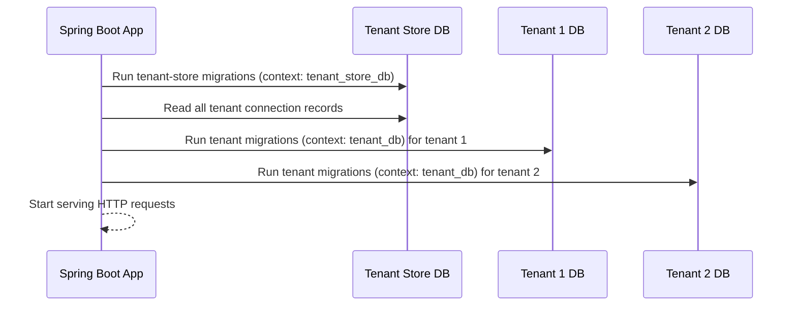

Fineract uses Liquibase to manage every schema change across both the tenant store database and per-tenant operational databases. All changelogs live under `fineract-provider/src/main/resources/db/changelog/` and are executed automatically when the Spring Boot application starts. The entry point is `db.changelog-master.xml`, which uses Liquibase *contexts* to route changesets to the correct database type — `tenant_store_db` for the tenant registry and `tenant_db` for per-tenant schemas. This context-driven routing means a single application startup can migrate both databases without any manual intervention, yet keeps their schemas entirely independent.

## Changelog Directory Structure

```
fineract-provider/src/main/resources/db/changelog/
├── db.changelog-master.xml          # Root entry point; context-routes to sub-files
├── tenant/
│   ├── initial-switch-changelog-tenant.xml   # Used on first migration (initial_switch context)
│   ├── changelog-tenant.xml                  # Main tenant changelog; includes all parts
│   ├── final-changelog-tenant.xml            # Post-module finalization changesets
│   ├── parts/
│   │   ├── 0001_initial_schema.xml           # Full initial schema creation
│   │   ├── 0002_initial_data.xml             # Seed data
│   │   ├── 0003_postgresql_specific_initial_data.xml
│   │   ├── ...
│   │   └── 0236_...xml                       # Latest incremental change
│   └── upgrades/
│       ├── 0000_upgrade_to_1.5.xml
│       └── 0000_upgrade_to_1.6.xml
└── tenant-store/
    ├── initial-switch-changelog-tenant-store.xml
    ├── changelog-tenant-store.xml
    ├── parts/
    │   ├── 0001_initial_schema.xml
    │   ├── ...
    │   └── 0012_m_tenant_oidc_config.xml
    └── upgrades/
```

## The Master Changelog and Contexts

`db.changelog-master.xml` includes sub-changelogs conditioned on Liquibase contexts:

```xml
<include file="tenant-store/changelog-tenant-store.xml"
         context="tenant_store_db AND !initial_switch"/>
<include file="tenant/changelog-tenant.xml"
         context="tenant_db AND !initial_switch"/>
<!-- Module changelogs (investor, savings, loan, etc.) -->
<include file="db/changelog/tenant/module/investor/module-changelog-master.xml"
         context="tenant_db AND !initial_switch"/>
```

The `initial_switch` context is used for brownfield migrations — upgrading a database that was originally created without Liquibase tracking. When `initial_switch` is active, an alternate changelog marks all historical changesets as already run without re-executing their SQL. Normal incremental migrations run under `!initial_switch`.

## Per-Tenant Execution

The platform executes Liquibase separately for each tenant at startup. The tenant connection details — JDBC URL, credentials, schema name — are read from the tenant store, and a dedicated `SpringLiquibase` bean is configured for each tenant. This means every tenant database is independently brought up to the current schema version before the application begins serving requests. The relevant configuration is wired in the `FineractLiquibaseOnlyApplicationConfiguration` class (part of the provider's Spring Boot auto-configuration).

For a three-tenant deployment the startup sequence looks like this:



## Numbering Convention for Part Files

Each incremental changeset file follows the format `NNNN_description.xml` where `NNNN` is a zero-padded four-digit sequence number. The number is globally unique within the `parts/` directory for that database type. Changesets within a file typically use a simple author `fineract` and a sequential `id` starting from `1`.

```xml
<!-- Example: fineract-provider/src/main/resources/db/changelog/tenant/parts/0043_add_external_event_table.xml -->
<databaseChangeLog ...>
    <changeSet author="fineract" id="1">
        <createTable tableName="m_external_event">
            <column autoIncrement="true" name="id" type="BIGINT">
                <constraints nullable="false" primaryKey="true"/>
            </column>
            <column name="type" type="VARCHAR(100)">
                <constraints nullable="false"/>
            </column>
            <column name="data" type="BLOB">
                <constraints nullable="false"/>
            </column>
            <column name="status" type="VARCHAR(100)">
                <constraints nullable="false"/>
            </column>
            <column name="idempotency_key" type="uuid">
                <constraints nullable="false"/>
            </column>
            <column name="business_date" type="date">
                <constraints nullable="false"/>
            </column>
        </createTable>
    </changeSet>
</databaseChangeLog>
```

## How to Write a New Migration

<Steps>
  <Step title="Determine the target database">
    Decide whether your change belongs to the tenant schema (business tables) or the tenant store (tenant registry tables). Almost all feature work targets the tenant schema.
  </Step>
  <Step title="Pick the next sequence number">
    Find the highest existing number in `tenant/parts/` and increment by one. As of the current codebase the latest is `0236_*`.
  </Step>
  <Step title="Create the changeset file">
    Create `NNNN_description_of_change.xml` in `fineract-provider/src/main/resources/db/changelog/tenant/parts/`. Use `author="fineract"` and start `id` at `1` for the first changeset in the file.
  </Step>
  <Step title="Include it in changelog-tenant.xml">
    Add an `<include>` line to `changelog-tenant.xml` at the end of the existing list:
    ```xml
    <include file="parts/NNNN_description.xml" relativeToChangelogFile="true"/>
    ```
  </Step>
  <Step title="Test the migration">
    Run `./gradlew fineract-provider:bootRun` against a clean or existing PostgreSQL instance. Liquibase will apply only the new changeset. Verify with `SELECT * FROM DATABASECHANGELOG ORDER BY DATEEXECUTED DESC LIMIT 5;`.
  </Step>
</Steps>

<Warning>
Never modify the SQL inside an already-applied changeset. Liquibase checksums the changeset XML and will throw `CheckSum` validation errors on the next startup. Always add a new changeset for corrections.
</Warning>

## Upgrade Path Files

The `upgrades/` subdirectory contains special changelogs for upgrading from older unmanaged schema versions:

- `0000_upgrade_to_1.5.xml` — migration path from pre-1.5 schemas
- `0000_upgrade_to_1.6.xml` — migration path from 1.5 to 1.6 schemas

These are applied under a custom Liquibase context and are not part of the default incremental migration chain. They bridge the gap for databases created before Liquibase tracking was introduced.

## Module Changelogs

As of the current master changelog, separate module-level changelogs are included after the core tenant changelog. These allow sub-modules (`fineract-investor`, `fineract-savings`, etc.) to own their own migration sequences independently:

```
db/changelog/tenant/module/loan/module-changelog-master.xml
db/changelog/tenant/module/investor/module-changelog-master.xml
db/changelog/tenant/module/savings/parts/module-changelog-master.xml
db/changelog/tenant/module/progressiveloan/module-changelog-master.xml
db/changelog/tenant/module/loanorigination/module-changelog-master.xml
db/changelog/tenant/module/command/module-changelog-master.xml
db/changelog/tenant/module/workingcapitalloan/module-changelog-master.xml
```

A `final-changelog-tenant.xml` is included last to allow cross-module finalization steps (foreign keys, final constraints — see part `0146_add_final_constraints.xml`).

## Related Pages

- [Database Schema](/data/database-schema) — table groups and naming conventions
- [JPA Entities and Repositories](/data/jpa-repositories) — Java entity classes that map to these tables
