Apache Fineract uses a Gradle multi-project build spanning over 30 subprojects, all coordinated from a single root `build.gradle`. The build targets Java 21 with Spring Boot 3.5 and enforces a layered quality pipeline — Spotless formatting, SpotBugs, Modernizer, Error Prone, and Apache RAT — before any artifact ships. Developers interact primarily with `./gradlew build` for a full verifying build or `./gradlew :fineract-provider:devRun` for a fast iteration loop that skips quality checks.

## Project Structure

The root `settings.gradle` declares every subproject and integrates with [Develocity](https://develocity.apache.org) for remote build caching:

```groovy
// settings.gradle (excerpt)
plugins {
    id 'com.gradle.develocity' version '3.18.2'
    id 'com.gradle.common-custom-user-data-gradle-plugin' version '2.6.0'
}

develocity {
    projectId = "fineract"
    server = "https://develocity.apache.org"
}

rootProject.name = 'fineract'
include ':fineract-core'
include ':fineract-security'
include ':fineract-cob'
include ':fineract-provider'
include ':fineract-loan'
include ':fineract-savings'
include ':fineract-war'
include ':integration-tests'
include ':fineract-e2e-tests-core'
include ':fineract-e2e-tests-runner'
// ... 30+ additional subprojects
```

The root `build.gradle` partitions subprojects into three typed lists controlled by `ext` properties:

| Variable | Purpose |
|---|---|
| `fineractJavaProjects` | All subprojects that receive the full Java toolchain, quality plugin, and test configuration |
| `fineractPublishProjects` | Subprojects published to Apache Maven repositories |

```mermaid
graph TD
    Root[":fineract (root)"]
    Root --> Core[":fineract-core"]
    Root --> Security[":fineract-security"]
    Root --> Provider[":fineract-provider"]
    Root --> Loan[":fineract-loan"]
    Root --> Savings[":fineract-savings"]
    Root --> COB[":fineract-cob"]
    Root --> War[":fineract-war"]
    Root --> ITest[":integration-tests"]
    Root --> E2ECore[":fineract-e2e-tests-core"]
    Root --> E2ERunner[":fineract-e2e-tests-runner"]
    Root --> Client[":fineract-client"]
    Root --> ClientFeign[":fineract-client-feign"]
    Root --> Custom[":custom:docker"]
```

| `fineractCustomProjects` | Dynamically discovered projects under `custom/<company>/<category>/<module>/` |



## buildSrc: Convention Plugin

All dependency versions and BOM imports for Java subprojects are centralised in `buildSrc/src/main/groovy/org.apache.fineract.dependencies.gradle`. This is applied to every `fineractJavaProject` via:

```groovy
apply from: "${rootDir}/buildSrc/src/main/groovy/org.apache.fineract.dependencies.gradle"
```

The file uses the Spring Dependency Management plugin to import a curated set of BOMs:

```groovy
// buildSrc/src/main/groovy/org.apache.fineract.dependencies.gradle (excerpt)
dependencyManagement {
    imports {
        mavenBom 'org.springframework.boot:spring-boot-dependencies:3.5.14'
        mavenBom 'org.junit:junit-bom:5.14.4'
        mavenBom 'io.cucumber:cucumber-bom:7.34.3'
        mavenBom 'com.fasterxml.jackson:jackson-bom:2.21.3'
        mavenBom 'org.testcontainers:testcontainers-bom:1.21.4'
        mavenBom 'io.opentelemetry:opentelemetry-bom:1.62.0'
        mavenBom 'org.mockito:mockito-bom:5.23.0'
    }
    dependencies {
        dependency 'org.projectlombok:lombok:1.18.46'
        dependency 'org.mapstruct:mapstruct:1.6.3'
        dependency 'org.liquibase:liquibase-core:4.33.0'
        dependency 'org.postgresql:postgresql:42.7.11'
        // ... all pinned dependency versions
    }
}
```

Pinning above the Spring BOM enables independent upgrades via Renovate Bot, which auto-proposes PRs when newer versions appear on Maven Central.

## Java Toolchain

Every `fineractJavaProject` configures the Java toolchain to language version 21:

```groovy
java {
    toolchain {
        languageVersion = JavaLanguageVersion.of(21)
    }
    withSourcesJar()
    withJavadocJar()
}
```

The Gradle daemon is configured in `gradle.properties` with `-Xmx12g` and the necessary `--add-exports` / `--add-opens` for JDK modules required by EclipseLink static weaving and the Error Prone annotation processor:

```properties
org.gradle.jvmargs=-Xmx12g \
  --add-exports jdk.compiler/com.sun.tools.javac.api=ALL-UNNAMED \
  --add-exports jdk.compiler/com.sun.tools.javac.tree=ALL-UNNAMED \
  ...
org.gradle.caching=true
org.gradle.parallel=true
```

## Key Gradle Tasks

<AccordionGroup>
  <Accordion title="./gradlew build">
    Full build including all quality checks (Spotless, SpotBugs, Modernizer, Error Prone, RAT, license headers) and unit tests. The `check` task is wired to depend on `rat`, `licenseMain`, and `licenseTest`.
  </Accordion>

  <Accordion title="./gradlew :fineract-provider:bootRun">
    Starts the Spring Boot application using the embedded Tomcat server. Sets `-Dspring.output.ansi.enabled=ALWAYS`. Defined in `fineract-provider/build.gradle`:

    ```groovy
    bootRun {
        jvmArgs = ["-Dspring.output.ansi.enabled=ALWAYS"]
    }
    springBoot {
        mainClass = 'org.apache.fineract.ServerApplication'
    }
    ```
  </Accordion>

  <Accordion title="./gradlew :fineract-provider:devRun">
    Development-mode boot run that dynamically disables Checkstyle, Spotless, SpotBugs, Javadoc, Modernizer, and Error Prone when detected in the task graph — useful for fast iteration:

    ```groovy
    tasks.register('devRun', org.springframework.boot.gradle.tasks.run.BootRun) {
        description = 'Runs the application quickly for development by skipping quality checks'
        gradle.taskGraph.whenReady { graph ->
            if (graph.hasTask(devRun)) {
                tasks.matching { task ->
                    task.name in ['checkstyleMain', 'spotlessCheck', 'spotbugsMain', 'modernizer']
                }.configureEach { enabled = false }
                tasks.withType(JavaCompile).configureEach {
                    options.errorprone.enabled = false
                }
            }
        }
        classpath = bootRun.classpath
        mainClass = bootRun.mainClass
    }
    ```
  </Accordion>

  <Accordion title="./gradlew :fineract-provider:createPGDB">
    Creates a PostgreSQL database using a direct JDBC connection. Requires `-PdbName=<name>` and optionally `-PpgUser` / `-PpgPassword`. Counterpart `dropPGDB` also exists.

    ```groovy
    tasks.register('createPGDB') {
        description = "Creates the PostgreSQL Database. Needs -PdbName=someDBname"
        doLast {
            def sql = Sql.newInstance('jdbc:postgresql://localhost:5432/', pgUser, pgPassword, 'org.postgresql.Driver')
            sql.execute('create database ' + "$dbName")
        }
    }
    ```
  </Accordion>

  <Accordion title="./gradlew :fineract-provider:jibDockerBuild">
    Builds a Docker image locally via JIB without a Docker daemon. Used in CI: `./gradlew --no-daemon :fineract-provider:jibDockerBuild -Djib.to.image=$IMAGE_NAME`. See [Docker & K8s →](/deployment/docker-kubernetes).
  </Accordion>
</AccordionGroup>

## WAR vs. Executable JAR

Fineract produces two deployable artifacts:

**Executable JAR** — assembled by the Spring Boot `bootJar` task in `fineract-provider`:

```groovy
bootJar {
    duplicatesStrategy = DuplicatesStrategy.EXCLUDE
    manifest {
        attributes(
            'Main-Class': 'org.springframework.boot.loader.launch.PropertiesLauncher',
            'Implementation-Title': 'Apache Fineract',
            'Implementation-Version': project.version
        )
    }
    archiveClassifier = ''
}
```

**WAR** — assembled by the dedicated `:fineract-war` subproject, which applies the `war` plugin and produces `fineract-provider.war` with archiveName set explicitly:

```groovy
// fineract-war/build.gradle
apply plugin: 'war'
war {
    archiveFileName = 'fineract-provider.war'
}
```

The WAR target is used by the Cargo plugin in the `:integration-tests` module for Tomcat-based deployments.

## Code Quality Plugins

All `fineractJavaProjects` apply the following quality toolchain:

| Plugin | Version | Configuration |
|---|---|---|
| `com.diffplug.spotless` | 6.25.0 | Eclipse formatter `config/fineractdev-formatter.xml`, sorted imports, modifier ordering enforcer |
| `com.github.spotbugs` | 6.5.4 | HTML reports via `fancy-hist.xsl`; exclusion filter at `config/spotbugs/exclude.xml` |
| `com.github.andygoossens.modernizer` | 1.13.0 | Fails on obsolete APIs; `includeTestClasses = true` |
| `net.ltgt.errorprone` | 4.4.0 | Error Prone 2.49.0; promoted ~40 checks to `error` level; active only during `build` or `check` |
| `org.nosphere.apache.rat` | 0.8.1 | Apache Release Audit Tool; checks license headers |
| `com.github.hierynomus.license` | 0.16.1 | Enforces Apache license header in all Java sources |
| `jacoco` | 0.8.14 | Generates HTML + XML reports under `build/reports/jacoco` |
| `checkstyle` | 13.4.2 + `sevntu-checks:1.44.1` | Applied to all Java source sets |

Error Prone `error`-level checks worth knowing: `DefaultCharset`, `BigDecimalEquals`, `WildcardImport`, `StreamResourceLeak`, `CatchAndPrintStackTrace`, `EmptyCatch`.

## GitHub Actions CI

The primary integration pipeline is `.github/workflows/build-postgresql.yml`. It fans out to **15 parallel shards** on `ubuntu-24.04` runners, each with a 90-minute timeout:

```yaml
strategy:
  fail-fast: false
  matrix:
    shard_index: [ 1, 2, 3, 4, 5, 6, 7, 8, 9, 10, 11, 12, 13, 14, 15 ]
    total_shards: [ 15 ]
```

Each shard:
1. Downloads the pre-built workspace artifact from a preceding `build-core` job.
2. Builds the Docker image via `./gradlew :fineract-provider:jibDockerBuild`.
3. Starts the PostgreSQL database and Fineract containers.
4. Polls `https://localhost:8443/fineract-provider/actuator/health` until ready.
5. Runs the allocated test slice (generated by `scripts/split-tests.sh`).
6. Uploads test reports and Docker logs on failure.

Additional workflows cover MariaDB (`build-mariadb.yml`), MySQL (`build-mysql.yml`), Cucumber E2E (`build-cucumber.yml`), code quality (`build-quality-checks.yml`), and Docker publishing (`build-docker.yml`).

The Develocity build scan integration is configured in `settings.gradle`:

```groovy
develocity {
    projectId = "fineract"
    server = "https://develocity.apache.org"
    buildScan {
        uploadInBackground = !isCI
        publishing.onlyIf { it.authenticated }
    }
}
```

Scans are published only when the `DEVELOCITY_ACCESS_KEY` secret is available, keeping public forks unaffected.

## Version Strategy

Versions are derived from Git tags via the `me.qoomon.git-versioning` plugin:

```groovy
gitVersioning.apply {
    refs {
        branch("release\\/\\d+\\.\\d+\\.\\d+") {
            version = '${describe.tag.version.major}.${describe.tag.version.minor}.${describe.tag.version.patch}'
        }
        tag("(\\d+\\.\\d+\\.\\d+)") {
            version = '${describe.tag.version.major}.${describe.tag.version.minor}.${describe.tag.version.patch}'
        }
    }
    rev {
        version = '${describe.tag.version.major}.${describe.tag.version.minor.next}.0-SNAPSHOT'
    }
}
```

Snapshot builds use the next minor version number. The CycloneDX SBOM plugin (`org.cyclonedx.bom:3.2.4`) generates a Bill of Materials for the assembled application artifact.

---

**See also:** [Docker & Kubernetes →](/deployment/docker-kubernetes) · [Configuration Reference →](/deployment/configuration-reference) · [Integration Tests →](/testing/integration-tests)
