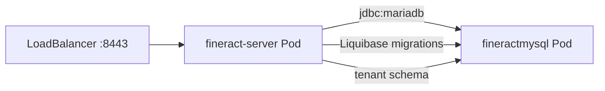

Fineract ships multiple Docker Compose configurations that cover different database backends and messaging topologies. All compose files are **for testing only** — production deployments should harden TLS, secrets management, and resource limits before use. The canonical Docker image is `apache/fineract`, built without a Docker daemon using Google JIB, and published to Docker Hub from the CI pipeline. For orchestrated deployments, a Kubernetes manifest at `kubernetes/fineract-server-deployment.yml` defines a Service and Deployment suitable as a starting point.

## Docker Image: JIB Build

The image is built by the `com.google.cloud.tools.jib` plugin applied in `fineract-provider/build.gradle`. It uses `azul/zulu-openjdk-alpine:21` as the base and runs as `nobody:nogroup`:

```groovy
// fineract-provider/build.gradle
jib {
    from {
        image = 'azul/zulu-openjdk-alpine:21'
        platforms {
            platform {
                architecture = System.getProperty("os.arch").equals("aarch64") ? "arm64" : "amd64"
                os = 'linux'
            }
        }
    }
    to {
        image = 'fineract'
        tags = ["${project.version}", 'latest']
    }
    container {
        creationTime = 'USE_CURRENT_TIMESTAMP'
        mainClass = 'org.apache.fineract.ServerApplication'
        extraClasspath = ['/app/plugins/*']
        args = [
            '-Duser.home=/tmp',
            '-Dfile.encoding=UTF-8',
            '-Duser.timezone=UTC',
            '-Djava.security.egd=file:/dev/./urandom'
        ]
        ports = ['8080/tcp', '8443/tcp']
        user = 'nobody:nogroup'
    }
}
```

`jib.dependsOn(bootJar, resolve, generateGitProperties)` ensures the OpenAPI spec and Git metadata are baked into the image.

To build locally (no Docker daemon needed):

```bash
./gradlew :fineract-provider:jibDockerBuild
```

To push to a registry:

```bash
./gradlew :fineract-provider:jib \
  -Djib.to.image=apache/fineract \
  -Djib.to.tags=latest,1.9.0
```

### Custom Image

The `:custom:docker` subproject (`custom/docker/build.gradle`) produces a `fineract-custom` image that bundles all modules discovered under `custom/<company>/`:

```groovy
// custom/docker/build.gradle
jib {
    from { image = 'azul/zulu-openjdk-alpine:21' }
    to {
        image = 'fineract-custom'
        tags = ["${project.version}", 'latest']
    }
    container {
        mainClass = 'org.apache.fineract.ServerApplication'
        ports = ['8080/tcp', '8443/tcp']
        user = 'nobody:nogroup'
    }
}
```

## Docker Compose Files

All compose files extend shared service fragments from `config/docker/compose/` and read environment variables from `config/docker/env/`.

### `docker-compose.yml` — Standard PostgreSQL

The simplest compose file for a single-node Fineract + PostgreSQL stack:

```yaml
# docker-compose.yml
services:
  db:
    extends:
      file: ./config/docker/compose/postgresql.yml
      service: postgresql

  fineract:
    extends:
      file: ./config/docker/compose/fineract.yml
      service: fineract
    ports:
      - "8443:8443"
      - "5000:5000"        # debug port
    depends_on:
      db:
        condition: service_healthy
    env_file:
      - ./config/docker/env/fineract.env
      - ./config/docker/env/fineract-common.env
      - ./config/docker/env/fineract-postgresql.env
```

The shared PostgreSQL service uses `postgres:18.3` with a health check via `pg_isready`. The shared Fineract service fragment (`config/docker/compose/fineract.yml`) mounts `config/docker/logback/logback-override.xml` and sets a `healthcheck` that polls `nc -z localhost 8443`.

### `docker-compose-postgresql.yml` — PostgreSQL (versioned)

Functionally identical to `docker-compose.yml` but pinned with `version: "3.8"`. Used as the basis for integration test sharding in `docker-compose-postgresql-test.yml`. The exposed port is 8443 only (no debug port).

### `docker-compose-postgresql-kafka.yml` — Manager/Worker Split + Kafka

Introduces the distributed topology with a `fineract-manager` node and two `fineract-worker` replicas connected via Apache Kafka:

```yaml
# docker-compose-postgresql-kafka.yml (excerpt)
services:
  kafka:
    image: "apache/kafka:4.2.0-rc2"
    ports:
      - "9092:9092"
    env_file:
      - ./config/docker/env/kafka-server.env

  fineract-manager:
    extends:
      file: ./config/docker/compose/fineract.yml
      service: fineract
    ports:
      - "8443:8443"
    depends_on:
      db:
        condition: service_healthy
      kafka:
        condition: service_started
    env_file:
      - ./config/docker/env/fineract-manager.env
      - ./config/docker/env/fineract-common.env
      - ./config/docker/env/fineract-postgresql.env
      - ./config/docker/env/kafka-client.env

  fineract-worker:
    extends:
      file: ./config/docker/compose/fineract.yml
      service: fineract
    deploy:
      mode: replicated
      replicas: 2
    ports:
      - "8444-8445:8443"
    depends_on:
      fineract-manager:
        condition: service_healthy
    env_file:
      - ./config/docker/env/fineract-worker.env
      - ./config/docker/env/fineract-common.env
      - ./config/docker/env/fineract-postgresql.env
      - ./config/docker/env/kafka-client.env
```

The manager and worker roles are differentiated by environment files:

**`config/docker/env/fineract-manager.env`**

```env
FINERACT_NODE_ID=1
FINERACT_MODE_BATCH_MANAGER_ENABLED=true
FINERACT_MODE_BATCH_WORKER_ENABLED=false
LOAN_COB_CHUNK_SIZE=10
LOAN_COB_PARTITION_SIZE=10
LOAN_COB_POLL_INTERVAL=1000
OTEL_SERVICE_NAME=fineract-manager
```

**`config/docker/env/fineract-worker.env`**

```env
FINERACT_NODE_ID=2
FINERACT_MODE_BATCH_MANAGER_ENABLED=false
FINERACT_MODE_BATCH_WORKER_ENABLED=true
OTEL_SERVICE_NAME=fineract-worker
FINERACT_LIQUIBASE_ENABLED=false
```

Workers disable Liquibase migrations (`FINERACT_LIQUIBASE_ENABLED=false`) to prevent concurrent schema changes.

### Compose File Summary

| File | Database | Messaging | Topology | Use Case |
|---|---|---|---|---|
| `docker-compose.yml` | PostgreSQL | Spring Events | Single node | Local dev |
| `docker-compose-postgresql.yml` | PostgreSQL | Spring Events | Single node | Integration tests |
| `docker-compose-postgresql-kafka.yml` | PostgreSQL | Kafka | Manager + 2 Workers | Distributed COB testing |

### PostgreSQL Connection Environment

The PostgreSQL environment file (`config/docker/env/fineract-postgresql.env`) sets the HikariCP and tenant-database coordinates that containers inject into the application:

```env
FINERACT_HIKARI_DRIVER_SOURCE_CLASS_NAME=org.postgresql.Driver
FINERACT_HIKARI_JDBC_URL=jdbc:postgresql://db:5432/fineract_tenants
FINERACT_HIKARI_USERNAME=postgres
FINERACT_HIKARI_PASSWORD=skdcnwauicn2ucnaecasdsajdnizucawencascdca
FINERACT_DEFAULT_TENANTDB_PORT=5432
FINERACT_DEFAULT_TENANTDB_UID=postgres
```

## Kubernetes Manifests

`kubernetes/fineract-server-deployment.yml` defines a `Service` (LoadBalancer, port 8443) and a `Deployment` using the `apache/fineract:latest` image. The manifest illustrates the expected environment variables and liveness/readiness probe configuration.

### Liveness and Readiness Probes

```yaml
livenessProbe:
  httpGet:
    path: /fineract-provider/actuator/health/liveness
    port: 8443
    scheme: HTTPS
  initialDelaySeconds: 90
  periodSeconds: 10
  failureThreshold: 3

readinessProbe:
  httpGet:
    path: /fineract-provider/actuator/health/readiness
    port: 8443
    scheme: HTTPS
  initialDelaySeconds: 60
  periodSeconds: 10
  failureThreshold: 3
```

Both probes use HTTPS against the Actuator endpoints enabled by `management.health.livenessState.enabled=true` and `management.health.readinessState.enabled=true` in `application.properties`.

### Resource Requests and Limits

The manifest ships with conservative defaults — tune these for production:

```yaml
resources:
  limits:
    cpu: "1000m"
    memory: "2Gi"
  requests:
    cpu: "200m"
    memory: "1Gi"
```

The container sets `JAVA_TOOL_OPTIONS: '-Xmx1G -XX:MaxMetaspaceSize=256m'` to constrain JVM heap within the memory limit.

### Key Environment Variables in the Deployment Manifest

```yaml
env:
- name: FINERACT_NODE_ID
  value: '1'
- name: FINERACT_HIKARI_DRIVER_CLASS_NAME
  value: org.mariadb.jdbc.Driver
- name: FINERACT_HIKARI_JDBC_URL
  value: jdbc:mariadb://fineractmysql:3306/fineract_tenants
- name: FINERACT_HIKARI_USERNAME
  valueFrom:
    secretKeyRef:
      name: fineract-tenants-db-secret
      key: username
- name: FINERACT_HIKARI_PASSWORD
  valueFrom:
    secretKeyRef:
      name: fineract-tenants-db-secret
      key: password
- name: FINERACT_DEFAULT_TENANTDB_HOSTNAME
  value: fineractmysql
- name: FINERACT_DEFAULT_TENANTDB_PORT
  value: '3306'
```

The manifest uses a Kubernetes `Secret` named `fineract-tenants-db-secret` for credentials. An `initContainer` waits for the MySQL/MariaDB service to be reachable on port 3306 using `netcat` before the main container starts.

### Additional Kubernetes Files

| File | Purpose |
|---|---|
| `kubernetes/fineract-server-deployment.yml` | Service + Deployment for Fineract server |
| `kubernetes/fineractmysql-deployment.yml` | MySQL Deployment for tenant databases |
| `kubernetes/fineractmysql-configmap.yml` | MySQL init configuration |
| `kubernetes/fineract-mifoscommunity-deployment.yml` | Community web UI deployment |
| `kubernetes/kubectl-startup.sh` | Applies manifests in dependency order |
| `kubernetes/kubectl-shutdown.sh` | Tears down the entire stack |



## Health Check Endpoint

The readiness/liveness endpoints are enabled by default in `application.properties`:

```properties
management.endpoint.health.probes.enabled=true
management.health.livenessState.enabled=true
management.health.readinessState.enabled=true
management.endpoints.web.exposure.include=${FINERACT_MANAGEMENT_ENDPOINT_WEB_EXPOSURE_INCLUDE:health,info,prometheus}
```

The CI pipeline waits for Fineract with:

```bash
curl -f -k --retry 60 --retry-all-errors --connect-timeout 30 \
  --retry-delay 30 \
  https://localhost:8443/fineract-provider/actuator/health
```

The `-k` flag bypasses TLS certificate verification; the default keystore (`classpath:keystore.jks`, password `openmf`) is a self-signed certificate for development use only.

---

**See also:** [Build System →](/deployment/build-system) · [Configuration Reference →](/deployment/configuration-reference) · [Integration Tests →](/testing/integration-tests)
