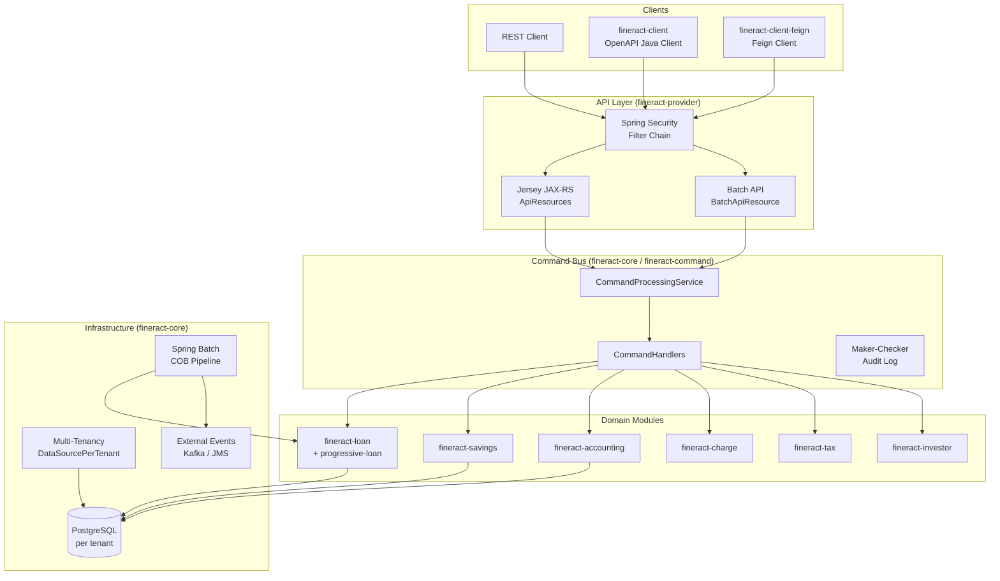

Apache Fineract is an open-source core banking platform built on Spring Boot 3.5, Spring Security, Spring Batch, and JPA/Hibernate. It is deployed as a self-contained JAR (or WAR) and exposes a Jersey (JAX-RS) REST API over HTTPS. The platform is architected as a **multi-module Gradle project** (~35 modules) organized around a command pattern, a multi-tenant data isolation model, and a Spring Batch–driven Close of Business (COB) pipeline. It is designed for financial inclusion — serving MFIs, cooperatives, and digital banks targeting underserved populations.

## High-Level Architecture

## Subsystem Map

<CardGroup cols={2}>
  <Card title="Introduction" icon="info" href="/overview/introduction">
    Project goals, repository layout, Gradle module dependency graph, and how the Spring Boot app boots.
  </Card>
  <Card title="Architecture" icon="sitemap" href="/overview/architecture">
    Layer-by-layer breakdown: API → Command Bus → Domain Services → Persistence. Request lifecycle trace.
  </Card>
  <Card title="Module Map" icon="map" href="/overview/module-map">
    Every Gradle subproject listed with its responsibilities, dependencies, and source root.
  </Card>
  <Card title="Core Infrastructure" icon="server" href="/core/fineract-core">
    `fineract-core`: shared domain types, tenant routing, serialization, pagination, and Spring wiring utilities.
  </Card>
  <Card title="Multi-Tenancy" icon="building" href="/core/multi-tenancy">
    Per-tenant database isolation, the tenant store, `DataSourcePerTenantService`, and the `Fineract-Tenant` header flow.
  </Card>
  <Card title="Command Pattern" icon="terminal" href="/core/command-pattern">
    `CommandProcessingService`, `CommandHandler` SPI, maker-checker, idempotency, and the new `fineract-command` framework.
  </Card>
  <Card title="Event System" icon="bolt" href="/core/event-system">
    Business events, `ExternalEventService`, Avro serialization, and the Kafka/JMS producer pipeline.
  </Card>
  <Card title="Batch Jobs" icon="clock" href="/core/batch-jobs">
    Spring Batch job configuration, scheduler, partitioned jobs, and the remote message handler (Kafka/JMS).
  </Card>
  <Card title="Security" icon="shield" href="/security/authentication">
    Basic Auth, OAuth2 resource server, OIDC federation, 2FA, CORS, and the `Fineract-Tenant` header filter.
  </Card>
  <Card title="Loan Engine" icon="credit-card" href="/loans/loan-module">
    `fineract-loan`: `Loan` aggregate, `LoanProduct`, transaction processing, delinquency, and COB business steps.
  </Card>
  <Card title="Progressive Loans" icon="chart-line" href="/loans/progressive-loan">
    EMI-based repayment schedule generator, progressive transaction processor, and schedule recalculation.
  </Card>
  <Card title="COB Pipeline" icon="rotate" href="/loans/cob-close-of-business">
    Close of Business Spring Batch workflow, business steps, lock manager, catch-up, and inline COB.
  </Card>
  <Card title="Savings & Deposits" icon="piggy-bank" href="/savings/savings-module">
    `fineract-savings`: savings accounts, fixed deposits, recurring deposits, interest posting, and COB.
  </Card>
  <Card title="Accounting" icon="book" href="/accounting/gl-accounts">
    `fineract-accounting`: GL chart of accounts, journal entries, accrual, provisioning, and product-account mappings.
  </Card>
  <Card title="Portfolio & Clients" icon="users" href="/portfolio/client-management">
    Client, Group, and Center management; collateral; charges; and product configuration.
  </Card>
  <Card title="API Layer" icon="code" href="/api/rest-api-overview">
    Jersey JAX-RS resource classes, OpenAPI spec generation, batch API, datatables, and report execution.
  </Card>
  <Card title="Data & Persistence" icon="database" href="/data/database-schema">
    Liquibase-managed schema, JPA entities, JDBC read paths, and the dual read/write datasource pattern.
  </Card>
  <Card title="Messaging" icon="envelope" href="/messaging/external-events">
    External event publishing pipeline: Kafka, JMS (ActiveMQ), Avro schemas, and outbox pattern.
  </Card>
  <Card title="Build & Deployment" icon="rocket" href="/deployment/build-system">
    Gradle multi-project build, Docker Compose configs, Kubernetes manifests, and environment properties.
  </Card>
</CardGroup>

## Where to Start

For a cold orientation, read in this order:

1. **[Architecture Overview](/overview/architecture)** — understand the full request lifecycle from HTTP → Command → Domain → DB.
2. **[ServerApplication.java](https://github.com/apache/fineract/blob/develop/fineract-provider/src/main/java/org/apache/fineract/ServerApplication.java)** — Spring Boot entry point; imports `FineractWebApplicationConfiguration`.
3. **[application.properties](https://github.com/apache/fineract/blob/develop/fineract-provider/src/main/resources/application.properties)** — all `fineract.*` configuration keys with defaults.
4. **[Command Pattern](/core/command-pattern)** — every write operation flows through `CommandProcessingService`; understanding this is mandatory before touching any handler.
5. **[Multi-Tenancy](/core/multi-tenancy)** — all DB queries are tenant-scoped; the `Fineract-Tenant` header drives datasource routing.
