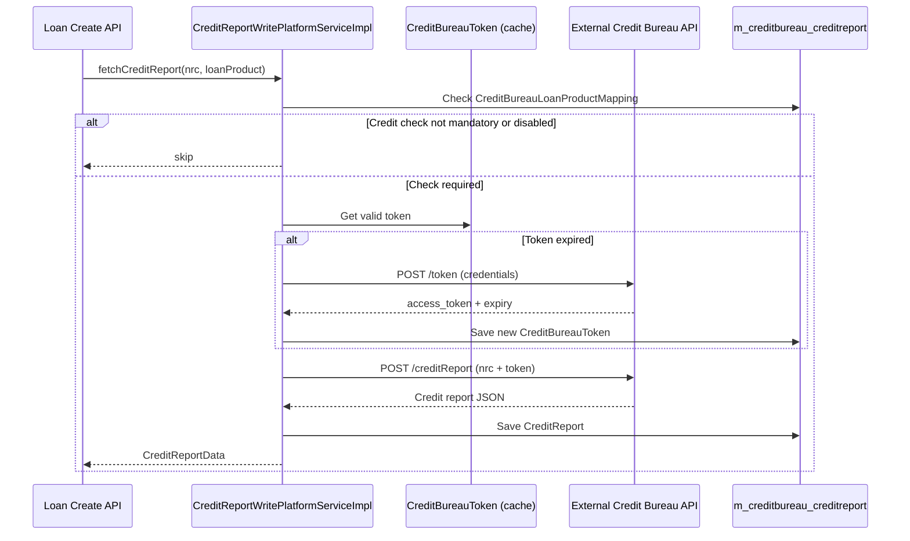

The `infrastructure.creditbureau` package provides Fineract's integration layer for external credit-bureau services. The design is **generic and pluggable**: each bureau implementation is identified by an `implementationKey` string in the `m_creditbureau` table, and the service layer dispatches to the appropriate HTTP client based on that key. An organization can register multiple bureaus, map them to different loan products, and configure per-bureau parameters (API URL, token endpoint, credentials) through the admin API without code changes.

## Package Structure

```
fineract-provider/src/main/java/org/apache/fineract/infrastructure/creditbureau/
├── api/
│   ├── CreditBureauIntegrationApiResource.java     # /v1/creditBureauIntegration
│   └── CreditBureauConfigurationApiResource.java   # /v1/creditBureauConfiguration
├── data/
│   └── CreditReportData.java                       # Read DTO for credit reports
├── domain/
│   ├── CreditBureau.java                           # m_creditbureau
│   ├── OrganisationCreditBureau.java               # m_organisation_creditbureau
│   ├── CreditBureauConfiguration.java              # m_creditbureau_configuration
│   ├── CreditBureauLoanProductMapping.java         # m_creditbureau_loanproduct_mapping
│   ├── CreditBureauToken.java                      # m_creditbureau_token
│   ├── CreditReport.java                           # m_creditbureau_creditreport
│   └── ...repositories
├── serialization/
└── service/
    ├── CreditReportWritePlatformServiceImpl.java   # Outbound HTTP to bureau
    ├── ExternalCreditBureauIntegrationWritePlatformServiceImpl.java
    └── ...
```

## Domain Entity Hierarchy

### CreditBureau

`CreditBureau` (`m_creditbureau`) is the master registry of known bureau integrations:

```java
// fineract-provider/.../creditbureau/domain/CreditBureau.java
@Entity
@Table(name = "m_creditbureau")
public class CreditBureau extends AbstractPersistableCustom<Long> {
    private String name;             // Human-readable name, e.g. "Trans Union"
    private String product;          // Product line or service tier
    private String country;          // ISO country code
    @Column(name = "implementation_key")
    private String implementationKey; // Dispatch key for the service implementation
}
```

### OrganisationCreditBureau

`OrganisationCreditBureau` (`m_organisation_creditbureau`) links a `CreditBureau` to the current organization with an alias and an active flag. An organization may activate multiple bureaus simultaneously, each with its own `alias` to disambiguate them in API responses:

```java
// fineract-provider/.../creditbureau/domain/OrganisationCreditBureau.java
@Entity
@Table(name = "m_organisation_creditbureau")
public class OrganisationCreditBureau extends AbstractPersistableCustom<Long> {
    private String alias;

    @OneToOne
    @JoinColumn(name = "creditbureau_id")
    private CreditBureau creditbureau;

    @Column(name = "is_active")
    private boolean isActive;

    @OneToMany(mappedBy = "organisation_creditbureau", cascade = CascadeType.ALL)
    private List<CreditBureauLoanProductMapping> creditBureauLoanProductMapping;
}
```

### CreditBureauConfiguration

Per-bureau key-value parameters (API endpoints, timeout values, NRC field mappings, etc.) are stored in `m_creditbureau_configuration` as `configkey`/`value` pairs linked to an `OrganisationCreditBureau`:

```java
// fineract-provider/.../creditbureau/domain/CreditBureauConfiguration.java
@Entity
@Table(name = "m_creditbureau_configuration")
public class CreditBureauConfiguration extends AbstractPersistableCustom<Long> {
    @Column(name = "configkey")
    private String configurationKey;  // e.g. "username", "addCreditReporturl"

    @Column(name = "value")
    private String value;

    @ManyToOne
    @JoinColumn(name = "organisation_creditbureau_id")
    private OrganisationCreditBureau organisationCreditbureau;
}
```

Typical configuration keys include `username`, `password`, `addCreditReporturl`, `getCreditReporturl`, `subscriptionId`, and `subscriptionKey`.

### CreditBureauLoanProductMapping

`CreditBureauLoanProductMapping` (`m_creditbureau_loanproduct_mapping`) ties a specific `OrganisationCreditBureau` to a `LoanProduct`, controlling whether credit checks are required for that product:

```java
// fineract-provider/.../creditbureau/domain/CreditBureauLoanProductMapping.java
@Entity
@Table(name = "m_creditbureau_loanproduct_mapping")
public class CreditBureauLoanProductMapping extends AbstractPersistableCustom<Long> {

    @Column(name = "is_credit_check_mandatory")
    private boolean creditCheckMandatory;     // Must pass bureau check to proceed

    @Column(name = "skip_credit_check_in_failure")
    private boolean skipCreditCheckInFailure; // Continue despite bureau connectivity failure

    @Column(name = "stale_period")
    private int stalePeriod;                  // Days before cached report is considered stale

    @Column(name = "is_active")
    private boolean active;

    @ManyToOne
    private OrganisationCreditBureau organisation_creditbureau;

    @OneToOne
    @JoinColumn(name = "loan_product_id")
    private LoanProduct loanProduct;
}
```

### CreditBureauToken

`CreditBureauToken` (`m_creditbureau_token`) caches the OAuth2 bearer token retrieved from the bureau's token endpoint, avoiding repeated authentication requests:

```java
// fineract-provider/.../creditbureau/domain/CreditBureauToken.java
@Entity
@Table(name = "m_creditbureau_token")
public class CreditBureauToken extends AbstractPersistableCustom<Long> {
    @Column(name = "username")     private String userName;
    @Column(name = "token")        private String accessToken;
    @Column(name = "token_type")   private String tokenType;
    @Column(name = "expires_in")   private String expiresIn;
    @Column(name = "expiry_date")  private LocalDate expires;
}
```

Token validity is checked against `expires` before each outbound request. If expired, `CreditReportWritePlatformServiceImpl` re-authenticates and persists a fresh `CreditBureauToken`.

### CreditReport

`CreditReport` (`m_creditbureau_creditreport`) persists the raw response payload from the bureau against a loan application, identified by NRC (national registration number) and credit bureau ID.

## REST API Resources

### CreditBureauIntegrationApiResource

Mounted at `/v1/creditBureauIntegration`. Handles live bureau lookups and credit report management:

- `POST /creditBureauIntegration` — submit a credit report request to the bureau for a given NRC number; returns `CreditReportData`
- `GET /creditBureauIntegration` — fetch previously retrieved credit reports
- `POST /creditBureauIntegration/creditReport` — upload a credit report from a file (multipart)
- `DELETE /creditBureauIntegration/{creditBureauId}/creditReport/{nrc}` — delete a cached credit report

The resource delegates to `CreditReportWritePlatformService` for outbound HTTP calls and `CreditReportReadPlatformService` for read queries.

### CreditBureauConfigurationApiResource

Mounted at `/v1/creditBureauConfiguration`. Manages the bureau registry and loan product mappings:

- `GET /creditBureauConfiguration` — list all registered credit bureaus
- `GET /creditBureauConfiguration/organisationCreditBureau` — list active organization bureaus
- `POST /creditBureauConfiguration/organisationCreditBureau` — register a bureau for the organization
- `PUT/GET /creditBureauConfiguration/{organisationCreditBureauId}` — update bureau active status or config
- `GET/POST/PUT /creditBureauConfiguration/{organisationCreditBureauId}/loanProduct` — manage loan product mappings

## Integration Flow



## Service Classes

| Class | Responsibility |
|---|---|
| `CreditReportWritePlatformServiceImpl` | Outbound HTTP to bureau; manages token refresh; persists `CreditReport` |
| `ExternalCreditBureauIntegrationWritePlatformServiceImpl` | Orchestrates the integration call, applies `skipCreditCheckInFailure` logic |
| `CreditBureauConfigurationWritePlatformServiceImpl` | CRUD for `CreditBureauConfiguration` key-value pairs |
| `CreditBureauLoanProductMappingWritePlatformServiceImpl` | CRUD for `CreditBureauLoanProductMapping` |
| `OrganisationCreditBureauWritePlatflormServiceImpl` | Register/activate `OrganisationCreditBureau` |
| `CreditBureauReadConfigurationServiceImpl` | Read configuration key-value pairs for a bureau |

## Related Pages

- [Database Schema](/data/database-schema) — `m_creditbureau*` table group
- [JPA Entities and Repositories](/data/jpa-repositories) — entity base classes and repository patterns
