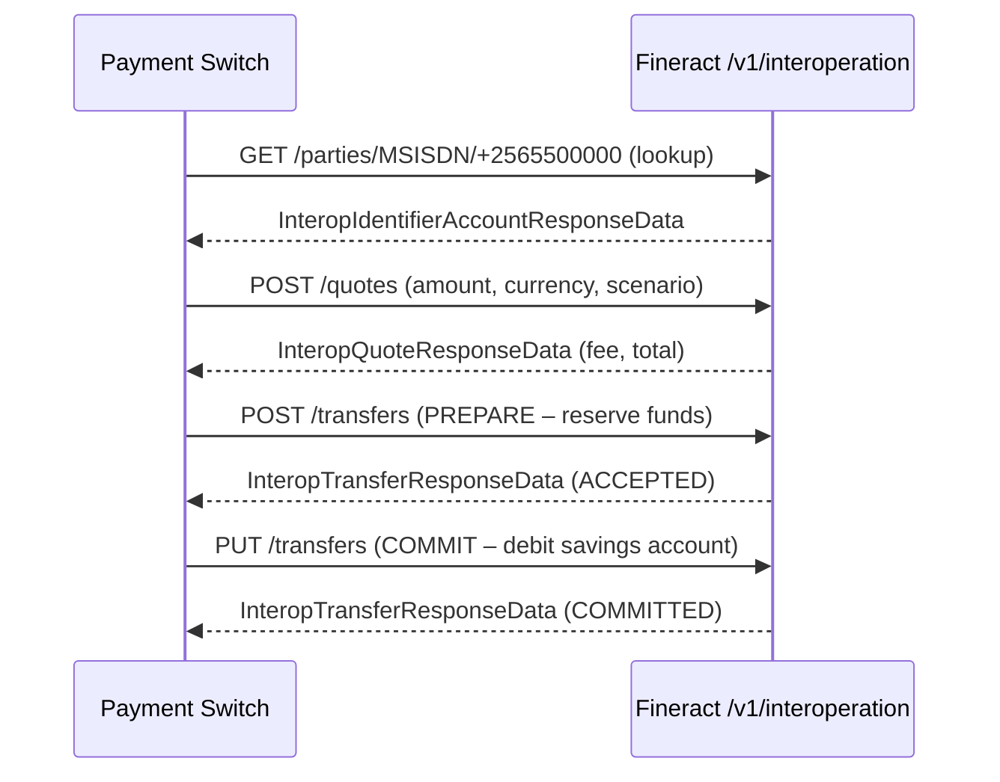

The interoperation layer positions Fineract as a **DFSP (Digital Financial Service Provider) backend** compatible with payment-switching hubs such as Mojaloop (Level One Project). It exposes a set of REST endpoints that a payment switch can call to look up account holders by external identifiers (MSISDN, email, national ID, IBAN, etc.), get transaction quotes, and commit or release fund transfers against savings accounts. The design follows the Interledger / Mojaloop FSP Interoperability API vocabulary: parties, quotes, transfers, and transaction requests are first-class concepts exposed over `/v1/interoperation`.

## Code Distribution

The interoperation feature spans two modules:

| Module | Package | Contents |
|---|---|---|
| `fineract-savings` | `org.apache.fineract.interoperation.domain` | `InteropIdentifier` JPA entity and domain enums |
| `fineract-savings` | `org.apache.fineract.interoperation.data` | `InteropIdentifierData`, `InteropAccountData` (shared DTOs) |
| `fineract-provider` | `org.apache.fineract.interoperation.domain` | `InteropIdentifierRepository` |
| `fineract-provider` | `org.apache.fineract.interoperation.api` | `InteropApiResource` (REST endpoints) |
| `fineract-provider` | `org.apache.fineract.interoperation.service` | `InteropService` / `InteropServiceImpl` |
| `fineract-provider` | `org.apache.fineract.interoperation.data` | Full DTO suite (quotes, transfers, KYC, etc.) |

## InteropIdentifier: Account Alias Registry

`InteropIdentifier` (in `fineract-savings/.../interoperation/domain/InteropIdentifier.java`) is the bridge between a payment-scheme-level identifier and a Fineract savings account. It maps to the `interop_identifier` table with two unique constraints:

```java
@Entity
@Table(name = "interop_identifier", uniqueConstraints = {
    @UniqueConstraint(name = "uk_hathor_identifier_account",
                      columnNames = { "account_id", "type" }),
    @UniqueConstraint(name = "uk_hathor_identifier_value",
                      columnNames = { "type", "a_value", "sub_value_or_type" })
})
public class InteropIdentifier extends AbstractPersistableCustom<Long> {

    @ManyToOne(optional = false)
    @JoinColumn(name = "account_id")
    private SavingsAccount account;       // The savings account this alias resolves to

    @Enumerated(EnumType.STRING)
    @Column(name = "type", length = 32)
    private InteropIdentifierType type;   // MSISDN | ACCOUNT_ID | ALIAS | EMAIL | ...

    @Column(name = "a_value", length = 128)
    private String value;                 // The actual identifier string

    @Column(name = "sub_value_or_type", length = 128)
    private String subType;               // Optional secondary qualifier

    @Column(name = "created_by")
    private String createdBy;
    @Column(name = "created_on")
    private LocalDateTime createdOn;
}
```

A single savings account can hold multiple identifiers of different types (e.g., one `MSISDN` and one `ALIAS`). The unique constraint on `(type, a_value, sub_value_or_type)` enforces that each external identifier maps to exactly one account.

## Domain Enums (fineract-savings)

| Enum | Values | Meaning |
|---|---|---|
| `InteropIdentifierType` | `MSISDN`, `EMAIL`, `PERSONAL_ID`, `ACCOUNT_ID`, `IBAN`, `ALIAS`, `CONSENT`, `THIRD_PARTY_LINK` | Identifier scheme type |
| `InteropTransactionRole` | `PAYER`, `PAYEE` | Direction of funds flow; `PAYER` maps to `WITHDRAWAL`, `PAYEE` maps to `DEPOSIT` |
| `InteropTransactionScenario` | `DEPOSIT`, `WITHDRAWAL`, `TRANSFER`, `PAYMENT`, `REFUND` | Payment scenario per Mojaloop vocabulary |
| `InteropAmountType` | `SEND`, `RECEIVE` | Whether amount is from sender or receiver perspective |
| `InteropActionState` | `ACCEPTED`, `REJECTED` | Action confirmation state |
| `InteropTransferActionType` | `PREPARE`, `COMMIT`, `ROLLBACK`, `ABORT` | Two-phase commit action |
| `InteropInitiatorType` | `CONSUMER`, `AGENT`, `BUSINESS`, `DEVICE` | Who initiated the transaction |

## InteropService: Full API Surface

`InteropService` (interface in `fineract-provider/.../interoperation/service/InteropService.java`) defines every operation:

```java
public interface InteropService {

    // Account discovery
    InteropIdentifiersResponseData getAccountIdentifiers(String accountId);
    InteropAccountData getAccountDetails(String accountId);
    InteropTransactionsData getAccountTransactions(String accountId, boolean debit,
            boolean credit, LocalDateTime from, LocalDateTime to);

    // Party lookup (by external identifier)
    InteropIdentifierAccountResponseData getAccountByIdentifier(
            InteropIdentifierType idType, String idValue, String subIdOrType);
    InteropIdentifierAccountResponseData registerAccountIdentifier(
            InteropIdentifierType idType, String idValue, String subIdOrType,
            JsonCommand command);
    InteropIdentifierAccountResponseData deleteAccountIdentifier(
            InteropIdentifierType idType, String idValue, String subIdOrType);

    // Transaction requests (pull-payment initiation)
    InteropTransactionRequestResponseData getTransactionRequest(
            String transactionCode, String requestCode);
    InteropTransactionRequestResponseData createTransactionRequest(JsonCommand command);

    // Quote (fee/FX calculation)
    InteropQuoteResponseData getQuote(String transactionCode, String quoteCode);
    InteropQuoteResponseData createQuote(JsonCommand command);

    // Transfer (two-phase commit)
    InteropTransferResponseData getTransfer(String transactionCode, String transferCode);
    InteropTransferResponseData prepareTransfer(JsonCommand command);
    InteropTransferResponseData commitTransfer(JsonCommand command);
    InteropTransferResponseData releaseTransfer(JsonCommand command);

    // KYC
    InteropKycResponseData getKyc(String accountId);

    // Loan integration
    String disburseLoan(String accountId, String apiRequestBodyAsJson);
    String loanRepayment(String accountId, String apiRequestBodyAsJson);
}
```

`InteropServiceImpl` resolves accounts from `accountId` (the savings account external ID or account number), performs savings transactions for confirmed transfers, and maps results to the DTO layer.

## REST API: InteropApiResource

Mounted at `/v1/interoperation`. Selected endpoints:

| Method | Path | Description |
|---|---|---|
| `GET` | `/health` | Returns `"OK"` — used by the payment switch for liveness checks |
| `GET` | `/accounts/{accountId}` | `InteropAccountData`: balance and account status |
| `GET` | `/accounts/{accountId}/transactions` | Filtered transaction list with debit/credit and date range |
| `GET` | `/accounts/{accountId}/identifiers` | All `InteropIdentifier` entries for an account |
| `GET` | `/parties/{idType}/{idValue}` | Look up account by external identifier |
| `GET` | `/parties/{idType}/{idValue}/{subIdOrType}` | Look up account with sub-type qualifier |
| `POST` | `/parties/{idType}/{idValue}` | Register an identifier against a savings account |
| `DELETE` | `/parties/{idType}/{idValue}` | De-register an identifier |
| `POST` | `/requests` | Create a transaction request (pull payment) |
| `GET` | `/requests/{transactionCode}/{requestCode}` | Fetch transaction request state |
| `POST` | `/quotes` | Calculate a quote (fees, FX conversion) |
| `GET` | `/quotes/{transactionCode}/{quoteCode}` | Fetch a quote |
| `POST` | `/transfers` | Prepare a two-phase transfer (reserve funds) |
| `PUT` | `/transfers` | Commit or release a prepared transfer |
| `GET` | `/transfers/{transactionCode}/{transferCode}` | Fetch transfer state |
| `GET` | `/accounts/{accountId}/kyc` | Return KYC data (client name, ID documents) |

## Two-Phase Transfer Flow



Prepare (`PREPARE`) places a hold on the savings account balance. Commit (`COMMIT`) converts the hold into a confirmed withdrawal (for `PAYER` role) or a deposit (for `PAYEE` role). Release (`ABORT`/`ROLLBACK`) removes the hold without executing the transaction.

## Data Objects

| DTO | Purpose |
|---|---|
| `InteropAccountData` | Account number, currency, status |
| `InteropIdentifierRequestData` / `InteropIdentifierAccountResponseData` | Identifier registration request/response |
| `InteropQuoteRequestData` / `InteropQuoteResponseData` | Fee calculation request/response |
| `InteropTransferRequestData` / `InteropTransferResponseData` | Transfer prepare/commit request/response |
| `InteropTransactionRequestData` | Pull-payment initiation payload |
| `InteropKycResponseData` / `InteropKycData` | KYC information (name, ID documents, address) |
| `MoneyData` | Amount + currency wrapper |
| `ExtensionData` | Key-value extension fields for Mojaloop extensibility |

## Related Pages

- [Database Schema](/data/database-schema) — `interop_identifier` table
- [JPA Entities and Repositories](/data/jpa-repositories) — entity base classes
