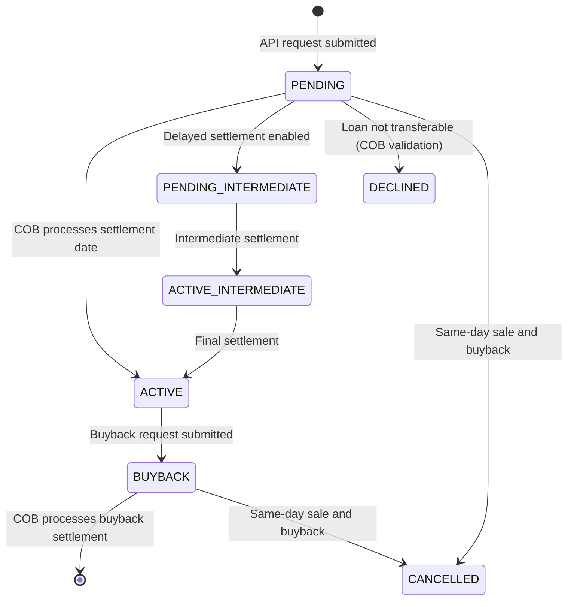

The `fineract-investor` module implements **loan asset externalization** — the mechanism by which an originating institution sells or pledges the economic ownership of a loan to an external investor or servicer while Fineract continues to service the loan. The platform tracks the history of ownership transfers, records their financial details at the point of sale or buyback, generates the corresponding general-ledger journal entries during the Close-of-Business (COB) processing, and emits `LoanOwnershipTransferBusinessEvent` domain events so downstream systems can reconcile positions.

## Module Location

```
fineract-investor/
├── src/main/java/org/apache/fineract/investor/
│   ├── accounting/journalentry/service/   # GL journal entry generation
│   ├── api/                               # REST API resources
│   │   └── search/                        # Search API
│   ├── cob/loan/                          # COB business step
│   ├── config/                            # InvestorModuleIsEnabledCondition
│   ├── data/                              # DTOs and enum types
│   ├── domain/                            # JPA entities and repositories
│   ├── service/                           # Business logic services
│   └── serialization/                     # Avro serializers for events
```

## Core Domain Entities

### ExternalAssetOwner

Represents a named external investor entity. Maps to the `m_external_asset_owner` table:

```java
// fineract-investor/.../investor/domain/ExternalAssetOwner.java
@Entity
@Table(name = "m_external_asset_owner")
public class ExternalAssetOwner extends AbstractAuditableWithUTCDateTimeCustom<Long> {

    @Column(name = "external_id", nullable = false, length = 100, unique = true)
    private ExternalId externalId;
}
```

Investors are created via `ExternalAssetOwnersApiResource` and referenced by `externalId` in all subsequent transfer requests.

### ExternalAssetOwnerTransfer

The core transfer record. Each row in `m_external_asset_owner_transfer` represents one state in the transfer lifecycle:

```java
// fineract-investor/.../investor/domain/ExternalAssetOwnerTransfer.java
@Entity
@Table(name = "m_external_asset_owner_transfer")
public class ExternalAssetOwnerTransfer extends AbstractAuditableWithUTCDateTimeCustom<Long> {

    @ManyToOne
    @JoinColumn(name = "owner_id")          // FK to m_external_asset_owner
    private ExternalAssetOwner owner;

    @Enumerated(EnumType.STRING)
    @Column(name = "status")
    private ExternalTransferStatus status;  // PENDING | ACTIVE | BUYBACK | DECLINED | CANCELLED

    @Column(name = "purchase_price_ratio")  // e.g. "1.0" for par
    private String purchasePriceRatio;

    @Column(name = "settlement_date")
    private LocalDate settlementDate;

    @Column(name = "effective_date_from")
    private LocalDate effectiveDateFrom;

    @Column(name = "effective_date_to")     // 9999-12-31 for currently active
    private LocalDate effectiveDateTo;

    @Column(name = "loan_id")
    private Long loanId;

    @ManyToOne
    @JoinColumn(name = "previous_owner_id") // owner before this transfer
    private ExternalAssetOwner previousOwner;
}
```

### ExternalAssetOwnerTransferDetails

A one-to-one snapshot of the loan's financial position **at the time of the transfer**, stored in `m_external_asset_owner_transfer_details`:

| Field | Column | Meaning |
|---|---|---|
| `totalPrincipalOutstanding` | `principal_outstanding_derived` | Principal balance at settlement |
| `totalInterestOutstanding` | `interest_outstanding_derived` | Accrued interest at settlement |
| `totalFeeChargesOutstanding` | `fee_charges_outstanding_derived` | Outstanding fees at settlement |
| `totalPenaltyChargesOutstanding` | `penalty_charges_outstanding_derived` | Penalty balance at settlement |
| `totalOverpaid` | `total_overpaid_derived` | Overpayment amount |

## Transfer Status Lifecycle



The `BUYBACK_INTERMEDIATE` status mirrors `PENDING_INTERMEDIATE` for the buy-back direction when delayed settlement attributes are enabled on the loan product.

## The COB Business Step: LoanAccountOwnerTransferBusinessStep

All transfer state transitions are executed by `LoanAccountOwnerTransferBusinessStep` (`fineract-investor/.../investor/cob/loan/LoanAccountOwnerTransferBusinessStep.java`), which implements `LoanCOBBusinessStep`. It runs during the `EXTERNAL_ASSET_OWNER_TRANSFER` COB step for every loan.

On each business day, the step:

1. Queries `m_external_asset_owner_transfer` for rows with `settlement_date = today` and a pending/buyback status.
2. If a **sale** is found: validates loan transferability, activates the PENDING record, creates a new ACTIVE row, calls `LoanJournalEntryPoster.postJournalEntriesForExternalOwnerTransfer`, creates an `ExternalAssetOwnerTransferLoanMapping`, and fires `LoanOwnershipTransferBusinessEvent`.
3. If a **buyback** is found: expires the ACTIVE record, posts the reverse journal entries, removes the loan mapping, and fires `LoanOwnershipTransferBusinessEvent`.
4. If a same-day sale + buyback pair is found: cancels both with `SAMEDAY_TRANSFERS` sub-status.

The step is guarded by `@Conditional(InvestorModuleIsEnabledCondition.class)` — it is a no-op when the investor module is disabled.

## Journal Entry Generation

`loanJournalEntryPoster.postJournalEntriesForExternalOwnerTransfer(loan, transfer, previousOwner)` (in `fineract-investor/.../accounting/journalentry/service/`) generates the double-entry GL records that move the loan asset onto or off the institution's books. The specific accounts used depend on the `acc_product_mapping` configuration for the loan product. Transfer details (outstanding balances at settlement) come from `ExternalAssetOwnerTransferDetails`.

`ExternalAssetOwnerJournalEntryMapping` and `ExternalAssetOwnerTransferJournalEntryMapping` entities (in the domain package) maintain foreign keys between transfer records and the journal entries they generated, enabling the trial-balance-with-asset-owner reports.

## REST API

### ExternalAssetOwnersApiResource

Mounted at `/v1/external-asset-owners`. Supports:

- `POST /transfers/loans/{loanId}` — submit a new sale transfer request (status = PENDING)
- `POST /transfers/loans/{loanId}/buyback` — submit a buyback request
- `GET /transfers/loans/{loanId}` — list all transfers for a loan
- `GET /transfers/{transferId}` — fetch a specific transfer record

### ExternalAssetOwnerLoanProductAttributesApiResource

Mounted at `/v1/external-asset-owners/loan-products/{loanProductId}/attributes`. Manages per-product attributes such as delayed settlement configuration (the `m_external_asset_owner_loan_product_attributes` table and `ExternalAssetOwnerLoanProductAttribute` entity).

### ExternalAssetOwnersSearchApiDelegate (Search API)

`ExternalAssetOwnersSearchApi` provides a flexible search endpoint (`POST /v1/external-asset-owners/search`) that accepts filter criteria (owner ID, loan ID, transfer status, date range) and returns paginated results. This is the primary interface for investor-side reconciliation.

## Events

The module fires two business events per transfer:

- `LoanOwnershipTransferBusinessEvent` (`fineract-investor/.../investor/domain/LoanOwnershipTransferBusinessEvent.java`) — carries the `ExternalAssetOwnerTransfer` and the `Loan`. Serialized as `LoanOwnershipTransferDataV1` Avro.
- `LoanAccountSnapshotBusinessEvent` — emitted after a successful sale or buyback so the full loan state is published as `LoanAccountDataV1`.

## Related Pages

- [External Events](/messaging/external-events) — how `LoanOwnershipTransferBusinessEvent` is published
- [Avro Schemas](/messaging/avro-schemas) — `LoanOwnershipTransferDataV1.avsc` schema
- [Database Schema](/data/database-schema) — `m_external_asset_owner*` table group
