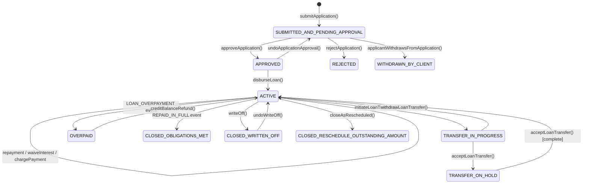

A loan in Apache Fineract moves through a well-defined state machine from the moment an applicant submits an application to the point the obligation is extinguished—either by full repayment, write-off, or rescheduling. Every state is an integer in `LoanStatus` (`fineract-core/.../domain/LoanStatus.java`); transitions are orchestrated by `DefaultLoanLifecycleStateMachine` (`fineract-loan/.../domain/DefaultLoanLifecycleStateMachine.java`). API calls arrive as commands, are validated by `LoanApplicationValidator` or `LoanDisbursementValidator`, then dispatched to `LoanApplicationWritePlatformServiceJpaRepositoryImpl` or `LoanWritePlatformServiceJpaStrategyImpl` in `fineract-provider`.

## State diagram



## `LoanStatus` enum

Defined in `fineract-core/src/main/java/org/apache/fineract/portfolio/loanaccount/domain/LoanStatus.java`. Integer codes are stored directly in `m_loan.loan_status_id`:

| Constant | Code | Description |
|---|---|---|
| `INVALID` | 0 | Sentinel; should never be persisted |
| `SUBMITTED_AND_PENDING_APPROVAL` | 100 | Application received, awaiting decision |
| `APPROVED` | 200 | Underwriter signed off; funds not yet released |
| `ACTIVE` | 300 | At least one disbursement posted |
| `TRANSFER_IN_PROGRESS` | 303 | Inter-office transfer started |
| `TRANSFER_ON_HOLD` | 304 | Transfer accepted by destination, pending completion |
| `WITHDRAWN_BY_CLIENT` | 400 | Applicant cancelled before approval |
| `REJECTED` | 500 | Underwriter declined |
| `CLOSED_OBLIGATIONS_MET` | 600 | All outstanding principal, interest, and fees paid |
| `CLOSED_WRITTEN_OFF` | 601 | Outstanding balance removed from the book |
| `CLOSED_RESCHEDULE_OUTSTANDING_AMOUNT` | 602 | Remaining balance migrated to a rescheduled loan |
| `OVERPAID` | 700 | Payment exceeded total obligation |

Helper methods such as `isActive()`, `isClosed()`, `isUnderTransfer()`, and `isOverpaid()` are provided on the enum for guard logic throughout the codebase.

## `LoanEvent` and the state machine

`DefaultLoanLifecycleStateMachine` listens to `LoanEvent` values (`fineract-loan/.../domain/LoanEvent.java`) and updates `loan.loanStatus` accordingly, then fires a `LoanStatusChangedBusinessEvent` to the event notifier. The three public methods are:

```java
// Compute next status without persisting (used for validation)
LoanStatus dryTransition(LoanEvent loanEvent, Loan loan);

// Execute a transition, persist new status, raise event
void transition(LoanEvent loanEvent, Loan loan);

// Determine and apply the correct transition automatically (e.g. after a repayment)
void determineAndTransition(Loan loan, LocalDate transactionDate);
```

`determineAndTransition` is the most commonly called method—invoked after every repayment posting to detect whether the loan has moved to `CLOSED_OBLIGATIONS_MET` or `OVERPAID`.

## Application phase — `LoanApplicationWritePlatformService`

The service interface is at `fineract-loan/.../service/LoanApplicationWritePlatformService.java`; the JPA implementation is `LoanApplicationWritePlatformServiceJpaRepositoryImpl` in `fineract-provider`.

| Operation | `LoanEvent` fired | Resulting `LoanStatus` |
|---|---|---|
| `submitApplication` | `LOAN_CREATED` | `SUBMITTED_AND_PENDING_APPROVAL` (100) |
| `approveApplication` | `LOAN_APPROVED` | `APPROVED` (200) |
| `undoApplicationApproval` | `LOAN_APPROVAL_UNDO` | `SUBMITTED_AND_PENDING_APPROVAL` (100) |
| `rejectApplication` | `LOAN_REJECTED` | `REJECTED` (500) |
| `applicantWithdrawsFromApplication` | `LOAN_WITHDRAWN` | `WITHDRAWN_BY_CLIENT` (400) |

During `submitApplication`, `LoanApplicationValidator` (in `fineract-provider`) enforces business rules, then `LoanAssemblerImpl` constructs the `Loan` aggregate, and `LoanScheduleAssembler` generates the projected repayment schedule.

## Active phase — `LoanWritePlatformService`

The interface is at `fineract-loan/.../service/LoanWritePlatformService.java`. All write operations on active loans go through this interface.

### Disbursement

```java
CommandProcessingResult disburseLoan(Long loanId, JsonCommand command, Boolean isAccountTransfer);
```

Fires `LOAN_DISBURSED`. Creates a `LoanTransaction` of type `DISBURSEMENT(1)`. If the product has a down-payment configured, a `DOWN_PAYMENT(28)` transaction is created immediately afterward. Multi-tranche loans call `disburseLoan` multiple times; each call adds another `DISBURSEMENT` row.

### Repayment posting

```java
CommandProcessingResult makeLoanRepayment(
    LoanTransactionType repaymentTransactionType,
    Long loanId, JsonCommand command, boolean isRecoveryRepayment);
```

The `repaymentTransactionType` argument may be `REPAYMENT(2)`, `MERCHANT_ISSUED_REFUND(21)`, `PAYOUT_REFUND(22)`, `GOODWILL_CREDIT(23)`, or any other type that `LoanTransactionType.isRepaymentType()` returns `true` for. After the transaction is persisted, the repayment schedule transaction processor (classic or `AdvancedPaymentScheduleTransactionProcessor`) allocates funds across installments, and `DefaultLoanLifecycleStateMachine.determineAndTransition` checks whether the loan is now fully paid.

### Write-off

```java
CommandProcessingResult writeOff(Long loanId, JsonCommand command);
```

Creates a `WRITEOFF(6)` transaction, marks all outstanding amounts as written off on every installment, and transitions the loan to `CLOSED_WRITTEN_OFF(601)`. Can be reversed with `undoWriteOff`, which fires `WRITE_OFF_OUTSTANDING_UNDO` and returns the loan to `ACTIVE`.

### Charge-off

```java
CommandProcessingResult chargeOff(JsonCommand command);
```

Creates a `CHARGE_OFF(27)` transaction. Unlike `writeOff`, charge-off does not close the loan—it marks `loan.isChargedOff() == true` and reclassifies the account for accounting purposes. The loan remains `ACTIVE` and can still receive recovery repayments.

### Waive interest

```java
CommandProcessingResult waiveInterestOnLoan(Long loanId, JsonCommand command);
```

Posts a `WAIVE_INTEREST(4)` transaction that reduces the interest outstanding on one or more installments without affecting principal.

### Close / reschedule

```java
CommandProcessingResult closeLoan(Long loanId, JsonCommand command);
CommandProcessingResult closeAsRescheduled(Long loanId, JsonCommand command);
```

`closeLoan` fires `LOAN_CLOSED` → `CLOSED_OBLIGATIONS_MET(600)`. `closeAsRescheduled` fires `LOAN_RESCHEDULE` → `CLOSED_RESCHEDULE_OUTSTANDING_AMOUNT(602)` and posts a `MARKED_FOR_RESCHEDULING(7)` transaction.

## Transaction type reference

`LoanTransactionType` (`fineract-loan/.../domain/LoanTransactionType.java`) is the complete catalogue of monetary events:

| Constant | Value | When created |
|---|---|---|
| `DISBURSEMENT` | 1 | First and subsequent disbursements |
| `REPAYMENT` | 2 | Standard client payment |
| `WAIVE_INTEREST` | 4 | Interest waiver |
| `REPAYMENT_AT_DISBURSEMENT` | 5 | Automatic charge collected at disbursement time |
| `WRITEOFF` | 6 | Loan written off |
| `RECOVERY_REPAYMENT` | 8 | Payment after write-off |
| `WAIVE_CHARGES` | 9 | Charge waiver |
| `ACCRUAL` | 10 | Periodic interest accrual (journal entries) |
| `CHARGE_PAYMENT` | 17 | Fee or penalty collected |
| `CREDIT_BALANCE_REFUND` | 20 | Overpaid amount returned |
| `MERCHANT_ISSUED_REFUND` | 21 | Refund from merchant side |
| `PAYOUT_REFUND` | 22 | Refund triggered by payout |
| `GOODWILL_CREDIT` | 23 | Goodwill concession |
| `CHARGEBACK` | 25 | Transaction reversal with chargeback |
| `CHARGE_OFF` | 27 | Charge-off classification |
| `DOWN_PAYMENT` | 28 | Auto-posted at disbursement |
| `REAGE` | 29 | Re-aging adjustment |
| `REAMORTIZE` | 30 | Schedule re-amortization |
| `INTEREST_PAYMENT_WAIVER` | 31 | Interest payment waived |
| `ACCRUAL_ACTIVITY` | 32 | Accrual activity posting |
| `INTEREST_REFUND` | 33 | Interest refund |
| `CAPITALIZED_INCOME` | 35 | Capitalized income added |
| `CAPITALIZED_INCOME_AMORTIZATION` | 36 | Capitalized income amortized |
| `CONTRACT_TERMINATION` | 38 | Contract terminated early |
| `BUY_DOWN_FEE` | 40 | Buy-down fee recorded |
| `BUY_DOWN_FEE_AMORTIZATION` | 42 | Buy-down fee amortized |
| `DISCOUNT_FEE` | 44 | Discount fee |

## Sub-status

`LoanSubStatus` (`fineract-loan/.../domain/LoanSubStatus.java`) adds a secondary classification on top of `LoanStatus`. It is separate from the main state and allows callers to distinguish, for example, NPA (non-performing asset) loans within the `ACTIVE` cohort.

## Related pages

- [Loan Module](/loans/loan-module) — domain entity reference
- [Progressive Loan Engine](/loans/progressive-loan) — how PROGRESSIVE schedule affects repayment processing
- [COB Pipeline](/loans/cob-close-of-business) — nightly interest recalculation and delinquency tagging
