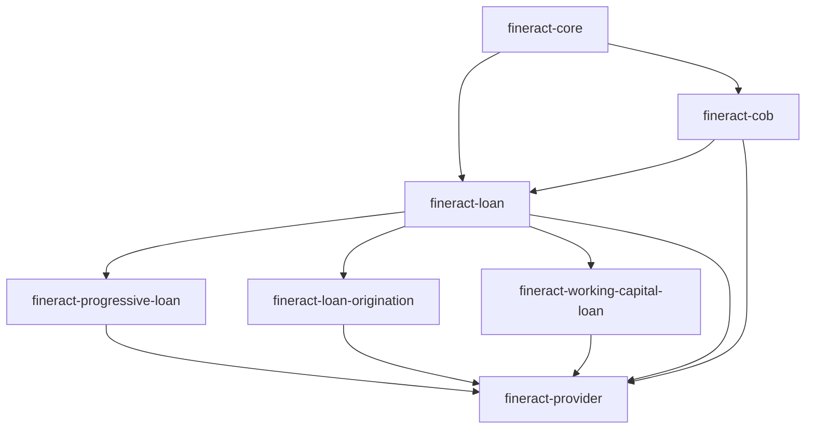

The `fineract-loan` Gradle module is the structural core of Apache Fineract's lending capability. It owns the JPA domain model for loans, the service interfaces that every caller must go through, the repayment schedule installment model, and the charge subsystem. Two satellite modules extend it: `fineract-progressive-loan` (EMI schedule generation and the advanced payment processor) and `fineract-loan-origination` (originator tracking and Avro enrichers). The runtime implementation classes—command handlers, schedule assembler, domain service impls—live in `fineract-provider`, which has a compile dependency on `fineract-loan`.

## Module layout

```
fineract-loan/
└── src/main/java/org/apache/fineract/portfolio/
    ├── loanaccount/
    │   ├── api/          # Swagger models, schedule API resource, transaction constants
    │   ├── command/      # LoanChargeCommand, UndoStateTransitionCommand, …
    │   ├── data/         # Read-side DTOs (LoanAccountData, LoanTransactionData, …)
    │   ├── domain/       # JPA entities and enums (Loan, LoanTransaction, LoanStatus, …)
    │   ├── loanschedule/ # Schedule model, LoanScheduleType, generators interface
    │   └── service/      # LoanWritePlatformService, LoanReadPlatformService interfaces
    ├── loanproduct/
    │   ├── data/         # LoanProductData, AdvancedPaymentData, …
    │   ├── domain/       # LoanProduct entity, payment/credit allocation enums
    │   └── service/      # LoanProductWritePlatformService interface (in provider)
    ├── collateral/
    │   ├── api/          # CollateralApiConstants
    │   ├── data/         # CollateralData
    │   └── domain/       # LoanCollateral JPA entity
    ├── delinquency/      # DelinquencyBucket, range/tag domains and services
    └── interestpauses/   # InterestPause API, commands, and service interfaces
```

<Info>
`fineract-loan` does **not** contain the Spring Boot application class or persistence configuration. Those belong in `fineract-provider`, which assembles the full runnable WAR.
</Info>

## The `Loan` aggregate

`Loan` (`fineract-loan/.../domain/Loan.java`) is the root JPA entity mapped to table `m_loan`. It extends `AbstractAuditableWithUTCDateTimeCustom<Long>` and carries an optimistic-locking `@Version int version` column. Its most important relationships:

| Field | Type | Description |
|---|---|---|
| `loanProduct` | `@ManyToOne LoanProduct` | The product template that governs interest method, schedule type, and payment allocation |
| `repaymentScheduleInstallments` | `@OneToMany LoanRepaymentScheduleInstallment` | All installments; ordered by `installment` ordinal |
| `loanTransactions` | `@OneToMany LoanTransaction` | Every monetary movement against the loan |
| `charges` | `@OneToMany LoanCharge` | Fees and penalties attached to this account |
| `collateral` | `@OneToMany LoanCollateral` | Legacy pledge items |
| `loanCollateralManagements` | `@OneToMany LoanCollateralManagement` | Modern collateral management records |

Key status state is stored as `LoanStatus loanStatus`, backed by `LoanStatusConverter` for the integer column value. The loan also records `LoanScheduleType` (`CUMULATIVE` or `PROGRESSIVE`) which routes schedule generation to either the classic generator or `ProgressiveLoanScheduleGenerator`.

```java
// fineract-loan/src/main/java/org/apache/fineract/portfolio/loanaccount/domain/Loan.java
@Entity
@Table(name = "m_loan", uniqueConstraints = {
    @UniqueConstraint(columnNames = {"account_no"}, name = "loan_account_no_UNIQUE"),
    @UniqueConstraint(columnNames = {"external_id"}, name = "loan_externalid_UNIQUE")
})
public class Loan extends AbstractAuditableWithUTCDateTimeCustom<Long> {

    @Version
    int version;

    @Column(name = "account_no", length = 20, unique = true, nullable = false)
    private String accountNumber;

    // status stored as integer; LoanStatus.fromInt() decodes it
    // schedule type drives generator selection at runtime
}
```

## `LoanProduct`

`LoanProduct` (`fineract-loan/.../loanproduct/domain/LoanProduct.java`) is mapped to `m_product_loan`. It holds the canonical parameters for any account created from it: interest method (`InterestMethod`), amortisation method (`AmortizationMethod`), schedule type (`LoanScheduleType`), the transaction processing strategy code, payment allocation rules (`List<LoanProductPaymentAllocationRule>`), credit allocation rules (`List<LoanProductCreditAllocationRule>`), and the delinquency bucket link. Changing product parameters after disbursement does not retroactively update live loans.

## `LoanTransaction`

`LoanTransaction` (`fineract-loan/.../domain/LoanTransaction.java`) is mapped to `m_loan_transaction`. Each row captures one monetary event with its component amounts:

```java
@Column(name = "principal_portion_derived")
private BigDecimal principalPortion;

@Column(name = "interest_portion_derived")
private BigDecimal interestPortion;

@Column(name = "fee_charges_portion_derived")
private BigDecimal feeChargesPortion;

@Column(name = "penalty_charges_portion_derived")
private BigDecimal penaltyChargesPortion;

@Column(name = "overpayment_portion_derived")
private BigDecimal overPaymentPortion;
```

The `LoanTransactionType` enum (`fineract-loan/.../domain/LoanTransactionType.java`) lists every possible transaction kind. Key values include `DISBURSEMENT(1)`, `REPAYMENT(2)`, `WRITEOFF(6)`, `CHARGE_PAYMENT(17)`, `CHARGEBACK(25)`, `CHARGE_OFF(27)`, `DOWN_PAYMENT(28)`, and the newer `CAPITALIZED_INCOME(35)`, `BUY_DOWN_FEE(40)`, and `DISCOUNT_FEE(44)`.

## `LoanRepaymentScheduleInstallment`

Mapped to `m_loan_repayment_schedule`, each installment holds per-period amounts for principal, interest, fees, and penalties in both charged and completed variants:

```java
@Column(name = "principal_amount")
private BigDecimal principal;

@Column(name = "principal_completed_derived")
private BigDecimal principalCompleted;

@Column(name = "interest_amount")
private BigDecimal interestCharged;

@Column(name = "interest_completed_derived")
private BigDecimal interestPaid;

@Column(name = "interest_waived_derived")
private BigDecimal interestWaived;
```

The installment also tracks accrual amounts (`interestAccrued`, `feeAccrued`, `penaltyAccrued`) and writtenOff amounts for the write-off flow. See `fineract-loan/.../domain/LoanRepaymentScheduleInstallment.java`.

## `LoanCharge`

`LoanCharge` (`fineract-loan/.../domain/LoanCharge.java`) is mapped to `m_loan_charge` and links to the global `Charge` catalogue via `@ManyToOne Charge charge`. It stores `chargeTime` (disbursement, specified due date, instalment fee, overdue instalment fee, etc.) and `chargeCalculationType` (flat, percentage of amount, etc.). Overdue instalment charges are applied programmatically by `ApplyChargeToOverdueLoansBusinessStep` during COB.

## Service interfaces

### `LoanApplicationWritePlatformService`

Located in `fineract-loan/.../service/LoanApplicationWritePlatformService.java`. Handles the pre-disbursement lifecycle of an application:

```java
CommandProcessingResult submitApplication(JsonCommand command);
CommandProcessingResult modifyApplication(Long loanId, JsonCommand command);
CommandProcessingResult deleteApplication(Long loanId);
CommandProcessingResult approveApplication(Long loanId, JsonCommand command);
CommandProcessingResult undoApplicationApproval(Long loanId, JsonCommand command);
CommandProcessingResult rejectApplication(Long loanId, JsonCommand command);
CommandProcessingResult applicantWithdrawsFromApplication(Long loanId, JsonCommand command);
```

The JPA implementation is `LoanApplicationWritePlatformServiceJpaRepositoryImpl` in `fineract-provider`.

### `LoanWritePlatformService`

Located in `fineract-loan/.../service/LoanWritePlatformService.java`. Handles all post-disbursement mutations:

```java
CommandProcessingResult disburseLoan(Long loanId, JsonCommand command, Boolean isAccountTransfer);
CommandProcessingResult makeLoanRepayment(LoanTransactionType type, Long loanId, JsonCommand command, boolean isRecoveryRepayment);
CommandProcessingResult waiveInterestOnLoan(Long loanId, JsonCommand command);
CommandProcessingResult writeOff(Long loanId, JsonCommand command);
CommandProcessingResult closeLoan(Long loanId, JsonCommand command);
CommandProcessingResult chargeOff(JsonCommand command);
CommandProcessingResult creditBalanceRefund(Long loanId, JsonCommand command);
Loan recalculateInterest(Loan loan);
```

### `LoanReadPlatformService`

Located in `fineract-loan/.../service/LoanReadPlatformService.java`. Provides query-side access with key methods such as `retrieveOne(Long loanId)`, `retrieveLoanTransactions(Long loanId)`, `retrieveRepaymentSchedule(...)`, and `retrieveAllOverdueInstallmentsForLoan(Loan loan)`.

## Module dependency graph



`fineract-progressive-loan` extends `fineract-loan` with `ProgressiveLoanScheduleGenerator`, `AdvancedPaymentScheduleTransactionProcessor`, `EMICalculator`, `ProgressiveLoanInterestScheduleModel`, and the `ProgressiveLoanModel` persistence entity. `fineract-loan-origination` is an optional, feature-flagged module that attaches originator metadata to loans via `DataEnricher` implementations. See the [Progressive Loan](/loans/progressive-loan) and [Loan Origination](/loans/loan-origination) pages for full details.

## Related pages

- [Loan Lifecycle](/loans/loan-lifecycle) — state machine, transitions, and transaction types
- [Progressive Loan Engine](/loans/progressive-loan) — EMI calculator and schedule model
- [Loan Origination](/loans/loan-origination) — originator enricher pattern
- [COB Pipeline](/loans/cob-close-of-business) — nightly batch processing
