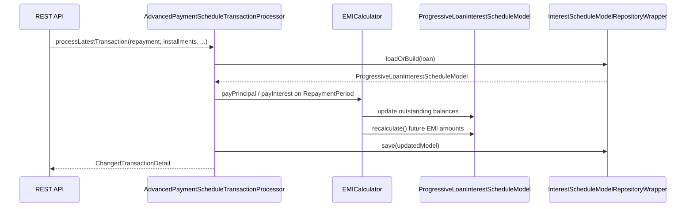

Progressive loans in Apache Fineract deliver fixed equal monthly instalments (EMI) where each payment retires more principal over time while the interest component shrinks—as opposed to the classic cumulative schedule that recalculates differently. The `fineract-progressive-loan` Gradle module owns the schedule generator, the EMI calculator, the interest model, the `AdvancedPaymentScheduleTransactionProcessor`, and the persistence entity for the computed model. It is a compile-time dependency of `fineract-provider`, which wires all beans into the running application.

## When to use progressive vs. cumulative

| Dimension | `PROGRESSIVE` | `CUMULATIVE` |
|---|---|---|
| Schedule type (`LoanScheduleType`) | `PROGRESSIVE` | `CUMULATIVE` |
| Transaction processor | `AdvancedPaymentScheduleTransactionProcessor` | Legacy strategy-based processors |
| Interest recalculation on partial payment | Yes — EMI is recomputed from partial-payment date | Optional, driven by `LoanProductInterestRecalculationDetails` |
| Stored interest model | `m_loan_progressive_model` (JSONB) | Not persisted separately |
| Payment allocation | Configurable `LoanProductPaymentAllocationRule` per transaction type | Fixed priority order |
| Credit allocation | Configurable `LoanProductCreditAllocationRule` | N/A |
| Suitable for | BNPL, mortgage-style retail lending, revolving lines | Microfinance flat-rate, group lending |

Set `loanScheduleType = PROGRESSIVE` on the `LoanProduct` to activate the progressive engine. The `AdvancedPaymentScheduleTransactionProcessorCondition` (`fineract-progressive-loan/.../starter/`) checks at startup whether `AdvancedPaymentScheduleTransactionProcessor` should be registered as a Spring bean.

## Module structure

```
fineract-progressive-loan/
└── src/main/java/org/apache/fineract/portfolio/
    ├── loanaccount/
    │   ├── domain/
    │   │   ├── ProgressiveLoanModel.java          # JPA entity (m_loan_progressive_model)
    │   │   ├── LoanBuyDownFeeBalance.java
    │   │   ├── LoanCapitalizedIncomeBalance.java
    │   │   └── transactionprocessor/impl/
    │   │       ├── AdvancedPaymentScheduleTransactionProcessor.java
    │   │       ├── ChangeOperation.java
    │   │       └── ProgressiveTransactionCtx.java
    │   ├── loanschedule/
    │   │   ├── domain/ProgressiveLoanScheduleGenerator.java
    │   │   └── data/
    │   │       ├── LoanSchedulePlan.java
    │   │       ├── LoanSchedulePlanRepaymentPeriod.java
    │   │       └── LoanSchedulePlanDisbursementPeriod.java
    │   └── service/
    │       ├── ProgressiveLoanModelProcessingService.java
    │       ├── ProgressiveLoanModelRecalculationService.java
    │       └── InterestScheduleModelRepositoryWrapper.java
    └── loanproduct/
        └── calc/
            ├── EMICalculator.java                 # Interface
            ├── ProgressiveEMICalculator.java      # Implementation
            └── data/
                ├── ProgressiveLoanInterestScheduleModel.java
                ├── RepaymentPeriod.java
                └── OutstandingDetails.java
```

Additionally, the standalone `fineract-progressive-loan-embeddable-schedule-generator` module ships a single class, `EmbeddableProgressiveLoanScheduleGenerator`, that can be embedded in external tooling without a full Fineract runtime.

## `ProgressiveLoanInterestScheduleModel`

`ProgressiveLoanInterestScheduleModel` (`fineract-progressive-loan/.../calc/data/ProgressiveLoanInterestScheduleModel.java`) is the central in-memory model that the EMI calculator operates on. It holds:

```java
private final List<RepaymentPeriod> repaymentPeriods;
private final TreeSet<InterestRate> interestRates;      // sorted descending
private final ILoanConfigurationDetails loanProductRelatedDetail;
private final Integer installmentAmountInMultiplesOf;
private final MathContext mc;
private final Map<LoanInterestScheduleModelModifiers, Boolean> modifiers;

private LocalDate lastOverdueBalanceChange;
private List<OverdueBalanceCorrection> overdueCorrections;
```

The `modifiers` map drives four behaviours: `COPY`, `EMI_RECALCULATION`, `INTEREST_PAUSE_FOR_EMI_CALCULATION`, and `INTEREST_RECALCULATION_ENABLED`.

The model is serialised to JSON and persisted in `ProgressiveLoanModel.jsonModel` (column `json_model` on `m_loan_progressive_model`). The `InterestScheduleModelRepositoryWrapper` service handles loading and saving. The Gson-based serialisation strategy is in `InterestScheduleModelServiceGsonContext` and `ProgressiveLoanInterestScheduleModelParserServiceGsonImpl`.

## `EMICalculator`

The `EMICalculator` interface (`fineract-progressive-loan/.../calc/EMICalculator.java`) is the contract for generating and mutating the interest model. Key methods:

```java
// Build model from schedule generator output
ProgressiveLoanInterestScheduleModel generatePeriodInterestScheduleModel(
    List<LoanScheduleModelRepaymentPeriod> periods,
    ILoanConfigurationDetails loanProductRelatedDetail,
    Integer installmentAmountInMultiplesOf, MathContext mc);

// Build model from persisted installments (e.g. during COB)
ProgressiveLoanInterestScheduleModel generateInstallmentInterestScheduleModel(
    List<RepaymentScheduleInstallmentData> installments,
    ILoanConfigurationDetails loanProductRelatedDetail,
    Integer installmentAmountInMultiplesOf, MathContext mc);

// Apply a disbursement; recalculates EMI amounts from disbursement date onward
void addDisbursement(ProgressiveLoanInterestScheduleModel scheduleModel,
    LocalDate disbursementDueDate, Money disbursedAmount);

// Apply a capitalized income event; recalculates EMI
void addCapitalizedIncome(ProgressiveLoanInterestScheduleModel scheduleModel,
    LocalDate transactionDueDate, Money transactionAmount);

// Apply interest rate change; recalculates EMI from effective date
void addInterestRateChange(ProgressiveLoanInterestScheduleModel scheduleModel, ...);
```

The default implementation is `ProgressiveEMICalculator` (also in `fineract-progressive-loan`). It uses the standard annuity formula with configurable rounding (`installmentAmountInMultiplesOf`) and the `MathContext` from the currency configuration.

## `ProgressiveLoanScheduleGenerator`

`ProgressiveLoanScheduleGenerator` (`fineract-progressive-loan/.../loanschedule/domain/`) implements `LoanScheduleGenerator`. It is conditionally registered; the factory `DefaultLoanScheduleGeneratorFactory` (in `fineract-provider`) returns it when `loanScheduleType == PROGRESSIVE`.

The generator:
1. Determines `periodStartDate` from `RepaymentStartDateType` (disbursement date or submitted-on date).
2. Creates `LoanScheduleParams`.
3. Calls `emiCalculator.generatePeriodInterestScheduleModel(...)` to build the initial model.
4. Iterates over repayment periods, calling `emiCalculator.addDisbursement(...)` for each expected disbursement.
5. For down-payment products, prepends a `LoanScheduleModelDownPaymentPeriod` before the first regular instalment.
6. Returns a `LoanScheduleModel` containing `LoanScheduleModelRepaymentPeriod` entries, each with computed due amounts.

```java
// fineract-progressive-loan/.../loanschedule/domain/ProgressiveLoanScheduleGenerator.java
@Component
public class ProgressiveLoanScheduleGenerator implements LoanScheduleGenerator {

    private final ScheduledDateGenerator scheduledDateGenerator;
    private final EMICalculator emiCalculator;
    private final InterestScheduleModelRepositoryWrapper interestScheduleModelRepositoryWrapper;

    @Override
    public LoanScheduleModel generate(MathContext mc,
            LoanApplicationTerms loanApplicationTerms,
            Set<LoanCharge> loanCharges,
            HolidayDetailDTO holidayDetailDTO) { ... }
}
```

## `AdvancedPaymentScheduleTransactionProcessor`

This processor (`fineract-progressive-loan/.../transactionprocessor/impl/AdvancedPaymentScheduleTransactionProcessor.java`) is invoked every time a transaction is posted to a progressive loan. It rebuilds the entire transaction ledger from scratch (the "replay" model) by sorting all non-reversed transactions chronologically and re-applying them to the model.

Key internal steps:

1. Load or reconstruct `ProgressiveLoanInterestScheduleModel` via `InterestScheduleModelRepositoryWrapper`.
2. Build a `ProgressiveTransactionCtx` that carries the current model, the installments, charges, and any in-flight changes.
3. Iterate sorted transactions; for each, route to the appropriate allocation method based on `LoanTransactionType`.
4. `REPAYMENT` and related types go through the configurable allocation matrix defined by `LoanProductPaymentAllocationRule` (e.g., allocate to oldest due penalty → fee → interest → principal).
5. `DISBURSEMENT` events call `emiCalculator.addDisbursement(...)`, adjusting all future EMI amounts.
6. `CHARGE_OFF` switches the allocation strategy to post-charge-off mode.
7. Collect `ChangeOperation` instances representing new, modified, or reversed transactions and pass them back as `ChangedTransactionDetail`.

The `FutureInstallmentAllocationRule` enum governs what happens when a payment overshoots the current instalment: `NEXT_INSTALLMENT`, `LAST_INSTALLMENT`, or `REAMORTIZATION`.

## Recalculation on partial payment

When a partial repayment arrives mid-period, the processor calls `EMICalculator.payInterest(...)` or `EMICalculator.payPrincipal(...)` on the affected `RepaymentPeriod`. If `INTEREST_RECALCULATION_ENABLED` is set in the modifiers, the outstanding balance is recomputed and EMI amounts for all future periods are recalculated via `emiCalculator.recalculate(...)`. This ensures the EMI remains constant (the standard annuity property) as long as the rate does not change.



## Delinquency bucket assignment

Progressive loans integrate with the delinquency subsystem (`fineract-loan/.../delinquency/`) in the same way as cumulative loans. During COB, `SetLoanDelinquencyTagsBusinessStep` calls `LoanAccountDomainService.setLoanDelinquencyTag(loan, businessDate, ...)`, which maps days-past-due onto `DelinquencyRange` entries that belong to the `DelinquencyBucket` configured on the `LoanProduct`.

The `DelinquencyWritePlatformServiceImpl` and `LoanDelinquencyDomainServiceImpl` store the result in `LoanDelinquencyTagHistory` and `LoanInstallmentDelinquencyTag`. For progressive loans, individual installment delinquency tags are granular enough to distinguish which instalment is overdue.

## Buy-down fee and capitalized income

Two progressive-loan-specific features extend the model:

- **Buy-down fee** (`LoanBuyDownFeeBalance`, `BuyDownFeeAmortizationBusinessStep`): A fee paid upfront to reduce the interest rate. It is posted as `BUY_DOWN_FEE(40)` and amortized daily via `BUY_DOWN_FEE_AMORTIZATION(42)` during COB.
- **Capitalized income** (`LoanCapitalizedIncomeBalance`, `CapitalizedIncomeAmortizationBusinessStep`): Income that is added to the loan principal and amortized. Posted as `CAPITALIZED_INCOME(35)` and amortized as `CAPITALIZED_INCOME_AMORTIZATION(36)`.

Both follow the same pattern: a balance entity is created, and a COB business step generates daily amortization journal entries by calling `EMICalculator.addCapitalizedIncome(...)` or the buy-down equivalent.

## Embeddable schedule generator

`EmbeddableProgressiveLoanScheduleGenerator` (`fineract-progressive-loan-embeddable-schedule-generator/.../domain/`) is a thin wrapper around `ProgressiveLoanScheduleGenerator` that can be called from outside a Spring context—useful for calculator tooling, front-end previews, or integration tests. It exposes `generate(MathContext mc, LoanRepaymentScheduleModelData modelData)` and returns a `LoanSchedulePlan`.

## Related pages

- [Loan Module](/loans/loan-module) — domain entities and service interfaces
- [Loan Lifecycle](/loans/loan-lifecycle) — state transitions including charge-off
- [COB Pipeline](/loans/cob-close-of-business) — interest recalculation and buy-down amortization during nightly batch
