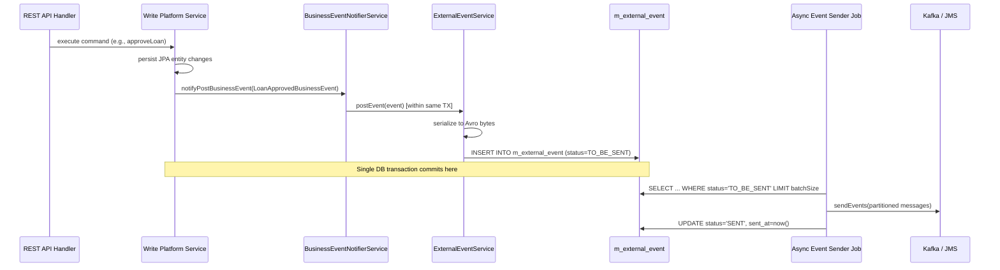

Fineract implements an **outbox pattern** for domain event publishing. When a business operation completes — a loan is approved, a savings deposit is posted, a client is activated — the platform serializes the corresponding domain event as an Avro byte payload and persists it to the `m_external_event` table within the same database transaction. A separate asynchronous job later reads queued events from the outbox and forwards them to the configured message broker (Kafka or JMS). This two-phase approach guarantees at-least-once delivery even if the broker is temporarily unavailable, because the event is committed to durable storage before the HTTP response is returned to the caller.

## BusinessEvent and AbstractBusinessEvent

Every domain event is a typed Java object that implements `BusinessEvent<T>` from `fineract-core/src/main/java/org/apache/fineract/infrastructure/event/business/domain/`. The generic parameter `T` is the aggregate root — e.g., `Loan`, `SavingsAccount`, or `Client`. Most events extend `AbstractBusinessEvent<T>`, which stores the aggregate root value and implements `get()`:

```java
// fineract-core/.../event/business/domain/AbstractBusinessEvent.java
@RequiredArgsConstructor
public abstract class AbstractBusinessEvent<T> implements BusinessEvent<T> {
    private final T value;

    @Override
    public T get() {
        return value;
    }
}
```

Each concrete event class provides `getType()` (a string like `"LoanApprovedBusinessEvent"`) and `getCategory()` (a domain category like `"LOAN"`, `"SAVINGS"`, `"CLIENT"`). `getAggregateRootId()` returns the database ID of the subject entity, used to partition events by aggregate in Kafka.

`BulkBusinessEvent` (in the same package) wraps a `List<BusinessEvent<?>>` and serializes the entire list as a single `BulkMessagePayloadV1` Avro record — used for COB batch events where emitting one message per loan would produce excessive broker traffic.

### NoExternalEvent Annotation

Event classes annotated with `@NoExternalEvent` are fired internally (for Spring `ApplicationEvent` listeners) but are never written to the outbox. This marker prevents audit-only events from polluting the message broker.

## BusinessEventNotifierService

`BusinessEventNotifierService` (interface in `fineract-core/.../event/business/service/`) is the primary intra-process notification bus. Services call `notifyPostBusinessEvent(event)` after completing a write operation. The implementation dispatches the event to all registered `@BusinessEventListener` beans and, if external events are enabled, forwards the event to `ExternalEventService`.

The `@BusinessEventListener` annotation (in `fineract-core/.../event/business/BusinessEventListener.java`) is a Spring component annotation with a type parameter. Spring beans annotated with `@BusinessEventListener(LoanApprovedBusinessEvent.class)` receive only loan approval events, enabling a clean subscriber pattern without explicit topic management.

## ExternalEventService

`ExternalEventService` (in `fineract-core/.../event/external/service/ExternalEventService.java`) is the outbox writer. It runs `@Transactional` and is called synchronously within the originating business transaction:

```java
// fineract-core/.../event/external/service/ExternalEventService.java
@Service
@RequiredArgsConstructor
@Transactional
public class ExternalEventService {

    private final ExternalEventRepository repository;
    private final ExternalEventIdempotencyKeyGenerator idempotencyKeyGenerator;
    private final BusinessEventSerializerFactory serializerFactory;
    private final ByteBufferConverter byteBufferConverter;

    public <T> void postEvent(BusinessEvent<T> event) {
        entityManager.flush(); // flush pending JPA changes before serializing
        ExternalEvent externalEvent;
        if (event instanceof BulkBusinessEvent) {
            externalEvent = handleBulkBusinessEvent((BulkBusinessEvent) event);
        } else {
            externalEvent = handleRegularBusinessEvent(event);
        }
        repository.save(externalEvent);
    }
}
```

For a regular event, it calls `BusinessEventSerializerFactory.create(event)` to obtain the correct `BusinessEventSerializer`, converts the event aggregate to an Avro DTO, serializes it to `byte[]`, generates an idempotency key, and persists the result as an `ExternalEvent` entity.

## ExternalEvent Entity (the Outbox Table)

`ExternalEvent` (in `fineract-core/.../event/external/repository/domain/ExternalEvent.java`) maps to the `m_external_event` table:

```java
@Entity
@Table(name = "m_external_event")
public class ExternalEvent extends AbstractPersistableCustom<Long> {

    @Column(name = "type", nullable = false)      // e.g. "LoanApprovedBusinessEvent"
    private String type;

    @Column(name = "category", nullable = false)  // e.g. "LOAN"
    private String category;

    @Column(name = "schema", nullable = false)    // Avro schema class name
    private String schema;

    @Basic(fetch = FetchType.LAZY)
    @Column(name = "data", nullable = false)      // Avro-serialized payload bytes
    private byte[] data;

    @Column(name = "created_at", nullable = false)
    private OffsetDateTime createdAt;

    @Enumerated(EnumType.STRING)
    @Column(name = "status", nullable = false)    // TO_BE_SENT | SENT
    private ExternalEventStatus status;

    @Column(name = "idempotency_key", nullable = false)
    private String idempotencyKey;

    @Column(name = "business_date", nullable = false)
    private LocalDate businessDate;

    @Column(name = "aggregate_root_id")
    private Long aggregateRootId;
}
```

New events are persisted with `status = TO_BE_SENT`. The outbox publisher job queries `findByStatusOrderByBusinessDateAscIdAsc(TO_BE_SENT, pageable)` and bulk-marks delivered events as `SENT` via `markEventsSent(ids, sentAt)`. A separate purge job deletes old `SENT` events older than a configured retention window.

## Event Configuration

Each event type can be individually enabled or disabled via the `m_external_event_configuration` table. The `ExternalEventConfigurationRepository` (in `fineract-core/.../event/external/repository/`) and `ExternalEventConfigurationWritePlatformService` expose a REST API for toggling event types at runtime. Only event types with `enabled = true` in this table will be written to the outbox.

## Full Pipeline Sequence



## Domain Event Types by Category

<AccordionGroup>
  <Accordion title="LOAN events">
    Event classes in `fineract-provider/.../event/business/domain/loan/` cover the full loan lifecycle. Key types include:

    - `LoanCreatedBusinessEvent` — new loan application submitted
    - `LoanApprovedBusinessEvent` — loan approved
    - `LoanDisbursalBusinessEvent` — loan disbursed
    - `LoanTransactionMakeRepaymentPostBusinessEvent` — repayment posted
    - `LoanChargebackTransactionCreatedBusinessEvent` — chargeback created
    - `LoanStatusChangedBusinessEvent` — status transition
    - `LoanDelinquencyRangeChangeBusinessEvent` — delinquency range updated by COB
    - `LoanAccountLockedBusinessEvent` / `LoanAccountUnlockedBusinessEvent` — COB lock events
    - `LoanRescheduledBusinessEvent` / `LoanReAgedBusinessEvent` / `LoanReAmortizeBusinessEvent`
    - `LoanCapitalizedIncomeTransactionCreatedBusinessEvent`
    - `LoanBuyDownFeeTransactionCreatedBusinessEvent`
  </Accordion>
  <Accordion title="SAVINGS events">
    Savings events cover account lifecycle and transaction posting. Key types include:

    - `SavingsAccountActivateBusinessEvent`
    - `SavingsDepositBusinessEvent` / `SavingsWithdrawalBusinessEvent`
    - `SavingsPostInterestBusinessEvent`
    - `SavingsAccountClosingBusinessEvent`
    - `SavingsAccountTransactionBusinessEvent`
  </Accordion>
  <Accordion title="CLIENT events">
    Client and group lifecycle events:

    - `ClientActivateBusinessEvent`
    - `ClientCreatedBusinessEvent`
    - `ClientRejectedBusinessEvent`
    - `GroupCreatedBusinessEvent`
    - `GroupActivatedBusinessEvent`
  </Accordion>
  <Accordion title="DEPOSIT events">
    Fixed and recurring deposit lifecycle events:

    - `FixedDepositAccountCreatedBusinessEvent`
    - `FixedDepositAccountApprovedBusinessEvent`
    - `RecurringDepositAccountCreatedBusinessEvent`
  </Accordion>
</AccordionGroup>

## Related Pages

- [Kafka and JMS Integration](/messaging/kafka-jms) — the producer implementations that consume the outbox
- [Avro Schemas](/messaging/avro-schemas) — schema definitions for event payloads
- [Database Schema](/data/database-schema) — `m_external_event` and `m_external_event_configuration` table details
