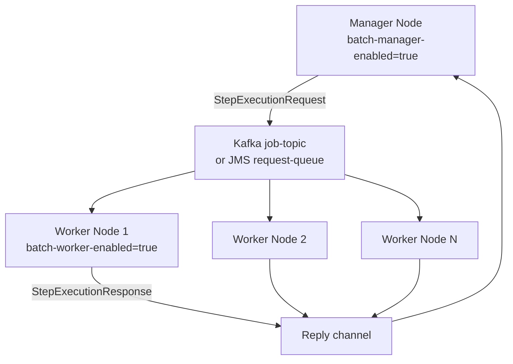

Fineract supports two external message brokers for event streaming: **Apache Kafka** and any JMS-compatible broker (Apache ActiveMQ is the reference implementation). Both are used in two distinct contexts: publishing serialized domain events from the outbox (`m_external_event`) to downstream consumers, and dispatching Spring Batch partitioned job steps to remote worker nodes for parallel COB processing. The two contexts are configured independently and can run simultaneously in a deployment.

## ExternalEventProducer Interface

All outbox event delivery implementations satisfy `ExternalEventProducer`, defined in `fineract-core/src/main/java/org/apache/fineract/infrastructure/event/external/producer/ExternalEventProducer.java`:

```java
public interface ExternalEventProducer {
    /**
     * Sends the created ExternalEvents.
     *
     * @param partitions  Map keyed by aggregateRootId; each value is a list of
     *                    Avro-serialized message bytes for that key.
     */
    void sendEvents(Map<Long, List<byte[]>> partitions)
            throws AcknowledgementTimeoutException;
}
```

The map key is the `aggregate_root_id` from `m_external_event`, which becomes the Kafka partition key (or JMS message group ID). This ordering guarantee ensures events for the same loan or savings account are delivered in sequence to a single consumer.

A `NoopExternalEventProducer` (also in `fineract-core`) is active when external events are disabled (`fineract.events.external.enabled=false`); it silently discards messages and carries a `@NoopExternalEventEnabled` conditional.

## KafkaExternalEventProducer

`KafkaExternalEventProducer` (in `fineract-provider/.../event/external/producer/kafka/KafkaExternalEventProducer.java`) is activated when `fineract.events.external.producer.kafka.enabled=true`. It uses a typed `KafkaTemplate<Long, byte[]>` where the key is the aggregate root ID and the value is the pre-serialized Avro byte array:

```java
@Component
@ConditionalOnProperty(
    value = "fineract.events.external.producer.kafka.enabled",
    havingValue = "true"
)
public class KafkaExternalEventProducer implements ExternalEventProducer {

    @Autowired
    private KafkaTemplate<Long, byte[]> externalEventsKafkaTemplate;

    @Autowired
    private FineractProperties fineractProperties;

    @Override
    public void sendEvents(Map<Long, List<byte[]>> partitions)
            throws AcknowledgementTimeoutException {
        String topicName = fineractProperties.getEvents()
            .getExternal().getProducer().getKafka().getTopic().getName();

        List<CompletableFuture<SendResult<Long, byte[]>>> sendResults = new ArrayList<>();
        for (Map.Entry<Long, List<byte[]>> entry : partitions.entrySet()) {
            for (byte[] message : entry.getValue()) {
                sendResults.add(externalEventsKafkaTemplate
                    .send(topicName, entry.getKey(), message));
            }
        }
        CompletableFuture.allOf(sendResults.toArray(new CompletableFuture[0]))
            .get(kafkaProperties.getTimeoutInSeconds(), TimeUnit.SECONDS);
    }
}
```

All sends are issued asynchronously then joined with a configurable timeout. If any send fails within the timeout window, a `RuntimeException` is propagated and the outbox job marks those events for retry on the next cycle.

## JMSMultiExternalEventProducer

`JMSMultiExternalEventProducer` (in `fineract-provider/.../event/external/producer/jms/JMSMultiExternalEventProducer.java`) is activated when `fineract.events.external.producer.jms.enabled=true`. It sends messages to either a JMS queue (point-to-point) or a JMS topic (pub/sub) depending on which of `event-queue-name` or `event-topic-name` is configured. Asynchronous send mode is controlled by `fineract.events.external.producer.jms.async-send-enabled`.

## External Event Configuration Properties

From `fineract-provider/src/main/resources/application.properties`:

```properties
# Master switch — must be true for any events to be published
fineract.events.external.enabled=${FINERACT_EXTERNAL_EVENTS_ENABLED:false}

# Outbox batch processing
fineract.events.external.partition-size=${FINERACT_EXTERNAL_EVENTS_PARTITION_SIZE:5000}
fineract.events.external.thread-pool-core-pool-size=${FINERACT_EVENT_TASK_EXECUTOR_CORE_POOL_SIZE:2}
fineract.events.external.thread-pool-max-pool-size=${FINERACT_EVENT_TASK_EXECUTOR_MAX_POOL_SIZE:25}

# Kafka producer for domain events
fineract.events.external.producer.kafka.enabled=${FINERACT_EXTERNAL_EVENTS_PRODUCER_KAFKA_ENABLED:false}
# (topic name configured via fineract.events.external.producer.kafka.topic.name)

# JMS producer for domain events
fineract.events.external.producer.jms.enabled=${FINERACT_EXTERNAL_EVENTS_PRODUCER_JMS_ENABLED:false}
fineract.events.external.producer.jms.event-queue-name=${FINERACT_EXTERNAL_EVENTS_PRODUCER_JMS_QUEUE_NAME:}
fineract.events.external.producer.jms.event-topic-name=${FINERACT_EXTERNAL_EVENTS_PRODUCER_JMS_TOPIC_NAME:}
fineract.events.external.producer.jms.broker-url=${FINERACT_EXTERNAL_EVENTS_PRODUCER_JMS_BROKER_URL:tcp://127.0.0.1:61616}
fineract.events.external.producer.jms.broker-username=${FINERACT_EXTERNAL_EVENTS_PRODUCER_JMS_BROKER_USERNAME:}
fineract.events.external.producer.jms.broker-password=${FINERACT_EXTERNAL_EVENTS_PRODUCER_JMS_BROKER_PASSWORD:}
```

<Info>
Only one producer can be active at a time per Fineract instance — either Kafka or JMS, not both. If both properties are set to `true`, the application context will fail to start due to duplicate bean definitions.
</Info>

## Spring Batch Remote Message Handlers (COB Partitioning)

In addition to domain event streaming, Fineract uses Kafka or JMS to dispatch **Spring Batch partitioned step execution requests** to remote worker nodes. This is the mechanism that allows the Loan Close-of-Business (COB) job to process tens of thousands of loans in parallel across multiple JVM instances.

The relevant classes are in `fineract-provider/.../infrastructure/springbatch/messagehandler/`:

| Class | Purpose |
|---|---|
| `MessageHandlerConfig` | Selects the active transport based on conditions |
| `StepExecutionRequestHandler` | Worker-side handler that processes a `StepExecutionRequest` |
| `jms/` sub-package | JMS channel factory beans for the manager ↔ worker channel |
| `kafka/` sub-package | Kafka channel factory beans for the manager ↔ worker channel |
| `spring/` sub-package | In-process Spring Events transport (default for single-node dev) |

### Remote Job Message Handler Configuration

```properties
# In-process Spring Events (default, single-node)
fineract.remote-job-message-handler.spring-events.enabled=${FINERACT_REMOTE_JOB_MESSAGE_HANDLER_SPRING_EVENTS_ENABLED:true}

# JMS-based remote dispatch
fineract.remote-job-message-handler.jms.enabled=${FINERACT_REMOTE_JOB_MESSAGE_HANDLER_JMS_ENABLED:false}
fineract.remote-job-message-handler.jms.request-queue-name=${FINERACT_REMOTE_JOB_MESSAGE_HANDLER_JMS_QUEUE_NAME:JMS-request-queue}
fineract.remote-job-message-handler.jms.broker-url=${FINERACT_REMOTE_JOB_MESSAGE_HANDLER_JMS_BROKER_URL:tcp://127.0.0.1:61616}

# Kafka-based remote dispatch
fineract.remote-job-message-handler.kafka.enabled=${FINERACT_REMOTE_JOB_MESSAGE_HANDLER_KAFKA_ENABLED:false}
fineract.remote-job-message-handler.kafka.topic.name=${FINERACT_REMOTE_JOB_MESSAGE_HANDLER_KAFKA_TOPIC_NAME:job-topic}
fineract.remote-job-message-handler.kafka.topic.partitions=${FINERACT_REMOTE_JOB_MESSAGE_HANDLER_KAFKA_TOPIC_PARTITIONS:10}
fineract.remote-job-message-handler.kafka.bootstrap-servers=${FINERACT_REMOTE_JOB_MESSAGE_HANDLER_KAFKA_BOOTSTRAP_SERVERS:localhost:9092}
fineract.remote-job-message-handler.kafka.consumer.group-id=${FINERACT_REMOTE_JOB_MESSAGE_HANDLER_KAFKA_CONSUMER_GROUPID:fineract-consumer-group-id}
```

### Manager / Worker Topology



The `ContextualMessage` wrapper (in `fineract-provider/.../springbatch/ContextualMessage.java`) packages the Spring Batch `StepExecutionRequest` along with tenant context so workers know which tenant database to connect to.

## Message Format

For domain events, messages are encoded as `MessageV1` Avro records (see [Avro Schemas](/messaging/avro-schemas)). The Avro payload bytes are produced by `BusinessEventSerializer` implementations and stored verbatim in `m_external_event.data`. The producer sends these bytes directly to the broker without re-encoding; consumers deserialize using the `dataschema` field of `MessageV1` to select the correct Avro `SpecificRecord` class.

## Related Pages

- [External Events](/messaging/external-events) — outbox pattern and how events are queued
- [Avro Schemas](/messaging/avro-schemas) — message envelope and domain schema files
