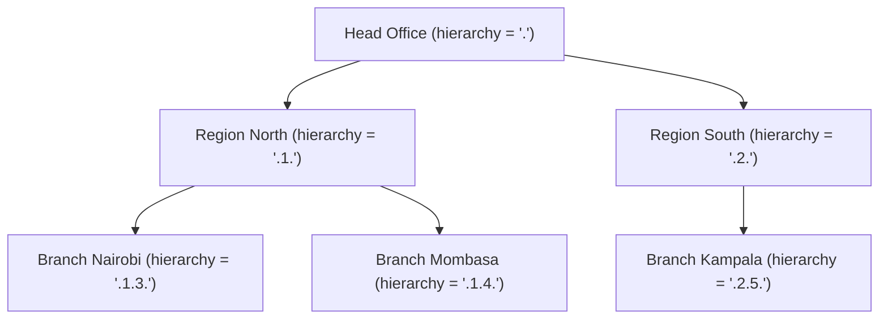

Apache Fineract models the physical and logical structure of a microfinance institution through a tree of **Office** entities backed by the `m_office` table, and a roster of **Staff** members backed by `m_staff`. Every other object in the platform—clients, loans, savings accounts, GL accounts—anchors itself to an office, making the office hierarchy the foundational axis around which data-scoping, permission checks, and reporting all revolve. Understanding this structure is essential before touching anything else in the codebase.

## Office Entity and Hierarchy Model

The `Office` class (`fineract-core/src/main/java/org/apache/fineract/organisation/office/domain/Office.java`) is a standard JPA entity mapped to `m_office`. A single root office (head office) always exists; every other office must declare a parent. The hierarchy is materialised as a dot-separated string stored in the `hierarchy` column, computed on creation and whenever a parent reassignment occurs.

```java
// Office.java — hierarchy generation
public void generateHierarchy() {
    if (this.parent != null) {
        this.hierarchy = this.parent.hierarchyOf(getId());
    } else {
        this.hierarchy = ".";
    }
}

private String hierarchyOf(final Long id) {
    return this.hierarchy + id.toString() + ".";
}
```

This dot notation (e.g., `.1.3.7.`) lets the database perform sub-tree queries using a `LIKE` predicate on the `hierarchy` column—any office whose `hierarchy` string starts with the parent's hierarchy is a descendant. The `doesNotHaveAnOfficeInHierarchyWithId` method traverses the in-memory children list to enforce rule violations (for example, preventing circular parent references).

Key entity fields:

| Column | Field | Notes |
|---|---|---|
| `name` | `String name` | Unique per tenant (`name_org` constraint) |
| `hierarchy` | `String hierarchy` | Materialised path, max 50 chars |
| `opening_date` | `LocalDate openingDate` | Non-nullable |
| `external_id` | `ExternalId externalId` | Optional, unique (`externalid_org`) |
| `parent_id` | `Office parent` | `null` for root; enforced in `RootOfficeParentCannotBeUpdated` |

The `children` association (`@OneToMany(fetch = FetchType.LAZY)` paired with `@JoinColumn(name = "parent_id")`) is lazy-loaded. Code that needs to walk the full tree must call `loadLazyCollections()` first.

### Office Hierarchy Diagram



Any query filtering `WHERE o.hierarchy LIKE '.1.%'` returns Region North plus both its branches, which is how data scoping works throughout the platform.

## OfficesApiResource

`OfficesApiResource` (`fineract-provider/src/main/java/org/apache/fineract/organisation/office/api/OfficesApiResource.java`) is a JAX-RS resource annotated with `@Path("/v1/offices")` and `@Tag(name = "Offices", ...)`. All write operations flow through `PortfolioCommandSourceWritePlatformService`, which wraps every mutation in a `CommandWrapper` and persists an audit trail before executing.

```java
@Path("/v1/offices")
@Component
@Tag(name = "Offices", description = "Offices are used to model an MFIs structure...")
public class OfficesApiResource {

    private static final Set<String> RESPONSE_DATA_PARAMETERS = new HashSet<>(
        List.of("id", "name", "nameDecorated", "externalId", "openingDate",
                "hierarchy", "parentId", "parentName", "allowedParents"));
    ...
}
```

The `RESPONSE_DATA_PARAMETERS` set controls which fields are included in serialised output when a caller uses the `?fields=` partial-response query parameter (processed by `ApiRequestParameterHelper`).

### Available Endpoints

| Method | Path | Description |
|---|---|---|
| `GET` | `/v1/offices` | List all offices; supports `?includeAllOffices`, `?orderBy`, `?sortOrder` |
| `GET` | `/v1/offices/template` | New-office form defaults with `allowedParents` list |
| `POST` | `/v1/offices` | Create office; mandatory: `name`, `openingDate`, `parentId` |
| `GET` | `/v1/offices/{officeId}` | Retrieve a single office; append `?template=true` for allowed parents |
| `GET` | `/v1/offices/external-id/{externalId}` | Look up by external ID |
| `PUT` | `/v1/offices/{officeId}` | Update office |
| `PUT` | `/v1/offices/external-id/{externalId}` | Update by external ID |
| `GET` | `/v1/offices/downloadtemplate` | Download Excel import template |
| `POST` | `/v1/offices/uploadtemplate` | Bulk-import offices via uploaded workbook |

The `OfficeSwaggerMapper` (in the same `api` package) converts between the internal `OfficeData` projection and the Swagger-annotated response models defined in `OfficesApiResourceSwagger`.

`SqlValidator.validate()` is called on `orderBy` and `sortOrder` query parameters before they are forwarded to `SearchParameters` to prevent SQL injection via sort column names.

## Staff Entity

`Staff` (`fineract-core/src/main/java/org/apache/fineract/organisation/staff/domain/Staff.java`) maps to `m_staff`. A staff member is always assigned to exactly one office. The boolean `is_loan_officer` column distinguishes between loan officers and support staff—this flag is checked by the loan origination flow to populate the loan officer dropdown.

```java
@Entity
@Table(name = "m_staff", uniqueConstraints = {
    @UniqueConstraint(columnNames = { "display_name" }, name = "display_name"),
    @UniqueConstraint(columnNames = { "external_id" }, name = "external_id_UNIQUE"),
    @UniqueConstraint(columnNames = { "mobile_no" }, name = "mobile_no_UNIQUE")
})
public class Staff extends AbstractPersistableCustom<Long> {

    @ManyToOne
    @JoinColumn(name = "office_id", nullable = false)
    private Office office;

    @Column(name = "is_loan_officer", nullable = false)
    private boolean loanOfficer;

    @Column(name = "organisational_role_enum")
    private Integer organisationalRoleType;

    @ManyToOne
    @JoinColumn(name = "organisational_role_parent_staff_id")
    private Staff organisationalRoleParentStaff;
    ...
}
```

The `organisationalRoleParentStaff` self-referential association allows a rudimentary reporting-line model (e.g., a relationship manager supervised by a branch manager). This field is optional and is not enforced by any workflow logic at present.

## StaffApiResource

`StaffApiResource` (`fineract-provider/src/main/java/org/apache/fineract/organisation/staff/api/StaffApiResource.java`) is at `@Path("/v1/staff")`. Unlike `OfficesApiResource`, this resource delegates writes through the newer `CommandDispatcher` abstraction rather than `PortfolioCommandSourceWritePlatformService`.

```java
@Path("/v1/staff")
@Tag(name = "Staff", description = "Allows you to model staff members. At present the key role
    of significance is whether this staff member is a loan officer or not.")
public class StaffApiResource {

    private final StaffReadService readPlatformService;
    private final CommandDispatcher dispatcher;
    ...

    @POST
    @Consumes({ MediaType.APPLICATION_JSON })
    public StaffCreateResponse createStaff(@RequestBody(required = true) @Valid StaffCreateRequest request) {
        final var command = new StaffCreateCommand();
        command.setPayload(request);
        final Supplier<StaffCreateResponse> response = dispatcher.dispatch(command);
        return response.get();
    }
}
```

### Available Endpoints

| Method | Path | Description |
|---|---|---|
| `GET` | `/v1/staff` | List; supports `?officeId`, `?staffInOfficeHierarchy`, `?loanOfficersOnly`, `?status` |
| `GET` | `/v1/staff/{staffId}` | Retrieve one; `?template=true` populates `allowedOffices` |
| `POST` | `/v1/staff` | Create; mandatory: `officeId`, `firstname`, `lastname` |
| `PUT` | `/v1/staff/{staffId}` | Update |
| `GET` | `/v1/staff/downloadtemplate` | Excel import template, scoped to `officeId` |
| `POST` | `/v1/staff/uploadtemplate` | Bulk import via workbook |

The `?status` parameter accepts `active` (default), `inactive`, or `all`. When `?staffInOfficeHierarchy=true` the query is delegated to `StaffReadService.retrieveAllStaffInOfficeAndItsParentOfficeHierarchy()`, which walks upward through parent offices rather than filtering downward.

### Staff-to-Loan Linkage

When a loan is originated, the `loanOfficerId` field on the loan application body must reference a `Staff` record with `is_loan_officer = true` in the same office hierarchy as the client. The loan domain model (`m_loan`) carries a `loan_officer_id` FK into `m_staff`. Reassignment of the loan officer is a dedicated command (`REASSIGN_STAFF`) tracked in the `m_loan_officer_assignment_history` table.

## Monetary Currencies (AllowedCurrencies)

The `CurrenciesApiResource` (`fineract-core/src/main/java/org/apache/fineract/organisation/monetary/api/CurrenciesApiResource.java`) at `@Path("/v1/currencies")` manages the set of currencies enabled for the tenant. Only currencies explicitly listed in `ApplicationCurrency` (table `m_application_currency`) can be used when creating products or transactions. The `CurrencyConfigurationData` read model aggregates both the currently enabled currencies and the full list of available ISO 4217 currencies for the template form.

## Working Days

`WorkingDays` (`fineract-core/src/main/java/org/apache/fineract/organisation/workingdays/domain/WorkingDays.java`) stores a recurrence rule string (e.g., `FREQ=WEEKLY;BYDAY=MO,TU,WE,TH,FR`) that defines which days of the week are working days. The `WorkingDaysUtil` helper provides `isWorkingDay(WorkingDays, LocalDate)` and `getOffSetDateIfNonWorkingDay(LocalDate, LocalDate, WorkingDays)` utilities consumed by the loan scheduler whenever a repayment or disbursement date falls on a non-working day.

`WorkingDaysApiResource` (`fineract-provider/src/main/java/org/apache/fineract/organisation/workingdays/api/WorkingDaysApiResource.java`) at `@Path("/v1/workingdays")` exposes `GET` and `PUT` endpoints. There is exactly one `WorkingDays` row per tenant.

## Holiday Management

`Holiday` (`fineract-core/src/main/java/org/apache/fineract/organisation/holiday/domain/Holiday.java`) is mapped to `m_holiday`. A holiday has a `fromDate`/`toDate` range and a `repaymentsRescheduledTo` date. Holidays are scoped to one or more offices via a `@ManyToMany` join table. The `reschedulingType` integer determines whether repayments falling within the holiday window are moved to `repaymentsRescheduledTo` or to the next working day.

`HolidaysApiResource` (`fineract-provider/src/main/java/org/apache/fineract/organisation/holiday/api/HolidaysApiResource.java`) at `@Path("/v1/holidays")` provides full CRUD. Newly created holidays enter a `PENDING` state (from `HolidayStatusType`) and must be activated before the loan scheduler respects them.

<Tip>
Use `GET /v1/holidays?officeId={id}` to list holidays scoped to a specific office. The scheduler's holiday-awareness is controlled by the global configuration key `reschedule-repayments-on-holidays`.
</Tip>

## Related Pages

- [Teller Management and Branch Cash Operations](/organisation/teller-branch) — branch-level teller and cashier operations that reference staff and offices
- [REST API Design: Jersey Resources and OpenAPI Spec](/api/rest-api-overview) — how `@Path`, `@Tag`, and `ApiRequestParameterHelper` work across all resources
