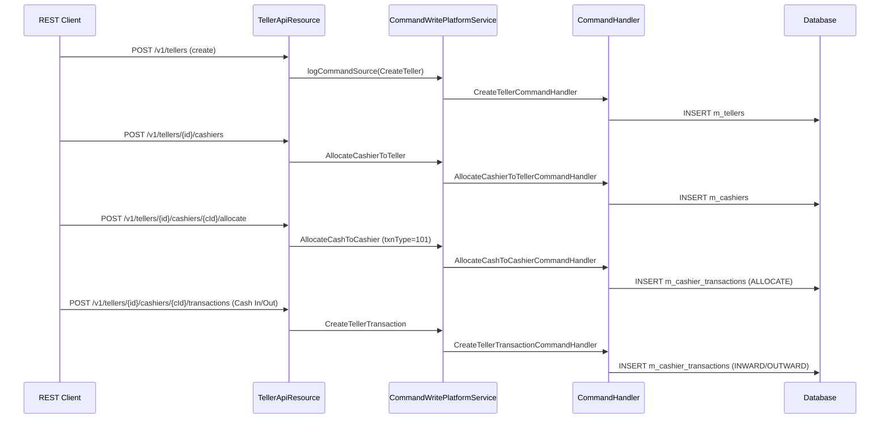

Branch cash management in Fineract is implemented in the dedicated **`fineract-branch`** Maven module, physically separated from `fineract-provider` to allow optional deployment. The domain centres on three entities—`Teller`, `Cashier`, and `CashierTransaction`—and exposes them through `TellerApiResource` and `CashierApiResource`. Every cash movement through a teller window is recorded in `m_cashier_transactions` and can optionally drive double-entry journal entries through linked GL accounts.

## Module Layout

All teller source lives under `fineract-branch/src/main/java/org/apache/fineract/organisation/teller/`:

```
domain/
  Teller.java                  — m_tellers entity
  Cashier.java                 — m_cashiers entity
  CashierTransaction.java      — m_cashier_transactions entity
  TellerTransaction.java       — m_teller_transactions entity
  TellerJournal.java           — journal data joined from GL
  CashierTxnType.java          — cash movement enum (ALLOCATE, SETTLE, INWARD, OUTWARD)
  TellerStatus.java            — teller lifecycle enum
api/
  TellerApiResource.java       — @Path("/v1/tellers")
  CashierApiResource.java      — @Path("/v1/cashiers")
  TellerJournalApiResource.java
service/
  TellerManagementReadPlatformService.java  — query interface
handler/
  CreateTellerCommandHandler.java
  AllocateCashierToTellerCommandHandler.java
  AllocateCashToCashierCommandHandler.java
  CreateTellerTransactionCommandHandler.java
```

## Teller Entity

`Teller` (`domain/Teller.java`) maps to the `m_tellers` table. A teller is always attached to exactly one `Office` and optionally linked to two `GLAccount` references (`debit_account_id`, `credit_account_id`) that are used when recording the corresponding GL entry for cash allocation/settlement.

```java
@Entity
@Table(name = "m_tellers",
    uniqueConstraints = { @UniqueConstraint(name = "ux_tellers_name", columnNames = { "name" }) })
public class Teller extends AbstractPersistableCustom<Long> {

    @ManyToOne(fetch = FetchType.LAZY)
    @JoinColumn(name = "office_id", nullable = false)
    private Office office;

    @ManyToOne(fetch = FetchType.EAGER)
    @JoinColumn(name = "debit_account_id")
    private GLAccount debitAccount;

    @ManyToOne(fetch = FetchType.EAGER)
    @JoinColumn(name = "credit_account_id")
    private GLAccount creditAccount;

    @Column(name = "state", nullable = false)
    private Integer status;           // maps to TellerStatus enum

    @Column(name = "valid_from")
    private LocalDate startDate;

    @Column(name = "valid_to")
    private LocalDate endDate;

    @OneToMany(mappedBy = "teller", fetch = FetchType.LAZY)
    private Set<Cashier> cashiers;
}
```

### TellerStatus Lifecycle

`TellerStatus` (`domain/TellerStatus.java`) is an enum with integer codes:

| Code | Constant | Meaning |
|---|---|---|
| 100 | `PENDING` | Created but not yet opened |
| 300 | `ACTIVE` | Open; transactions can be posted |
| 400 | `INACTIVE` | Temporarily suspended |
| 600 | `CLOSED` | Permanently closed |

A teller's `startDate` and `endDate` define its operational window. The `fromJson` factory sets status from the integer passed in the request body.

## Cashier Entity

A `Cashier` (`domain/Cashier.java`) represents a `Staff` member assigned to operate a specific teller for a bounded date range. The unique constraint `ux_cashiers_staff_teller` on `(staff_id, teller_id)` prevents the same person being double-allocated.

```java
@Entity
@Table(name = "m_cashiers",
    uniqueConstraints = {
        @UniqueConstraint(name = "ux_cashiers_staff_teller",
            columnNames = { "staff_id", "teller_id" }) })
public class Cashier extends AbstractPersistableCustom<Long> {

    @ManyToOne(fetch = FetchType.LAZY)
    @JoinColumn(name = "staff_id", nullable = false)
    private Staff staff;

    @ManyToOne(fetch = FetchType.LAZY)
    @JoinColumn(name = "teller_id", nullable = false)
    private Teller teller;

    @Column(name = "start_date", nullable = false)
    private LocalDate startDate;

    @Column(name = "end_date", nullable = false)
    private LocalDate endDate;

    @Column(name = "is_full_day")
    private boolean isFullDay;
    ...
}
```

A cashier's date range must fall entirely within the parent teller's `startDate`/`endDate`; if not, `CashierDateRangeOutOfTellerDateRangeException` is thrown.

## CashierTransaction Entity and Transaction Types

All actual cash movements are stored in `CashierTransaction` (`domain/CashierTransaction.java`) mapped to `m_cashier_transactions`:

```java
@Entity
@Table(name = "m_cashier_transactions")
public class CashierTransaction extends AbstractPersistableCustom<Long> {

    @ManyToOne(fetch = FetchType.LAZY)
    @JoinColumn(name = "cashier_id", nullable = false)
    private Cashier cashier;

    @Column(name = "txn_type", nullable = false)
    private Integer txnType;      // maps to CashierTxnType

    @Column(name = "txn_amount", scale = 6, precision = 19, nullable = false)
    private BigDecimal txnAmount;

    @Column(name = "txn_date", nullable = false)
    private LocalDate txnDate;

    @Column(name = "entity_type")
    private String entityType;    // "loans", "savings", etc.

    @Column(name = "entity_id")
    private Long entityId;        // FK into the referenced portfolio entity
}
```

The `txnType` integer is decoded by `CashierTxnType`:

```java
public final class CashierTxnType {
    public static final CashierTxnType ALLOCATE         = new CashierTxnType(101, "Allocate Cash");
    public static final CashierTxnType SETTLE           = new CashierTxnType(102, "Settle Cash");
    public static final CashierTxnType INWARD_CASH_TXN  = new CashierTxnType(103, "Cash In");
    public static final CashierTxnType OUTWARD_CASH_TXN = new CashierTxnType(104, "Cash Out");
}
```

- **ALLOCATE (101)**: Management allocates a float to a cashier at the start of the shift.
- **SETTLE (102)**: Cashier returns remaining cash to the vault at shift end.
- **INWARD_CASH_TXN (103)**: Customer deposit or loan repayment received at the window.
- **OUTWARD_CASH_TXN (104)**: Cash paid out (loan disbursement, savings withdrawal).

`entityType` and `entityId` link a transaction to its originating portfolio object (e.g., `entityType = "loans"`, `entityId = 42`).

## Teller and Cashier Operations Flow



## TellerApiResource

`TellerApiResource` (`api/TellerApiResource.java`) is at `@Path("/v1/tellers")`. Write operations are wrapped in `CommandWrapper` objects via `CommandWrapperBuilder` and dispatched through `PortfolioCommandSourceWritePlatformService`. Read operations delegate to `TellerManagementReadPlatformService`.

### Key Endpoints

| Method | Path | Description |
|---|---|---|
| `GET` | `/v1/tellers` | List tellers; `?officeId` to scope by branch |
| `GET` | `/v1/tellers/{tellerId}` | Retrieve single teller |
| `POST` | `/v1/tellers` | Create teller; mandatory: `name`, `officeId`, `startDate`, `status` |
| `PUT` | `/v1/tellers/{tellerId}` | Update teller details |
| `DELETE` | `/v1/tellers/{tellerId}` | Delete teller |
| `GET` | `/v1/tellers/{tellerId}/cashiers` | List cashiers for a teller; supports `?fromdate`, `?todate` |
| `GET` | `/v1/tellers/{tellerId}/cashiers/template` | Template for cashier creation (staff list) |
| `GET` | `/v1/tellers/{tellerId}/cashiers/{cashierId}` | Retrieve one cashier |
| `POST` | `/v1/tellers/{tellerId}/cashiers` | Allocate staff as cashier; mandatory: `staffId`, `startDate`, `endDate` |
| `POST` | `/v1/tellers/{tellerId}/cashiers/{cashierId}/allocate` | Allocate float cash (ALLOCATE txn) |
| `POST` | `/v1/tellers/{tellerId}/cashiers/{cashierId}/settle` | Settle cash (SETTLE txn) |
| `GET` | `/v1/tellers/{tellerId}/cashiers/{cashierId}/transactions` | Paginated cashier transactions |
| `GET` | `/v1/tellers/{tellerId}/cashiers/{cashierId}/summaryandtransactions` | Summary + paginated transactions |
| `GET` | `/v1/tellers/{tellerId}/transactions` | All teller transactions (cross-cashier) |
| `GET` | `/v1/tellers/{tellerId}/journals` | Teller journal entries |

The `?fromdate` and `?todate` parameters on cashier and journal queries use `DateTimeFormatter.BASIC_ISO_DATE` (`yyyyMMdd`) format, not ISO-8601.

### Cashier Summary

`CashierTransactionsWithSummaryData` is returned by the `/summaryandtransactions` endpoint. It aggregates opening balance, total cash-in, total cash-out, and a `Page<CashierTransactionData>` in a single response, saving round trips for the teller reconciliation UI.

`TellerManagementReadPlatformService` exposes:

```java
Page<CashierTransactionData> retrieveCashierTransactions(
    Long cashierId,
    boolean includeAllTellers,
    LocalDate fromDate,
    LocalDate toDate,
    String currencyCode,
    SearchParameters searchParameters);

CashierTransactionsWithSummaryData retrieveCashierTransactionSummary(
    Long cashierId,
    boolean includeAllTellers,
    LocalDate fromDate,
    LocalDate toDate,
    String currencyCode,
    SearchParameters searchParameters);
```

## CashierApiResource

`CashierApiResource` (`api/CashierApiResource.java`) at `@Path("/v1/cashiers")` is a lightweight read-only resource that returns cashiers filtered by `officeId`, `tellerId`, and `staffId` for a given date. It consults `TellerManagementReadPlatformService.getCashierData()`.

## Relation to GL Entries

When the `Teller` entity has `debitAccount` and `creditAccount` populated, the `AllocateCashToCashierCommandHandler` creates a corresponding `JournalEntry` pair. Specifically:

- **Cash allocation to cashier**: `DEBIT` the cashier's asset account (`debitAccount`), `CREDIT` the vault/safe account (`creditAccount`).
- **Cash settlement from cashier**: Reverses the above.

The `TellerJournalApiResource` (`api/TellerJournalApiResource.java`) at `/v1/tellers/{tellerId}/journals` exposes `TellerJournalData` objects, which join `m_cashier_transactions` with `m_journal_entries` so the branch manager can reconcile cash movements against the general ledger without needing direct GL access.

<Warning>
If `debitAccount` or `creditAccount` is not set on a Teller, cash transactions are still recorded in `m_cashier_transactions` but **no GL entries are created**. This is a valid configuration for deployments not using the accounting module, but will leave your trial balance incomplete if accounting is enabled.
</Warning>

## Exception Types

The `exception/` package defines business-rule violations:

| Exception | Trigger |
|---|---|
| `TellerNotFoundException` | Lookup of non-existent teller ID |
| `CashierNotFoundException` | Lookup of non-existent cashier ID |
| `CashierAlreadyAllocated` | Attempt to allocate the same staff to the same teller twice |
| `CashierDateRangeOutOfTellerDateRangeException` | Cashier date range outside teller's operational window |
| `CashierInsufficientAmountException` | OUTWARD transaction exceeds cashier's available balance |
| `CashierExistForTellerException` | Attempt to delete a teller that still has active cashiers |

## Related Pages

- [Offices, Staff, and Organisational Hierarchy](/organisation/offices-staff) — how Office and Staff are structured; tellers reference both
- [REST API Design: Jersey Resources and OpenAPI Spec](/api/rest-api-overview) — how all JAX-RS resources including `TellerApiResource` are wired
