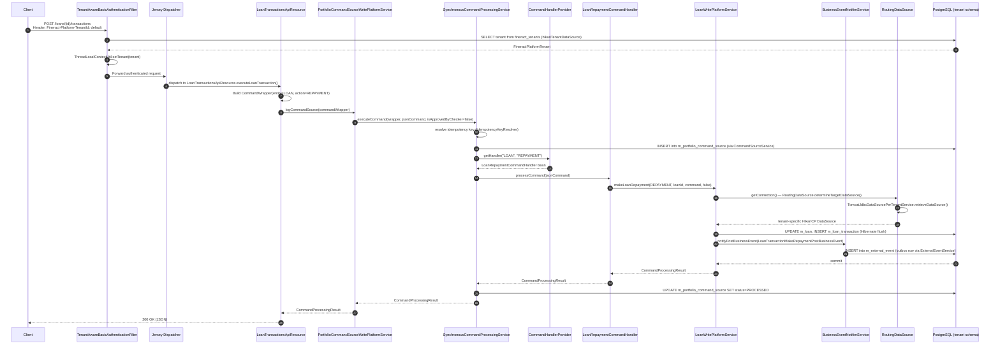

Apache Fineract is structured as a layered Spring Boot monolith where every component boundary is enforced by abstraction interfaces rather than service boundaries. The application has no microservice split at runtime — all modules compile into a single `fineract-provider` JAR — but the codebase is partitioned into functionally cohesive Gradle subprojects that enforce dependency direction at build time. Understanding the request lifecycle from an inbound HTTP call to a committed database row reveals how each layer interacts and where to hook in custom logic.

## Layer Overview

```
HTTP Client
    │
    ▼
Spring Security Filter Chain
(TenantAwareBasicAuthenticationFilter / OAuth2 filter)
    │  resolves Fineract-Platform-TenantId header
    │  stores FineractPlatformTenant in ThreadLocal
    ▼
Jersey (JAX-RS) Dispatcher
(registered via JerseyConfig in fineract-provider)
    │
    ▼
Resource Class (e.g., LoanTransactionsApiResource)
    │  builds CommandWrapper
    ▼
PortfolioCommandSourceWritePlatformService
    │  logs CommandSource to m_portfolio_command_source
    │  resolves idempotency key
    ▼
SynchronousCommandProcessingService
    │  looks up NewCommandSourceHandler via CommandHandlerProvider
    │  (dispatches via @CommandType entity + action)
    ▼
Domain CommandHandler (e.g., LoanRepaymentCommandHandler)
    │  calls domain write service
    ▼
Domain Write Service (e.g., LoanWritePlatformService)
    │  loads JPA entities, applies business logic
    │  notifies BusinessEventNotifierService
    ▼
JPA / JDBC (Hibernate + JdbcTemplate)
    │
    ▼
RoutingDataSource → TomcatJdbcDataSourcePerTenantService
    │  resolves per-tenant DataSource from ConcurrentHashMap
    ▼
PostgreSQL (per-tenant schema)
```

## Spring Application Context Wiring

The application context is bootstrapped by `ServerApplication`, which imports `FineractWebApplicationConfiguration` from `fineract-provider/src/main/java/org/apache/fineract/infrastructure/core/boot/FineractWebApplicationConfiguration.java`. This class is annotated with:

```java
// FineractWebApplicationConfiguration.java
@Configuration
@EnableAutoConfiguration(exclude = {
    DataSourceAutoConfiguration.class,
    HibernateJpaAutoConfiguration.class,
    DataSourceTransactionManagerAutoConfiguration.class,
    GsonAutoConfiguration.class,
    JdbcTemplateAutoConfiguration.class,
    LiquibaseAutoConfiguration.class
})
@EnableTransactionManagement
@EnableWebSecurity
@EnableConfigurationProperties({ FineractProperties.class, LiquibaseProperties.class })
@ComponentScan(basePackages = "org.apache.fineract.**")
@IntegrationComponentScan(basePackages = "org.apache.fineract.**")
@Conditional(FineractWebApplicationCondition.class)
public abstract class FineractWebApplicationConfiguration implements InitializingBean { ... }
```

The broad `@ComponentScan("org.apache.fineract.**")` pulls in every `@Component`, `@Service`, `@Repository`, and `@Configuration` class from all Gradle submodules on the classpath. Individual modules declare their beans normally — there is no manual wiring needed when adding a new module to the classpath. The exclusion of `DataSourceAutoConfiguration` and `HibernateJpaAutoConfiguration` is intentional: Fineract registers its own `RoutingDataSource` and `LocalContainerEntityManagerFactoryBean` to implement per-tenant database switching at connection acquisition time.

`FineractProperties` (in `fineract-core/src/main/java/org/apache/fineract/infrastructure/core/config/FineractProperties.java`) is a `@ConfigurationProperties(prefix = "fineract")` class that provides typed access to all `fineract.*` properties from `application.properties`, covering tenant connection details, mode flags, remote job handlers, and event configuration.

## Detailed Sequence: Loan Repayment

The following sequence diagram traces a `POST /api/v1/loans/{loanId}/transactions?command=repayment` request from the client to the committed database row.



## Security Filter and Tenant Resolution

The `TenantAwareBasicAuthenticationFilter` (in `fineract-security/src/main/java/org/apache/fineract/infrastructure/security/filter/`) reads the `Fineract-Platform-TenantId` HTTP header on every request and calls `JdbcTenantDetailsService.loadTenantById(tenantId)`. The resolved `FineractPlatformTenant` object — containing the tenant's database host, port, schema name, and connection pool config via `FineractPlatformTenantConnection` — is stored in a `ThreadLocal` via `ThreadLocalContextUtil.setTenant()`. All downstream code retrieves the active tenant through `ThreadLocalContextUtil.getTenant()`.

When OIDC federation is enabled (`fineract.security.oidc-federation.enabled=true`), the tenant identifier is extracted from the JWT claim named by `fineract.security.oidc-federation.tenant-claim-name` (default: `fineract_tenant`) instead of an HTTP header.

## Read vs. Write Path Separation

Fineract separates reads from writes both structurally and at the datasource level.

**Write path:** All mutations go through `PortfolioCommandSourceWritePlatformService.logCommandSource()`, which stores a `CommandSource` entity in `m_portfolio_command_source` and delegates to `SynchronousCommandProcessingService.executeCommand()`. The command source record provides a complete audit trail and is the anchor for maker-checker workflows.

**Read path:** Read services (e.g., `LoanReadPlatformService`, `SavingsAccountReadPlatformService`) bypass the command layer entirely. They use `JdbcTemplate` directly against the tenant's datasource, typically with named row mapper implementations. The `RoutingDataSourceServiceFactory` can be configured to direct read operations to a read-replica schema (`fineract.tenant.read-only-host`), with the switch happening transparently at the `RoutingDataSource` level.

**Mode flags:** At the instance level, four boolean properties in `application.properties` control which paths are active:

```properties
fineract.mode.read-enabled=${FINERACT_MODE_READ_ENABLED:true}
fineract.mode.write-enabled=${FINERACT_MODE_WRITE_ENABLED:true}
fineract.mode.batch-worker-enabled=${FINERACT_MODE_BATCH_WORKER_ENABLED:true}
fineract.mode.batch-manager-enabled=${FINERACT_MODE_BATCH_MANAGER_ENABLED:true}
```

This allows running dedicated read nodes, write nodes, and batch worker nodes from the same JAR by overriding these properties per instance.

<Warning>
Setting `fineract.mode.write-enabled=false` does not disable all write paths — only the command-processing layer. Direct JPA mutations from batch jobs are unaffected. Use this flag in combination with network-level routing to enforce a true read-only replica.
</Warning>

## Component Scan and Module Registration

Because `@ComponentScan` covers `org.apache.fineract.**`, any jar on the classpath that contains classes under that package root will have its beans registered automatically. This is how domain modules like `fineract-loan`, `fineract-savings`, and `fineract-accounting` contribute their `@CommandType`-annotated handlers, `@BusinessEventListener`-annotated services, and JPA repositories without any explicit registration in the provider module. The `CommandHandlerProvider` bean (in `fineract-core`) discovers all `NewCommandSourceHandler` implementations at startup via `ApplicationContext.getBeanNamesForAnnotation(CommandType.class)`.

See [Command Pattern](/core/command-pattern) for a deep-dive into handler registration and dispatch. See [Multi-Tenancy](/core/multi-tenancy) for the datasource routing internals.
