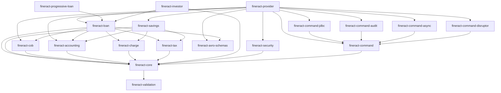

Apache Fineract is a Gradle multi-project build. All subprojects are enumerated in `settings.gradle` at the repository root. The dependency graph flows from infrastructure modules upward to domain modules and finally to the deployable `fineract-provider`. Understanding this map tells you where to add code, which modules to depend on, and how the build avoids circular dependencies.

## Module Reference Table

| Module | Role | Key Source Root |
|---|---|---|
| `fineract-core` | Shared infrastructure: tenant routing, command SPI, event SPI, serialization, JPA base classes, pagination, threading utilities | `org.apache.fineract.infrastructure.core` |
| `fineract-security` | Spring Security configuration, `TenantAwareBasicAuthenticationFilter`, OAuth2 / OIDC filters, 2FA, user details service | `org.apache.fineract.infrastructure.security` |
| `fineract-validation` | JSR-303 validator extensions, custom constraint annotations used across all modules | `org.apache.fineract.infrastructure.validation` |
| `fineract-command` | New command framework: `Command<T>`, `CommandHandler<REQ,RES>`, `CommandDispatcher`, `CommandStore` SPI, hook lifecycle | `org.apache.fineract.command.core` |
| `fineract-command-jdbc` | JDBC-backed `CommandStore` implementation using `JdbcCommandStore` and `CommandRepository` | `org.apache.fineract.command.jdbc` |
| `fineract-command-audit` | Audit hook implementations (`AuditCommandHookBefore`, `AuditCommandHookAfter`, `AuditCommandHookError`) | `org.apache.fineract.command.audit` |
| `fineract-command-async` | `AsyncCommandDispatcher` — executes command handlers in a managed thread pool | `org.apache.fineract.command.async` |
| `fineract-command-disruptor` | LMAX Disruptor-backed `DisruptorCommandDispatcher` for low-latency command dispatch | `org.apache.fineract.command.disruptor` |
| `fineract-command-test` | Test utilities and shared `TestConfiguration` for command module tests | `org.apache.fineract.command` (test) |
| `fineract-cob` | Close-of-Business (COB) engine: `COBBusinessStep<T>` SPI, `COBBusinessStepService`, account locking, business step config | `org.apache.fineract.cob` |
| `fineract-accounting` | Chart of accounts, journal entries, GL account mapping, accounting rules, trial balance | `org.apache.fineract.accounting` |
| `fineract-loan` | Core loan lifecycle: origination, disbursement, repayment, charges, accruals, delinquency, loan events, COB steps | `org.apache.fineract.portfolio.loanaccount` |
| `fineract-progressive-loan` | Progressive loan repayment schedule engine (EMI, declining balance progressive) | `org.apache.fineract.portfolio.loanaccount.loanschedule` |
| `fineract-progressive-loan-embeddable-schedule-generator` | Standalone embeddable schedule generator library for progressive loans | Standalone library |
| `fineract-working-capital-loan` | Working capital loan product specialization and COB job | `org.apache.fineract.portfolio.workingcapital` |
| `fineract-loan-origination` | Loan origination workflow extensions | `org.apache.fineract.portfolio.loanorigination` |
| `fineract-savings` | Savings accounts, fixed deposits, recurring deposits, share products | `org.apache.fineract.portfolio.savings` |
| `fineract-charge` | Charge and fee domain model, charge calculation strategies, overdue charge application | `org.apache.fineract.portfolio.charge` |
| `fineract-tax` | Tax components, tax groups, tax mapping to products | `org.apache.fineract.portfolio.tax` |
| `fineract-rates` | Floating rate definitions and rate periods | `org.apache.fineract.portfolio.floatingrates` |
| `fineract-investor` | External asset owner / investor management, portfolio transfer | `org.apache.fineract.investor` |
| `fineract-branch` | Office hierarchy (branches), staff management | `org.apache.fineract.organisation.office` |
| `fineract-document` | Document storage metadata (file attachments on entities) | `org.apache.fineract.infrastructure.documentmanagement` |
| `fineract-report` | Pentaho / JDBC-backed report engine, report mailing, stretch reporting | `org.apache.fineract.infrastructure.report` |
| `fineract-mix` | CGAP MIX Market indicator computation and XML reporting | `org.apache.fineract.mix` |
| `fineract-avro-schemas` | Apache Avro schema definitions and generated Java DTO classes for external events | `org.apache.fineract.avro` |
| `fineract-provider` | The deployable Spring Boot application: assembles all modules, Jersey config, batch job config, Spring Integration config, `application.properties` | `org.apache.fineract` |
| `fineract-war` | WAR packaging artifact for traditional servlet container deployment | N/A (packaging only) |
| `fineract-client` | Auto-generated OpenAPI Java client library | `org.apache.fineract.client` |
| `fineract-client-feign` | Feign-based REST client wrappers built on top of `fineract-client` | `org.apache.fineract.client.feign` |
| `fineract-doc` | OpenAPI / documentation generation Gradle tasks; produces `fineract.json` and related artifacts | N/A (build tooling) |
| `integration-tests` | Full-stack integration tests against a running Fineract instance | `org.apache.fineract.integrationtests` |
| `twofactor-tests` | 2FA-specific integration tests | `org.apache.fineract.integrationtests` |
| `oauth2-tests` | OAuth2/OIDC integration tests | `org.apache.fineract.integrationtests` |
| `fineract-e2e-tests-core` | Shared E2E test helpers and step definitions | `org.apache.fineract.test` |
| `fineract-e2e-tests-runner` | Cucumber E2E test runner | `org.apache.fineract.test` |

## Dependency Graph

The dependency direction is strictly bottom-up. Arrows point from dependent to dependency.



<Note>
`fineract-provider` does not itself contain domain logic — it is an assembly module. Its primary responsibilities are Jersey resource registration, Spring Batch job wiring, Spring Integration channel configuration, and providing `application.properties`. Domain modules are pulled in transitively via Gradle `implementation` dependencies.
</Note>

## Module Detail Cards

<CardGroup cols={2}>
  <Card title="fineract-core" icon="gears" href="/core/fineract-core">
    Shared infrastructure: JPA base classes, tenant routing, command SPI (`NewCommandSourceHandler`), event SPI (`BusinessEventNotifierService`), `PaginationHelper`, `ThreadLocalContextUtil`, `RoutingDataSource`. Everything else depends on this module.
  </Card>
  <Card title="fineract-provider" icon="server">
    The runnable artifact. Wires Spring Batch jobs (`ScheduledJobRunnerConfig`), Spring Integration channels (`ManagerConfig`, `WorkerConfig`), Jersey configuration, and `FineractWebApplicationConfiguration`. No business logic lives here.
  </Card>
  <Card title="fineract-loan" icon="money-bill">
    The largest domain module. Contains the `Loan` JPA aggregate, all loan lifecycle command handlers (annotated with `@CommandType`), `LoanCOBBusinessStep` implementations, accrual logic, delinquency classification, and all loan-related business events.
  </Card>
  <Card title="fineract-cob" icon="clock">
    The COB engine. Defines `COBBusinessStep<T>` SPI, `COBBusinessStepService.run()`, account locking services, and the business step configuration persistence model. Does not contain loan-specific steps — those are in `fineract-loan`.
  </Card>
  <Card title="fineract-command" icon="terminal">
    The new command framework with `Command<T>`, `CommandHandler<REQ,RES>`, `CommandDispatcher`, and hook lifecycle interfaces. Separate from the older `commands` package in `fineract-core` which remains the primary path for REST-triggered writes.
  </Card>
  <Card title="fineract-avro-schemas" icon="database">
    Avro schema definitions (`.avsc` files) and generated Java classes for external event payloads. Every event serialized and published to Kafka or JMS is encoded using a schema from this module.
  </Card>
</CardGroup>

## Custom Module Extension

The `custom/` directory at the repository root is the official mechanism for adding company-specific modules without modifying core code. `settings.gradle` dynamically discovers all directories matching `custom/<company>/<category>/<module>` and includes them as Gradle subprojects:

```groovy
// settings.gradle
file("${rootDir}/custom").eachDir { companyDir ->
    if ('build' != companyDir.name && 'docker' != companyDir.name) {
        file("${rootDir}/custom/${companyDir.name}").eachDir { categoryDir ->
            file("${rootDir}/custom/${companyDir.name}/${categoryDir.name}").eachDir { moduleDir ->
                include ":custom:${companyDir.name}:${categoryDir.name}:${moduleDir.name}"
            }
        }
    }
}
```

A custom module follows the same conventions as any other Gradle subproject. It can declare `implementation project(':fineract-core')` (or any other Fineract module) as a dependency, define its own `@CommandType`-annotated handlers, and register beans that will be component-scanned automatically because `FineractWebApplicationConfiguration` scans `org.apache.fineract.**`.

<Tip>
The `custom:docker` special module assembles a Docker image that includes all discovered custom modules. Use it as the base for your deployment image rather than building custom Docker tooling from scratch.
</Tip>
