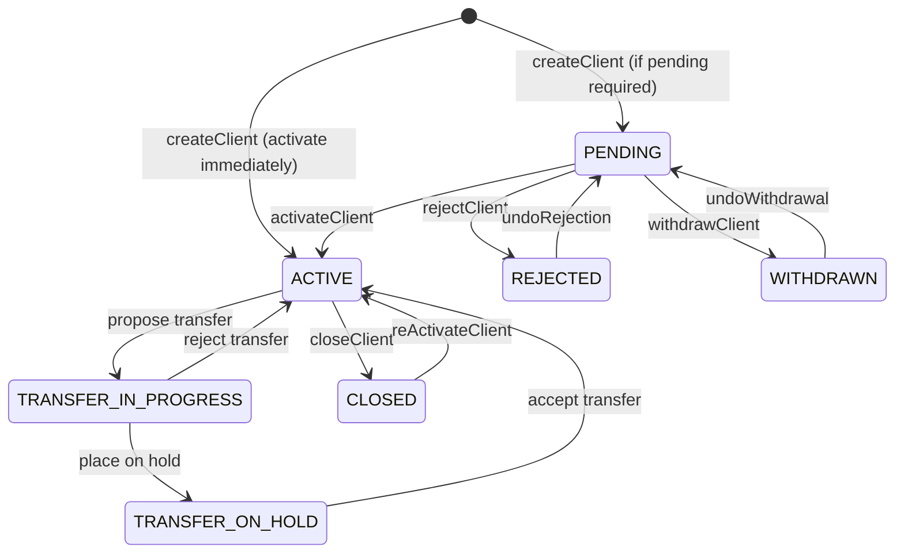

The client is the foundational entity in Apache Fineract's portfolio domain. A `Client` record represents either an individual or a legal entity (such as a company or cooperative) that can hold loans, savings accounts, share accounts, and be a member of groups and centers. All client domain classes live in `fineract-core` and `fineract-provider`; the service interfaces and implementations are split between them. This page covers the entity model, the status machine, auxiliary entities (addresses, identifiers, non-person detail), and the REST API surface.

## Entity Structure

`Client` is mapped to `m_client` in `fineract-core`:

```java
// fineract-core/.../portfolio/client/domain/Client.java
@Entity
@Table(name = "m_client")
public class Client extends AbstractAuditableWithUTCDateTimeCustom<Long> {

    @Column(name = "account_no", length = 20, unique = true)
    private String accountNumber;

    @ManyToOne
    @JoinColumn(name = "office_id", nullable = false)
    private Office office;

    @Column(name = "status_enum", nullable = false)
    private Integer status;              // ClientStatus integer

    @ManyToOne(fetch = FetchType.LAZY)
    @JoinColumn(name = "sub_status")
    private CodeValue subStatus;

    @Column(name = "activation_date")
    private LocalDate activationDate;

    @Column(name = "firstname", length = 50)
    private String firstname;

    @Column(name = "middlename", length = 50)
    private String middlename;

    @Column(name = "lastname", length = 50)
    private String lastname;

    @Column(name = "fullname", length = 160)
    private String fullname;             // Used for legal entities

    @Column(name = "display_name", length = 160, nullable = false)
    private String displayName;

    @Column(name = "mobile_no", length = 50, unique = true)
    private String mobileNo;

    @Column(name = "email_address", length = 50, unique = true)
    private String emailAddress;

    @Column(name = "external_id", length = 100, unique = true)
    private ExternalId externalId;

    @Column(name = "date_of_birth")
    private LocalDate dateOfBirth;

    @ManyToOne
    @JoinColumn(name = "staff_id")
    private Staff staff;                 // Assigned loan officer / field officer

    @ManyToMany(fetch = FetchType.LAZY)
    @JoinTable(name = "m_group_client", ...)
    private Set<Group> groups;

    @Column(name = "default_savings_account")
    private Long savingsAccountId;       // FK to m_savings_account

    @Column(name = "legal_form_enum")
    private Integer legalForm;           // 1=PERSON, 2=ENTITY
}
```

<Tip>
`legalForm` distinguishes individual clients (`PERSON`) from corporate clients (`ENTITY`). Entity clients additionally have a `ClientNonPerson` record holding `incorp_no` (incorporation number) and `incorp_validity_till`.
</Tip>

## ClientStatus Lifecycle

`ClientStatus` is defined in `fineract-core`:

```java
// fineract-core/.../portfolio/client/domain/ClientStatus.java
public enum ClientStatus {
    INVALID(0, "clientStatusType.invalid"),
    PENDING(100, "clientStatusType.pending"),
    ACTIVE(300, "clientStatusType.active"),
    TRANSFER_IN_PROGRESS(303, "clientStatusType.transfer.in.progress"),
    TRANSFER_ON_HOLD(304, "clientStatusType.transfer.on.hold"),
    CLOSED(600, "clientStatusType.closed"),
    REJECTED(700, "clientStatusType.rejected"),
    WITHDRAWN(800, "clientStatusType.withdraw");
}
```



The `sub_status` column (a `CodeValue` FK) carries secondary labels like "Blacklisted" or "KYC Pending". It is purely informational and does not gate lifecycle transitions.

## Auxiliary Entities

### ClientNonPerson

For `legalForm = ENTITY`, a linked `ClientNonPerson` row (table `m_client_non_person`) holds company registration data:

- `incorp_no` — incorporation number
- `incorp_validity_till` — expiry of the incorporation certificate
- `remarks` — free-text notes
- `constitutionCvId`, `mainBusinessLineCvId` — CodeValue references

### ClientAddress

`ClientAddress` (mapped to `m_client_address`) links a client to one or more `Address` records:

```
fineract-provider/.../portfolio/client/domain/ClientAddress.java
fineract-provider/.../portfolio/client/api/ClientAddressApiResource.java
```

Addresses are managed via `POST/PUT /v1/client/{id}/addresses`. Each address carries fields such as `addressLine1`, `city`, `stateProvinceId`, `countryId`, and `postalCode`, all driven by `CodeValue` lookups.

### ClientIdentifier

`ClientIdentifier` (mapped to `m_client_identifier` in `fineract-core`) stores government-issued IDs:

- `documentTypeId` — CodeValue (e.g. National ID, Passport, Driver's Licence)
- `documentKey` — the ID number (unique per document type)
- `description`, `status`

The `ClientIdentifiersApiResource` at `/v1/clients/{clientId}/identifiers` provides CRUD. Duplicate detection is enforced by `DuplicateClientIdentifierException`.

### Family Members

`ClientFamilyMembers` (mapped to `m_family_members`) is an optional extension for microfinance use cases, recording spouse/dependent information. It has its own API at `/v1/clients/{id}/familymembers`.

## ClientWritePlatformService

```java
// fineract-provider/.../portfolio/client/service/ClientWritePlatformService.java
public interface ClientWritePlatformService {
    CommandProcessingResult createClient(JsonCommand command);
    CommandProcessingResult updateClient(Long clientId, JsonCommand command);
    CommandProcessingResult activateClient(Long clientId, JsonCommand command);
    CommandProcessingResult deleteClient(Long clientId);        // Only PENDING clients
    CommandProcessingResult closeClient(Long clientId, JsonCommand command);
    CommandProcessingResult rejectClient(Long entityId, JsonCommand command);
    CommandProcessingResult withdrawClient(Long entityId, JsonCommand command);
    CommandProcessingResult reActivateClient(Long entityId, JsonCommand command);
    CommandProcessingResult undoRejection(Long entityId, JsonCommand command);
    CommandProcessingResult undoWithdrawal(Long entityId, JsonCommand command);
    CommandProcessingResult unassignClientStaff(Long clientId, JsonCommand command);
    CommandProcessingResult assignClientStaff(Long clientId, JsonCommand command);
    CommandProcessingResult updateDefaultSavingsAccount(Long clientId, JsonCommand command);
}
```

The implementation (`ClientWritePlatformServiceJpaRepositoryImpl` in `fineract-provider`) validates state transitions using `ClientStatus.fromInt()` and throws `InvalidClientStateTransitionException` on invalid paths.

`deleteClient()` is only allowed when `ClientStatus == PENDING`. For any other status the client must be closed, rejected, or withdrawn before deletion is permitted (`ClientMustBePendingToBeDeletedException`).

## ClientReadPlatformService

```java
// fineract-core/.../portfolio/client/service/ClientReadPlatformService.java
public interface ClientReadPlatformService {
    Page<ClientData> retrieveAll(SearchParameters searchParameters);
    ClientData retrieveOne(Long clientId);
    Collection<ClientData> retrieveAllForLookup(String extraCriteria);
    Collection<ClientData> retrieveClientMembersOfGroup(Long groupId);
    Collection<ClientData> retrieveActiveClientMembersOfCenter(Long centerId);
    LocalDate retrieveClientTransferProposalDate(Long clientId);
    Long retrieveClientIdByExternalId(ExternalId externalId);
}
```

`SearchParameters` supports filtering by `officeId`, `externalId`, `displayName`, `mobileNo`, `staffId`, and date ranges. The `Page<ClientData>` response is paginated.

## v2 Client Search API

For full-text / fuzzy search, Fineract provides a separate v2 endpoint backed by `ClientSearchV2ApiResource`:

```java
// fineract-provider/.../portfolio/client/api/v2/search/ClientSearchV2ApiResource.java
@Path("/v2/clients")
@Component
public class ClientSearchV2ApiResource implements ClientSearchV2Api {

    @POST
    @Path("search")
    @Consumes({ MediaType.APPLICATION_JSON })
    @Produces({ MediaType.APPLICATION_JSON })
    public Page<ClientSearchData> searchByText(
        @Parameter PagedRequest<ClientTextSearch> request) {
        return delegate.searchByText(request);
    }
}
```

Request body (`ClientTextSearch`) accepts a `text` field that is matched against `display_name`, `account_no`, `mobile_no`, and `external_id`. The response includes pagination metadata and a list of `ClientSearchData` records. The delegate implementation is in `ClientSearchV2ApiDelegate`.

Example request:
```json
POST /v2/clients/search
{
  "request": { "text": "John" },
  "page": { "pageNumber": 0, "pageSize": 20 }
}
```

## REST API (ClientsApiResource)

`ClientsApiResource` (`fineract-provider/.../portfolio/client/api/ClientsApiResource.java`) is the primary v1 REST resource at `/v1/clients`:

| Method | Path | Description |
|---|---|---|
| `POST` | `/v1/clients` | Create client |
| `GET` | `/v1/clients` | List/search clients |
| `GET` | `/v1/clients/{clientId}` | Retrieve one client |
| `GET` | `/v1/clients/external-id/{externalId}` | Retrieve by external ID |
| `PUT` | `/v1/clients/{clientId}` | Update client |
| `DELETE` | `/v1/clients/{clientId}` | Delete (PENDING only) |
| `POST` | `/v1/clients/{clientId}?command=activate` | Activate |
| `POST` | `/v1/clients/{clientId}?command=close` | Close |
| `POST` | `/v1/clients/{clientId}?command=reject` | Reject |
| `POST` | `/v1/clients/{clientId}?command=withdraw` | Withdraw |
| `POST` | `/v1/clients/{clientId}?command=reactivate` | Re-activate from CLOSED |
| `POST` | `/v1/clients/{clientId}?command=undorejection` | Undo rejection |
| `POST` | `/v1/clients/{clientId}?command=undowithdrawal` | Undo withdrawal |
| `POST` | `/v1/clients/{clientId}?command=assignStaff` | Assign field officer |
| `POST` | `/v1/clients/{clientId}?command=unassignStaff` | Unassign field officer |

## Related Pages

- [Groups, Centers, and Group Lending](/portfolio/groups-centers) — clients are members of groups; groups are members of centers
- [Charges, Fees, and Tax Configuration](/portfolio/charges-taxes) — `CLIENT` charge type applied to client transactions
- [Savings Module](/savings/savings-module) — `default_savings_account` on the client entity
