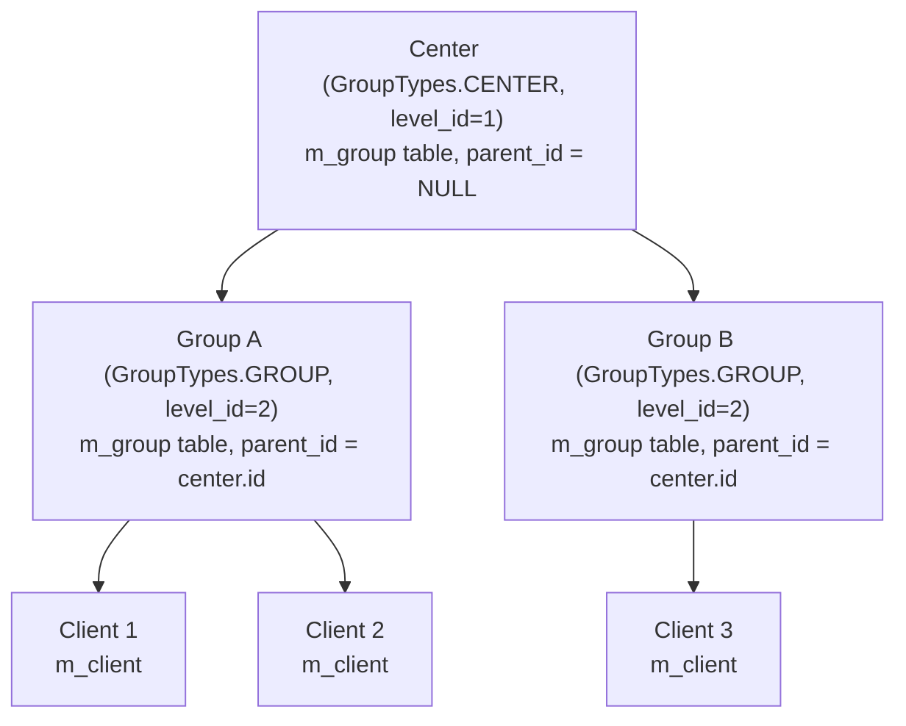
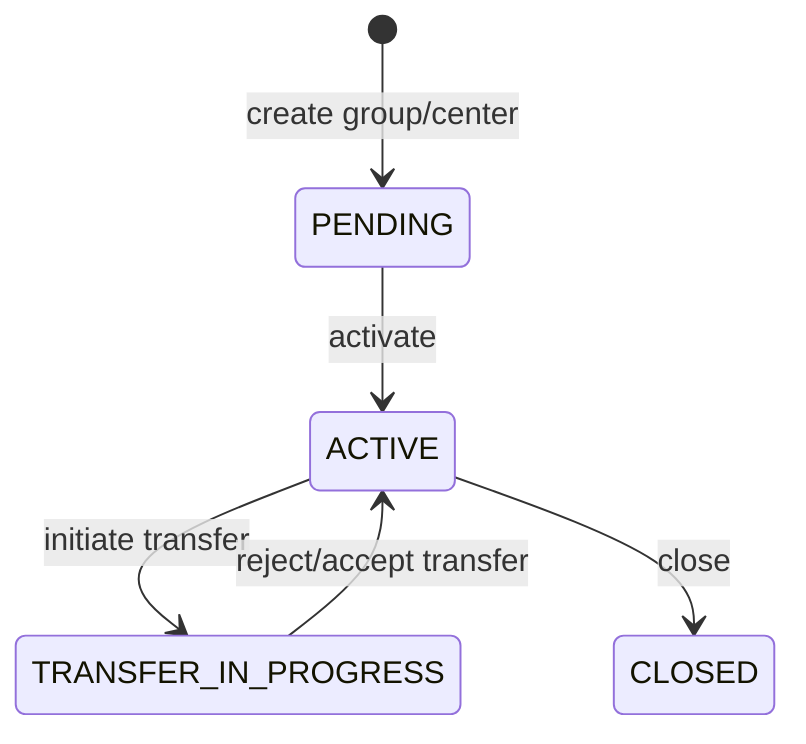

Fineract models cooperative and group-lending structures through a two-level hierarchy: a **Center** is a field-level collection point containing one or more **Groups**, each of which contains one or more **Clients**. A single JPA entity — `Group` (in `fineract-core`) — represents both levels, distinguished by a `GroupLevel` and the `GroupTypes` discriminator. This design allows the platform to share lifecycle logic, collection-sheet infrastructure, and calendar management across both levels without duplicating entity definitions.

## Hierarchy Overview



In the database, both centers and groups are rows in `m_group`. The `level_id` foreign key references `m_group_level`, and the `parent_id` self-referential FK links a group to its parent center.

## GroupTypes Enum

```java
// fineract-provider/.../portfolio/group/domain/GroupTypes.java
public enum GroupTypes {
    INVALID(0L, "lendingStrategy.invalid", "invalid"),
    CENTER(1L, "groupTypes.center", "center"),
    GROUP(2L, "groupTypes.group", "group");
}
```

Internally, the platform uses `GroupTypes` to determine which API resource and service logic to apply. `CentersApiResource` at `/v1/centers` and `GroupsApiResource` at `/v1/groups` both ultimately manipulate `Group` entities, filtered by `GroupTypes`.

## Group Entity

```java
// fineract-core/.../portfolio/group/domain/Group.java
@Entity
@Table(name = "m_group")
public final class Group extends AbstractPersistableCustom<Long> {

    @Column(name = "external_id", length = 100, unique = true)
    private String externalId;

    @Column(name = "status_enum", nullable = false)
    private Integer status;            // GroupingTypeStatus integer

    @Column(name = "activation_date")
    private LocalDate activationDate;

    @ManyToOne
    @JoinColumn(name = "office_id", nullable = false)
    private Office office;

    @ManyToOne
    @JoinColumn(name = "staff_id")
    private Staff staff;               // Loan officer / field officer

    @ManyToOne(fetch = FetchType.LAZY)
    @JoinColumn(name = "parent_id")
    private Group parent;              // null for Centers, non-null for Groups

    @ManyToOne
    @JoinColumn(name = "level_id", nullable = false)
    private GroupLevel groupLevel;     // CENTER or GROUP level record

    @Column(name = "display_name", length = 100, unique = true)
    private String name;

    @Column(name = "hierarchy", length = 100)
    private String hierarchy;          // Materialised path, e.g. "1.5."

    @OneToMany(fetch = FetchType.EAGER)
    @JoinColumn(name = "parent_id")
    private List<Group> groupMembers;  // Child groups (for Centers)

    @ManyToMany
    @JoinTable(name = "m_group_client", ...)
    private Set<Client> clientMembers; // Direct client members (for Groups)
}
```

## GroupingTypeStatus

`GroupingTypeStatus` mirrors `ClientStatus` in structure:

```java
// fineract-core/.../portfolio/group/domain/GroupingTypeStatus.java
public enum GroupingTypeStatus {
    INVALID(0, "groupingStatusType.invalid"),
    PENDING(100, "groupingStatusType.pending"),
    ACTIVE(300, "groupingStatusType.active"),
    TRANSFER_IN_PROGRESS(303, "clientStatusType.transfer.in.progress"),
    TRANSFER_ON_HOLD(304, "clientStatusType.transfer.on.hold"),
    CLOSED(600, "groupingStatusType.closed");
}
```



Groups in `PENDING` state cannot accept loan applications or collection sheet entries. Only `ACTIVE` groups are eligible for transaction posting.

## GroupLevel

`GroupLevel` (mapped to `m_group_level`) is seeded at database initialisation and defines the structural rules:

```java
// fineract-core/.../portfolio/group/domain/GroupLevel.java
@Entity
@Table(name = "m_group_level")
public class GroupLevel extends AbstractPersistableCustom<Long> {

    @Column(name = "parent_id")
    private Long parentId;

    @Column(name = "super_parent", nullable = false)
    private boolean superParent;       // true for Level 1 (Center)

    @Column(name = "level_name", nullable = false, length = 100)
    private String levelName;

    @Column(name = "recursable", nullable = false)
    private boolean recursable;        // Whether this level can nest under itself

    @Column(name = "can_have_clients", nullable = false)
    private boolean canHaveClients;    // false for Centers, true for Groups
}
```

Out-of-the-box seeded levels: Level 1 = "Center" (`superParent=true`, `canHaveClients=false`), Level 2 = "Group" (`parentId=1`, `canHaveClients=true`).

## GroupRole

`GroupRole` (mapped to `m_group_roles`) assigns a named role to a client within a group — for example, "Group Leader" or "Treasurer":

```java
// fineract-core/.../portfolio/group/domain/GroupRole.java
@Entity
@Table(name = "m_group_roles")
public class GroupRole extends AbstractPersistableCustom<Long> {

    @ManyToOne(fetch = FetchType.LAZY)
    @JoinColumn(name = "group_id")
    private Group group;

    @ManyToOne(fetch = FetchType.LAZY)
    @JoinColumn(name = "client_id")
    private Client client;             // Must be a member of the group

    @ManyToOne(fetch = FetchType.LAZY)
    @JoinColumn(name = "role_cv_id")
    private CodeValue role;            // From m_code "GroupRole"
}
```

Role CRUD is handled by `GroupRolesWritePlatformService` / `GroupRolesReadPlatformService` in `fineract-provider`, and exposed at `/v1/groups/{groupId}/roles`.

## CalendarInstance for Meeting Schedules

Each group or center can have a weekly/monthly meeting schedule. This is stored as a `Calendar` (meeting recurrence rule) associated with the group via `CalendarInstance`:

```java
// fineract-core/.../portfolio/calendar/domain/CalendarInstance.java
@Entity
@Table(name = "m_calendar_instance")
public class CalendarInstance extends AbstractPersistableCustom<Long> {

    @ManyToOne(cascade = CascadeType.PERSIST)
    @JoinColumn(name = "calendar_id", nullable = false)
    private Calendar calendar;         // Recurrence rule (iCal RRULE)

    @Column(name = "entity_id", nullable = false)
    private Long entityId;             // group.id or center.id

    @Column(name = "entity_type_enum", nullable = false)
    private Integer entityTypeId;      // CalendarEntityType: GROUP=3, CENTER=5
}
```

The `Calendar` entity stores the iCalendar-style recurrence rule (`RRULE`). The platform uses this to compute meeting dates for collection sheets and to validate that loan repayment dates align with meeting days.

## Collection Sheet

The collection sheet aggregates all loan repayment and savings deposit/withdrawal transactions due for a center or group on a given meeting date. This allows field officers to capture all transactions for a meeting in one API call.

`CollectionSheetApiResource` is at `/v1/collectionsheet`:

```
fineract-provider/.../portfolio/collectionsheet/api/CollectionSheetApiResource.java
```

**Generate** (read the due transactions for a date):
```
POST /v1/collectionsheet?command=generateCollectionSheet
Body: { "calendarId": 12, "transactionDate": "01 Aug 2024", ... }
```

**Save** (post all the collected transactions):
```
POST /v1/collectionsheet?command=saveCollectionSheet
Body: { ... bulk repayment and deposit data ... }
```

The save command triggers `SaveGroupCollectionSheetCommandHandler` or `SaveCenterCollectionSheetCommandHandler` (both in `fineract-provider/.../group/handler/`), which iterates each row and posts individual loan repayments and savings deposits.

## Service Layer

| Service | Location | Purpose |
|---|---|---|
| `GroupReadPlatformService` | `fineract-provider` | Retrieve group data, member lists |
| `GroupReadPlatformServiceImpl` | `fineract-provider` | SQL-backed implementation |
| `CenterReadPlatformService` | `fineract-provider` | Center-specific reads, staff-center summary |
| `GroupRolesWritePlatformService` | `fineract-provider` | Assign/update/remove group roles |
| `GroupWritePlatformService` (via handlers) | `fineract-provider` | Create, activate, close, associate/disassociate members |

## REST API Resources

### GroupsApiResource (`/v1/groups`)

| Method | Path | Description |
|---|---|---|
| `POST` | `/v1/groups` | Create group |
| `GET` | `/v1/groups` | List groups (filterable by officeId, staffId, orphansOnly) |
| `GET` | `/v1/groups/{groupId}` | Retrieve group |
| `PUT` | `/v1/groups/{groupId}` | Update group |
| `DELETE` | `/v1/groups/{groupId}` | Delete (only PENDING groups) |
| `POST` | `/v1/groups/{groupId}?command=activate` | Activate group |
| `POST` | `/v1/groups/{groupId}?command=close` | Close group |
| `POST` | `/v1/groups/{groupId}?command=associateClients` | Add clients to group |
| `POST` | `/v1/groups/{groupId}?command=disassociateClients` | Remove clients from group |
| `POST` | `/v1/groups/{groupId}?command=generateCollectionSheet` | Generate collection sheet |
| `POST` | `/v1/groups/{groupId}?command=saveCollectionSheet` | Submit collection sheet |
| `GET` | `/v1/groups/{groupId}/accounts` | List loans and savings under group |

### CentersApiResource (`/v1/centers`)

| Method | Path | Description |
|---|---|---|
| `POST` | `/v1/centers` | Create center |
| `GET` | `/v1/centers` | List centers |
| `POST` | `/v1/centers/{centerId}?command=activate` | Activate center |
| `POST` | `/v1/centers/{centerId}?command=close` | Close center |
| `POST` | `/v1/centers/{centerId}?command=associateGroups` | Attach groups to center |
| `POST` | `/v1/centers/{centerId}?command=disassociateGroups` | Detach groups |
| `POST` | `/v1/centers/{centerId}?command=generateCollectionSheet` | Center-level collection sheet |

## Related Pages

- [Client Management](/portfolio/client-management) — clients are the leaf nodes of the group hierarchy
- [Charges, Fees, and Tax Configuration](/portfolio/charges-taxes) — loan and savings charges applied at group-lending meetings
- [Savings Module](/savings/savings-module) — group savings accounts (GSIM — Group Savings Individual Monitoring)
