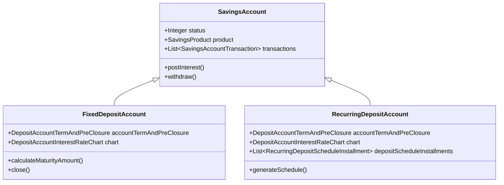

Fixed Deposits (FD) and Recurring Deposits (RD) are specialisations of the `SavingsAccount` aggregate in Apache Fineract. They share the same JPA table (`m_savings_account`) through single-table inheritance and reuse the full savings lifecycle infrastructure — account status, transactions, interest engine, COB jobs — while adding deposit-specific behaviour: locked terms, maturity dates, instalment schedules, interest rate charts, and configurable roll-over / closure instructions. Understanding them requires first being familiar with the base [Savings Module](/savings/savings-module).

## Inheritance Structure



The discriminator column `deposit_type_enum` in `m_savings_account` distinguishes them:

| Value | Class |
|---|---|
| `100` | `SavingsAccount` (regular) |
| `200` | `FixedDepositAccount` |
| `300` | `RecurringDepositAccount` |

Both classes reside in:
```
fineract-provider/src/main/java/org/apache/fineract/portfolio/savings/domain/
    FixedDepositAccount.java
    RecurringDepositAccount.java
```

The corresponding product classes are in `fineract-savings`:
```
fineract-savings/src/main/java/org/apache/fineract/portfolio/savings/domain/
    FixedDepositProduct.java
    RecurringDepositProduct.java
```

## DepositAccountTermAndPreClosure

Both account types embed a `DepositAccountTermAndPreClosure` entity (mapped to `m_deposit_account_term_and_preclosure`) that holds the core term parameters:

```java
@Entity
@Table(name = "m_deposit_account_term_and_preclosure")
public class DepositAccountTermAndPreClosure extends AbstractPersistableCustom<Long> {

    @Column(name = "deposit_amount")
    private BigDecimal depositAmount;

    @Column(name = "maturity_amount")
    private BigDecimal maturityAmount;

    @Column(name = "maturity_date")
    private LocalDate maturityDate;

    @Column(name = "deposit_period")
    private Integer depositPeriod;

    @Column(name = "deposit_period_frequency_enum")
    private Integer depositPeriodFrequency; // DAYS, WEEKS, MONTHS, YEARS

    @Column(name = "on_account_closure_enum")
    private Integer onAccountClosureType;

    @Embedded
    private DepositPreClosureDetail preClosureDetail;

    @Embedded
    protected DepositTermDetail depositTermDetail;
}
```

**Maturity date calculation**: `maturityDate` is derived by adding `depositPeriod` units of `depositPeriodFrequency` to the account activation date. For example, a 12-month FD activated on 2024-01-15 matures on 2025-01-15. The calculation occurs inside `FixedDepositAccount` and `RecurringDepositAccount` during activation.

## DepositAccountOnClosureType

When an FD or RD matures (or is closed prematurely), the system consults `DepositAccountTermAndPreClosure.onAccountClosureType`:

```java
// fineract-core/.../portfolio/savings/DepositAccountOnClosureType.java
public enum DepositAccountOnClosureType {
    INVALID(0, "depositAccountClosureType.invalid"),
    WITHDRAW_DEPOSIT(100, "depositAccountClosureType.withdrawDeposit"),
    TRANSFER_TO_SAVINGS(200, "depositAccountClosureType.transferToSavings"),
    REINVEST_PRINCIPAL_AND_INTEREST(300, "depositAccountClosureType.reinvestPrincipalAndInterest"),
    REINVEST_PRINCIPAL_ONLY(400, "depositAccountClosureType.reinvestPrincipalOnly");
}
```

`REINVEST_PRINCIPAL_AND_INTEREST` and `REINVEST_PRINCIPAL_ONLY` trigger roll-over: the platform creates a new FD account with the same product configuration. `TRANSFER_TO_SAVINGS` credits the linked savings account identified by `transferToSavingsId` on `DepositAccountTermAndPreClosure`.

## Pre-Closure Penalty

`DepositPreClosureDetail` (`@Embeddable` on `DepositAccountTermAndPreClosure`) captures the penalty rules:

```java
@Embeddable
public class DepositPreClosureDetail {
    @Column(name = "pre_closure_penal_applicable")
    private boolean preClosurePenalApplicable;

    @Column(name = "pre_closure_penal_interest")
    private BigDecimal preClosurePenalInterest;

    @Column(name = "pre_closure_penal_interest_on_enum")
    private Integer preClosurePenalInterestOnType; // WHOLE_TERM or TILL_PREMATURE_WITHDRAWAL
}
```

When `preClosurePenalApplicable` is true, the system applies a reduced interest rate for the period actually held. The `PreClosurePenalInterestOnType` enum (`fineract-core`) governs whether the penalty applies to the whole term or only until the premature closure date.

## Interest Rate Charts

Both FD and RD accounts use `InterestRateChart` (mapped to `m_interest_rate_chart`) to define tiered interest rates that vary by deposit term and, optionally, deposit amount:

```java
// fineract-savings/.../interestratechart/domain/InterestRateChart.java
@Entity
@Table(name = "m_interest_rate_chart")
public class InterestRateChart extends AbstractPersistableCustom<Long> {

    @Embedded
    private InterestRateChartFields chartFields; // fromDate, endDate, isPrimaryGroupingByAmount

    @OneToMany(mappedBy = "interestRateChart", cascade = CascadeType.ALL, ...)
    private Set<InterestRateChartSlab> chartSlabs;
}
```

Each `InterestRateChartSlab` defines:
- A period range (`fromPeriod` to `toPeriod` in weeks/months/etc.)
- An optional deposit amount range (`amountRangeFrom` to `amountRangeTo`)
- The `annualInterestRate` to apply when both conditions are satisfied
- Zero or more `DepositAccountInterestIncentive` overrides for specific client attributes

The account-level chart (`DepositAccountInterestRateChart`) extends `InterestRateChart` and is linked to the account via `DepositAccountTermAndPreClosure`. The product-level `InterestRateChart` serves as the default when creating a new account.

### Rate Resolution at Maturity

When calculating the maturity amount, `FixedDepositAccount.calculateMaturityAmount()` calls the interest chart to resolve the applicable rate given the term length and deposit amount. The resolved rate is stored in `SavingsAccount.nominalAnnualInterestRate` for subsequent interest engine calculations.

```mermaid
flowchart TD
    A[FixedDepositAccount.activate()] --> B[Resolve term from depositPeriod + frequency]
    B --> C[chart.getApplicableInterestRate(term, amount)]
    C --> D{Chart slabs}
    D -->|Period match| E[Check amount range]
    D -->|No match| F[Use product default rate]
    E --> G[Apply incentive overrides]
    G --> H[Set nominalAnnualInterestRate on account]
    H --> I[Calculate maturityAmount using interest engine]
    I --> J[Store maturityDate on DepositAccountTermAndPreClosure]
```

## FixedDepositAccount

`FixedDepositAccount` (`@DiscriminatorValue("200")`) holds exactly one lump-sum deposit for the full term. Key operations:

- `createNewApplicationForSubmittal(...)` — static factory; sets status `SUBMITTED_AND_PENDING_APPROVAL`.
- `close(AppUser, JsonCommand, LocalDate)` — validates maturity or pre-closure, posts final interest, and transitions to `CLOSED` or `PRE_MATURE_CLOSURE`.
- `autoMatured()` — called by the `UpdateDepositsAccountMaturityDetailsTasklet` batch job to mark the account `MATURED` when the maturity date is reached.

The REST API is exposed by `FixedDepositAccountsApiResource` (`/v1/fixeddepositaccounts`) and `FixedDepositAccountTransactionsApiResource` (`/v1/fixeddepositaccounts/{id}/transactions`).

## RecurringDepositAccount

`RecurringDepositAccount` (`@DiscriminatorValue("300")`) requires periodic deposits on an instalment schedule:

```java
@Entity
@DiscriminatorValue("300")
public class RecurringDepositAccount extends SavingsAccount {

    @OneToOne(mappedBy = "account", cascade = CascadeType.ALL)
    private DepositAccountTermAndPreClosure accountTermAndPreClosure;

    @OneToOne(fetch = FetchType.LAZY, cascade = CascadeType.ALL, mappedBy = "account")
    protected DepositAccountInterestRateChart chart;

    @OneToMany(cascade = CascadeType.ALL, mappedBy = "account", ...)
    @OrderBy(value = "installmentNumber")
    private List<RecurringDepositScheduleInstallment> depositScheduleInstallments;
}
```

`RecurringDepositScheduleInstallment` (mapped to `m_mandatory_savings_schedule`) stores `dueDate`, `depositAmount`, and `completedDerivedFlag` for each expected instalment. The `GenerateRdScheduleTasklet` batch job regenerates the schedule whenever account or calendar parameters change.

The `DepositRecurringDetail` embeddable on `RecurringDepositProduct` holds:

| Field | Column | Description |
|---|---|---|
| `mandatoryRecommendedDepositAmount` | `mandatory_recommended_deposit_amount` | Required per-instalment amount |
| `isMandatoryDeposit` | `is_mandatory_deposit` | Whether missed instalments are penalised |
| `allowWithdrawal` | `allow_withdrawal` | Whether partial withdrawals are allowed during term |
| `adjustAdvanceTowardsFuturePayments` | `adjust_advance_towards_future_payments` | Credit early payments against future dues |

## Deposit-Related Batch Jobs

| Job Tasklet | Location | Purpose |
|---|---|---|
| `UpdateDepositsAccountMaturityDetailsTasklet` | `fineract-provider/.../jobs/updatedepositsaccountmaturitydetails/` | Triggers `MATURED` status on due FD/RD accounts |
| `GenerateRdScheduleTasklet` | `fineract-provider/.../jobs/generaterdschedule/` | Regenerates RD instalment schedule |
| `TransferInterestToSavingsTasklet` | `fineract-provider/.../jobs/transferinteresttosavings/` | Moves FD interest to a linked savings account if configured |

## REST API Resources

| Resource | Path | Key Operations |
|---|---|---|
| `FixedDepositAccountsApiResource` | `/v1/fixeddepositaccounts` | Submit, approve, activate, close, premature-close |
| `FixedDepositAccountTransactionsApiResource` | `/v1/fixeddepositaccounts/{id}/transactions` | Post deposit, undo transaction |
| `FixedDepositProductsApiResource` | `/v1/fixeddepositproducts` | CRUD for FD products |
| `RecurringDepositAccountsApiResource` | `/v1/recurringdepositaccounts` | Full RD account lifecycle |
| `RecurringDepositAccountTransactionsApiResource` | `/v1/recurringdepositaccounts/{id}/transactions` | Post recurring instalments |
| `RecurringDepositProductsApiResource` | `/v1/recurringdepositproducts` | CRUD for RD products |

Command handlers follow the same CQRS pattern as the savings module. For example, `CloseFixedDepositAccountCommandHandler` delegates to `DepositAccountDomainServiceJpa.closeFDAccount()`.

## Related Pages

- [Savings Module](/savings/savings-module) — base account types, status lifecycle, transaction types
- [Charges, Fees, and Tax Configuration](/portfolio/charges-taxes) — pre-closure penalties and savings charges
- [Journal Entries](/accounting/journal-entries) — accounting entries generated on FD/RD maturity and closure
