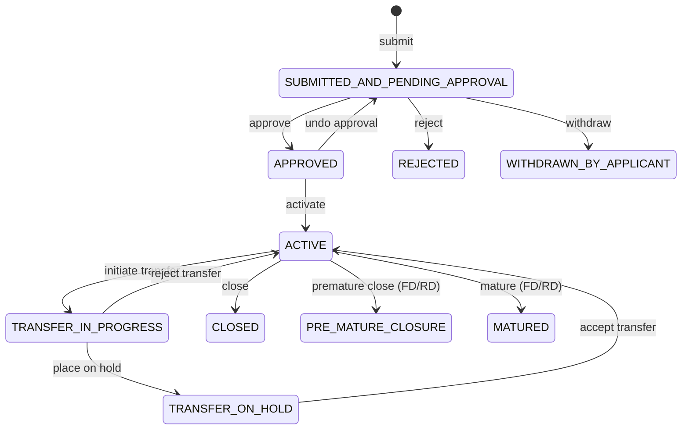

The savings module (`fineract-savings` Gradle subproject) implements the full lifecycle of deposit accounts in Apache Fineract. It owns the domain model — `SavingsAccount`, `SavingsProduct`, and `SavingsAccountTransaction` — and the service interfaces that drive everything from account opening through interest calculation, dormancy enforcement, and close-of-business (COB) processing. Most of the concrete implementations that call external dependencies (JPA repositories, accounting bridges) live in `fineract-provider`, while the portable domain logic and service contracts remain in `fineract-savings`. Understanding the boundary between those two modules is essential for contributing to this area.

## Module Structure

```
fineract-savings/src/main/java/org/apache/fineract/portfolio/savings/
├── domain/
│   ├── SavingsAccount.java                  # Core aggregate root
│   ├── SavingsProduct.java                  # Product template
│   ├── SavingsAccountTransaction.java       # Individual money movements
│   ├── SavingsAccountCharge.java            # Charges attached to an account
│   ├── SavingsAccountSummary.java           # Denormalised running totals
│   ├── FixedDepositProduct.java             # FD product (extends SavingsProduct)
│   ├── RecurringDepositProduct.java         # RD product (extends SavingsProduct)
│   └── interest/                            # Interest calculation engine
├── service/
│   ├── SavingsAccountWritePlatformService.java
│   └── SavingsAccountReadPlatformService.java
└── cob/savings/
    └── SavingsCOBBusinessStep.java          # Marker interface for COB steps
```

The `fineract-provider` module contributes the JPA assemblers, domain-service implementations, and REST API resources at:
```
fineract-provider/src/main/java/org/apache/fineract/portfolio/savings/
├── domain/
│   ├── SavingsAccountAssembler.java
│   ├── SavingsAccountDomainServiceJpa.java
│   ├── FixedDepositAccount.java
│   └── RecurringDepositAccount.java
└── api/
    ├── SavingsAccountsApiResource.java      # /v1/savingsaccounts
    ├── SavingsProductsApiResource.java      # /v1/savingsproducts
    └── SavingsAccountTransactionsApiResource.java
```

## SavingsAccount Aggregate

`SavingsAccount` (mapped to `m_savings_account`) is the central aggregate. It uses JPA single-table inheritance via `@DiscriminatorColumn(name = "deposit_type_enum")`:

| Discriminator | Class |
|---|---|
| `100` | `SavingsAccount` (regular) |
| `200` | `FixedDepositAccount` |
| `300` | `RecurringDepositAccount` |

Key fields from `SavingsAccount.java`:

```java
@Entity
@Table(name = "m_savings_account")
@Inheritance(strategy = InheritanceType.SINGLE_TABLE)
@DiscriminatorColumn(name = "deposit_type_enum", discriminatorType = DiscriminatorType.INTEGER)
@DiscriminatorValue("100")
public class SavingsAccount extends AbstractAuditableWithUTCDateTimeCustom<Long> {

    @Column(name = "status_enum", nullable = false)
    protected Integer status;

    @Column(name = "sub_status_enum", nullable = false)
    protected Integer sub_status = 0;

    @OneToMany(mappedBy = "savingsAccount", cascade = CascadeType.ALL, ...)
    private List<SavingsAccountTransaction> transactions;

    @ManyToOne
    @JoinColumn(name = "product_id", nullable = false)
    protected SavingsProduct product;
}
```

The `status` column stores the primary state using integer discriminators from `SavingsAccountStatusType`, and `sub_status` stores secondary operational states from `SavingsAccountSubStatusEnum`.

## Account Status Lifecycle

`SavingsAccountStatusType` is defined in `fineract-core`:
`org.apache.fineract.portfolio.savings.domain.SavingsAccountStatusType`

```java
public enum SavingsAccountStatusType {
    INVALID(0, "savingsAccountStatusType.invalid"),
    SUBMITTED_AND_PENDING_APPROVAL(100, "savingsAccountStatusType.submitted.and.pending.approval"),
    APPROVED(200, "savingsAccountStatusType.approved"),
    ACTIVE(300, "savingsAccountStatusType.active"),
    TRANSFER_IN_PROGRESS(303, "savingsAccountStatusType.transfer.in.progress"),
    TRANSFER_ON_HOLD(304, "savingsAccountStatusType.transfer.on.hold"),
    WITHDRAWN_BY_APPLICANT(400, "savingsAccountStatusType.withdrawn.by.applicant"),
    REJECTED(500, "savingsAccountStatusType.rejected"),
    CLOSED(600, "savingsAccountStatusType.closed"),
    PRE_MATURE_CLOSURE(700, "savingsAccountStatusType.pre.mature.closure"),
    MATURED(800, "savingsAccountStatusType.matured");
}
```

<Tip>
States 303 and 304 (`TRANSFER_IN_PROGRESS` / `TRANSFER_ON_HOLD`) are transient: they wrap an active account during an inter-office transfer and resolve back to `ACTIVE` or `CLOSED`.
</Tip>



## Sub-Status / Operational Flags

`SavingsAccountSubStatusEnum` (also in `fineract-core`) describes runtime operational restrictions on an otherwise-active account:

```java
public enum SavingsAccountSubStatusEnum {
    NONE(0, "SavingsAccountSubStatusEnum.none"),
    INACTIVE(100, "SavingsAccountSubStatusEnum.inactive"),
    DORMANT(200, "SavingsAccountSubStatusEnum.dormant"),
    ESCHEAT(300, "SavingsAccountSubStatusEnum.escheat"),
    BLOCK(400, "SavingsAccountSubStatusEnum.block"),
    BLOCK_CREDIT(500, "SavingsAccountSubStatusEnum.blockCredit"),
    BLOCK_DEBIT(600, "SavingsAccountSubStatusEnum.blockDebit");
}
```

The `SavingsProduct` carries three thresholds — `daysToInactive`, `daysToDormancy`, and `daysToEscheat` — that the scheduled job `UpdateSavingsDormantAccountsTasklet` uses to transition sub-statuses:

```
fineract-provider/.../savings/jobs/updatesavingsdormantaccounts/
    UpdateSavingsDormantAccountsConfig.java
    UpdateSavingsDormantAccountsTasklet.java
```

Once a sub-status is `BLOCK`, `BLOCK_CREDIT`, or `BLOCK_DEBIT`, `SavingsAccount` throws `SavingsAccountBlockedException`, `SavingsAccountCreditsBlockedException`, or `SavingsAccountDebitsBlockedException` respectively on any relevant transaction attempt.

## SavingsProduct

`SavingsProduct` (mapped to `m_savings_product`) is the template from which `SavingsAccount` instances inherit configuration:

| Field | Column | Description |
|---|---|---|
| `nominalAnnualInterestRate` | `nominal_annual_interest_rate` | Product-level default rate |
| `interestCompoundingPeriodType` | `interest_compounding_period_enum` | DAILY / MONTHLY / QUARTERLY / etc. |
| `interestPostingPeriodType` | `interest_posting_period_enum` | When earned interest is posted |
| `interestCalculationType` | `interest_calculation_type_enum` | DAILY_BALANCE or AVERAGE_DAILY_BALANCE |
| `interestCalculationDaysInYearType` | `interest_calculation_days_in_year_enum` | 360 or 365 |
| `minRequiredOpeningBalance` | `min_required_opening_balance` | Minimum to activate account |
| `enforceMinRequiredBalance` | `enforce_min_required_balance` | Block withdrawals below minimum |
| `isDormancyTrackingActive` | `is_dormancy_tracking_active` | Enable dormancy tracking |
| `allowOverdraft` | `allow_overdraft` | Permit negative balance |
| `overdraftLimit` | `overdraft_limit` | Maximum overdraft amount |
| `withHoldTax` | `withhold_tax` | Whether to withhold tax on interest |

The `SavingsProductAssembler` in `fineract-savings` wires `SavingsProduct` objects from `JsonCommand` inputs; `SavingsProductChargeAssembler` attaches default `Charge` entities to the product.

## SavingsAccountTransaction

All monetary events on an account are persisted as `SavingsAccountTransaction` rows in `m_savings_account_transaction`. The type is represented by `SavingsAccountTransactionType` (in `fineract-core`):

```java
public enum SavingsAccountTransactionType {
    DEPOSIT(1, "savingsAccountTransactionType.deposit", TransactionEntryType.CREDIT),
    WITHDRAWAL(2, "savingsAccountTransactionType.withdrawal", TransactionEntryType.DEBIT),
    INTEREST_POSTING(3, "savingsAccountTransactionType.interestPosting", TransactionEntryType.CREDIT),
    WITHDRAWAL_FEE(4, "savingsAccountTransactionType.withdrawalFee", TransactionEntryType.DEBIT),
    ANNUAL_FEE(5, "savingsAccountTransactionType.annualFee", TransactionEntryType.DEBIT),
    WAIVE_CHARGES(6, "savingsAccountTransactionType.waiveCharge"),
    PAY_CHARGE(7, "savingsAccountTransactionType.payCharge", TransactionEntryType.DEBIT),
    DIVIDEND_PAYOUT(8, "savingsAccountTransactionType.dividendPayout", TransactionEntryType.CREDIT),
    ACCRUAL(10, "savingsAccountTransactionType.accrual"),
    OVERDRAFT_INTEREST(17, "savingsAccountTransactionType.overdraftInterest", TransactionEntryType.DEBIT),
    WITHHOLD_TAX(18, "savingsAccountTransactionType.withholdTax", TransactionEntryType.DEBIT),
    ESCHEAT(19, "savingsAccountTransactionType.escheat", TransactionEntryType.DEBIT),
    AMOUNT_HOLD(20, "savingsAccountTransactionType.onHold", TransactionEntryType.DEBIT),
    AMOUNT_RELEASE(21, "savingsAccountTransactionType.release", TransactionEntryType.CREDIT);
}
```

Each transaction stores:
- `running_balance_derived` — updated by the platform after posting
- `cumulative_balance_derived` — used for AVERAGE_DAILY_BALANCE interest computation
- `balance_end_date_derived` / `balance_number_of_days_derived` — used for daily-balance interest periods
- `is_reversed` — soft-delete flag; reversed transactions remain visible

## Interest Calculation and Posting

Interest is calculated in-memory by the `PostingPeriod` engine (`fineract-savings/.../savings/domain/interest/PostingPeriod.java`). The engine:

1. Iterates all non-reversed transactions ordered by date.
2. Computes end-of-day balances for each day in the posting period.
3. Applies the `SavingsInterestCalculationType` (DAILY_BALANCE or AVERAGE_DAILY_BALANCE).
4. Uses the configured compounding period to accumulate interest.
5. Returns a `Money` amount that `SavingsAccount.calculateInterest()` uses to create an `INTEREST_POSTING` transaction.

The scheduled job responsible for running this across all accounts is `PostInterestForSavingTasklet`:
```
fineract-provider/.../savings/jobs/postinterestforsavings/
    PostInterestForSavingConfig.java
    PostInterestForSavingTasklet.java
```

## Service Layer

### SavingsAccountWritePlatformService

Located at `org.apache.fineract.portfolio.savings.service.SavingsAccountWritePlatformService`, this interface defines all mutating operations:

```java
CommandProcessingResult activate(Long savingsId, JsonCommand command);
CommandProcessingResult deposit(Long savingsId, JsonCommand command);
CommandProcessingResult withdrawal(Long savingsId, JsonCommand command);
CommandProcessingResult calculateInterest(Long savingsId);
CommandProcessingResult reverseTransaction(Long savingsId, Long transactionId,
    boolean allowAccountTransferModification, JsonCommand command);
CommandProcessingResult close(Long savingsId, JsonCommand command);
CommandProcessingResult addSavingsAccountCharge(JsonCommand command);
CommandProcessingResult waiveCharge(Long savingsAccountId, Long savingsAccountChargeId);
CommandProcessingResult payCharge(Long savingsAccountId, Long savingsAccountChargeId,
    JsonCommand command);
```

The implementation (`SavingsAccountWritePlatformServiceJpaRepositoryImpl` in `fineract-provider`) calls `SavingsAccountDomainServiceJpa` for pure-domain logic that requires JPA access (e.g., auto-posting annual fees, creating the accounting bridge map).

### SavingsAccountReadPlatformService

Located at `org.apache.fineract.portfolio.savings.service.SavingsAccountReadPlatformService`. Provides pageable list queries, template data for new accounts, and retrieval by external-ID.

## REST API Resources

| Resource | Path | Module |
|---|---|---|
| `SavingsAccountsApiResource` | `GET/POST /v1/savingsaccounts` | `fineract-provider` |
| `SavingsAccountTransactionsApiResource` | `POST /v1/savingsaccounts/{id}/transactions` | `fineract-provider` |
| `SavingsProductsApiResource` | `GET/POST /v1/savingsproducts` | `fineract-provider` |
| `SavingsAccountChargesApiResource` | `GET/POST /v1/savingsaccounts/{id}/charges` | `fineract-provider` |

Commands are dispatched through the `PortfolioCommandSourceWritePlatformService` command bus (standard Fineract CQRS pattern). Handler classes follow the naming convention `*CommandHandler` and live in `fineract-provider/.../savings/handler/`.

## COB Business Steps

The Close-of-Business (COB) job processes savings accounts overnight using implementations of `SavingsCOBBusinessStep`:

```java
// fineract-savings/src/main/java/org/apache/fineract/cob/savings/SavingsCOBBusinessStep.java
public interface SavingsCOBBusinessStep extends COBBusinessStep<SavingsAccount> {}
```

Scheduled batch jobs for savings (in `fineract-provider`):

| Job Tasklet | Purpose |
|---|---|
| `PostInterestForSavingTasklet` | Calculate and post interest |
| `ApplyAnnualFeeForSavingsTasklet` | Collect annual-fee charges |
| `PayDueSavingsChargesTasklet` | Apply charges whose due-date has passed |
| `UpdateSavingsDormantAccountsTasklet` | Transition sub-status: INACTIVE → DORMANT → ESCHEAT |
| `AddAccrualTransactionForSavingsTasklet` | Post accrual transactions |
| `UpdateDepositsAccountMaturityDetailsTasklet` | Check FD/RD maturity and update status |
| `GenerateRdScheduleTasklet` | Regenerate instalment schedule for recurring deposits |

## Withdrawal Fees and Minimum Balance Enforcement

When `SavingsProduct.withdrawalFeeForTransfers` is false, withdrawal fees are only applied to manual withdrawals. The fee charge must have `ChargeTimeType.WITHDRAWAL_FEE` and be attached to the product or account.

Minimum balance enforcement is triggered inside `SavingsAccount.withdraw()` when `enforceMinRequiredBalance == true`: if the resulting balance would fall below `minRequiredBalance`, an `InsufficientAccountBalanceException` is thrown (defined in `fineract-savings/.../savings/exception/`).

## Related Pages

- [Fixed and Recurring Deposit Accounts](/savings/fixed-recurring-deposits) — how `FixedDepositAccount` and `RecurringDepositAccount` extend this aggregate
- [Charges, Fees, and Tax Configuration](/portfolio/charges-taxes) — charge types applicable to savings accounts
- [Journal Entries](/accounting/journal-entries) — how savings transactions generate GL entries
