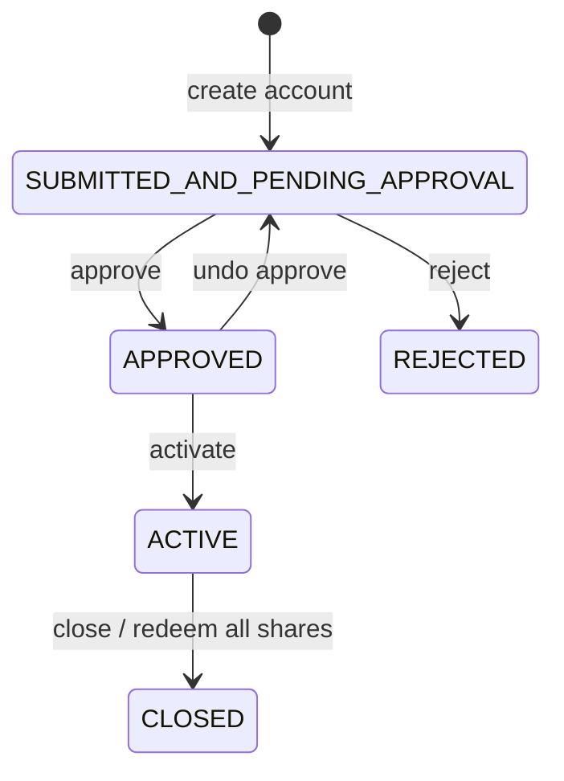
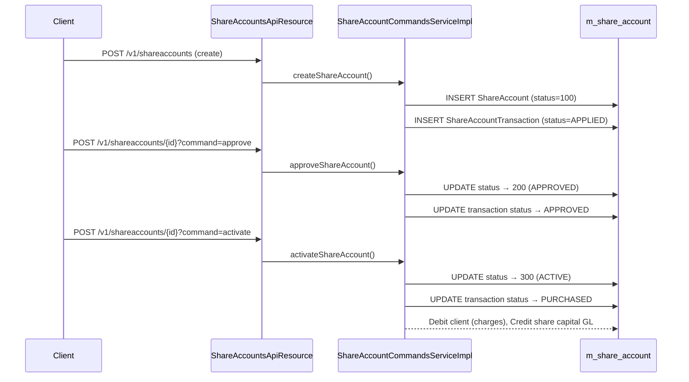

The share accounts feature models cooperative share ownership in Apache Fineract. A `ShareProduct` defines the issuable shares at the institution level (total shares, unit price, lock periods, market price history), while each member holds a `ShareAccount` that tracks their individual purchases, pending applications, and redemptions. Dividends are calculated at the product level and distributed to individual accounts through a scheduled batch job. The feature is entirely contained within `fineract-provider` — unlike the savings module it has no separate Gradle subproject.

## Package Layout

```
fineract-provider/src/main/java/org/apache/fineract/portfolio/
├── shareaccounts/
│   ├── domain/
│   │   ├── ShareAccount.java
│   │   ├── ShareAccountTransaction.java
│   │   ├── ShareAccountCharge.java
│   │   ├── ShareAccountDividendDetails.java
│   │   ├── ShareAccountStatusType.java
│   │   └── PurchasedSharesStatusType.java
│   ├── service/
│   │   ├── ShareAccountWritePlatformService.java
│   │   ├── ShareAccountReadPlatformService.java
│   │   └── ShareAccountCommandsServiceImpl.java
│   ├── handler/                        # CQRS command handlers
│   └── jobs/postdividentsforshares/    # Dividend posting batch job
└── shareproducts/
    ├── domain/
    │   ├── ShareProduct.java
    │   ├── ShareProductMarketPrice.java
    │   └── ShareProductDividendPayOutDetails.java
    └── service/
        ├── ShareProductWritePlatformService.java
        └── ShareProductDividendReadPlatformServiceImpl.java
```

## ShareProduct

`ShareProduct` (mapped to `m_share_product`) is the institutional template. Key fields:

```java
@Entity
@Table(name = "m_share_product")
public class ShareProduct extends AbstractAuditableCustom {

    @Column(name = "name", nullable = false, unique = true)
    private String name;

    @Column(name = "total_shares", nullable = false)
    private Long totalShares;          // Maximum shares authorised

    @Column(name = "issued_shares", nullable = false)
    private Long totalSharesIssued;    // Currently issued to accounts

    @Column(name = "unit_price", nullable = false)
    private BigDecimal unitPrice;      // Par / nominal price per share

    @Column(name = "capital_amount", nullable = false)
    private BigDecimal shareCapital;   // totalShares × unitPrice

    @Column(name = "minimum_client_shares")
    private Long minimumShares;

    @Column(name = "nominal_client_shares")
    private Long nominalShares;

    @Column(name = "maximum_client_shares")
    private Long maximumShares;

    @OneToMany(cascade = CascadeType.ALL, ...)
    private Set<ShareProductMarketPrice> marketPrice;  // Time-series of prices

    @ManyToMany(...)
    private Set<Charge> charges;       // Default charges for new accounts

    @Column(name = "lock_period")
    private Integer lockPeriod;        // Lock duration before redemption

    @Enumerated(EnumType.ORDINAL)
    private PeriodFrequencyType lockPeriodType;  // DAYS / WEEKS / MONTHS / YEARS

    @Column(name = "minimum_active_period_frequency")
    private Integer minimumActivePeriod;
}
```

`ShareProductMarketPrice` (mapped to `m_share_product_market_price`) stores the effective-from date and price, allowing the platform to look up the price that was applicable on any given transaction date.

## ShareAccount

`ShareAccount` (mapped to `m_share_account`) holds a client's share portfolio:

```java
@Entity
@Table(name = "m_share_account")
public class ShareAccount extends AbstractPersistableCustom<Long> {

    @ManyToOne
    @JoinColumn(name = "client_id")
    private Client client;

    @ManyToOne
    @JoinColumn(name = "product_id")
    private ShareProduct shareProduct;

    @Column(name = "status_enum", nullable = false)
    protected Integer status;          // ShareAccountStatusType

    @Column(name = "total_approved_shares")
    private Long totalSharesApproved;

    @Column(name = "total_pending_shares")
    private Long totalSharesPending;

    @Embedded
    private MonetaryCurrency currency;

    @Column(name = "allow_dividends_inactive_clients")
    private Boolean allowDividendsForInactiveClients;

    @ManyToOne
    @JoinColumn(name = "savings_account_id")
    private SavingsAccount savingsAccount; // Linked savings for dividend credit
}
```

## Account Status

`ShareAccountStatusType` governs the overall account lifecycle:

```java
// fineract-provider/.../shareaccounts/domain/ShareAccountStatusType.java
public enum ShareAccountStatusType {
    INVALID(0, "shareAccountStatusType.invalid"),
    SUBMITTED_AND_PENDING_APPROVAL(100, "shareAccountStatusType.submitted.and.pending.approval"),
    APPROVED(200, "shareAccountStatusType.approved"),
    ACTIVE(300, "shareAccountStatusType.active"),
    REJECTED(500, "shareAccountStatusType.rejected"),
    CLOSED(600, "shareAccountStatusType.closed");
}
```



## ShareAccountTransaction and PurchasedSharesStatusType

Every share movement is recorded as a `ShareAccountTransaction` row in `m_share_account_transactions`:

```java
@Entity
@Table(name = "m_share_account_transactions")
public class ShareAccountTransaction extends AbstractPersistableCustom<Long> {
    @Column(name = "transaction_date")
    private LocalDate transactionDate;

    @Column(name = "total_shares")
    private Long totalShares;          // Number of shares in this transaction

    @Column(name = "unit_price")
    private BigDecimal shareValue;     // Price per share at transaction time

    @Column(name = "amount")
    private BigDecimal amount;         // totalShares × shareValue

    @Column(name = "amount_paid")
    private BigDecimal amountPaid;     // Actual cash collected (amount + charges)

    @Column(name = "charge_amount")
    private BigDecimal chargeAmount;

    @Column(name = "status_enum")
    private Integer status;            // PurchasedSharesStatusType

    @Column(name = "type_enum")
    private Integer type;              // PURCHASED or REDEEMED
}
```

Individual transaction status follows `PurchasedSharesStatusType`:

```java
public enum PurchasedSharesStatusType {
    INVALID(0),
    APPLIED(100),     // Application submitted, awaiting approval
    APPROVED(300),    // Approved but not yet active
    REJECTED(400),    // Application rejected
    PURCHASED(500),   // Shares fully paid and active
    REDEEMED(600),    // Shares returned and deactivated
    CHARGE_PAYMENT(700); // Administrative charge entry
}
```

## Share Application / Approval / Activation Flow



The command handlers wiring into the CQRS bus are:

| Handler | Command |
|---|---|
| `CreateShareAccountCommandHandler` | `CREATE` |
| `ApproveShareAccountCommandHandler` | `APPROVE` |
| `UndoApproveShareAccountCommandHandler` | `UNDOAPPROVAL` |
| `ActivateShareAccountCommandHandler` | `ACTIVATE` |
| `RejectShareAccountCommandHandler` | `REJECT` |
| `ApplyAddtionalSharesCommandHandler` | `APPLYADDITIONALSHARES` |
| `ApproveAddtionalSharesCommandHandler` | `APPROVEADDITIONALSHARES` |
| `RejectAddtionalSharesCommandHandler` | `REJECTADDITIONALSHARES` |
| `RedeemSharesCommandHandler` | `REDEEMSHARES` |
| `CloseShareAccountCommandHandler` | `CLOSE` |

## Additional Share Purchases

After activation a client can apply for more shares via the `APPLYADDITIONALSHARES` command. This creates a new `ShareAccountTransaction` with `status=APPLIED`. The workflow is identical to initial purchase: `ApplyAddtionalSharesCommandHandler` → `ApproveAddtionalSharesCommandHandler` → shares become `PURCHASED`. A corresponding check verifies that `totalSharesIssued + newShares ≤ ShareProduct.totalShares` to prevent overselling (`IssueableSharesExceededException`).

## Share Redemption

The `REDEEMSHARES` command, handled by `RedeemSharesCommandHandler`, calls `ShareAccountWritePlatformService.redeemShares()`. The service:
1. Validates that the lock period (configured on `ShareProduct`) has elapsed since the purchase transaction date.
2. Creates a `ShareAccountTransaction` with `type=REDEEMED`.
3. Reduces `ShareAccount.totalSharesApproved`.
4. Reduces `ShareProduct.totalSharesIssued`.
5. Posts accounting entries (Credit the equity/shares-issued GL, Debit the liability GL).

## Dividend Calculation and Distribution

Dividends are declared at the `ShareProduct` level. `ShareProductDividendPayOutDetails` (mapped to `m_share_product_dividend_pay_out`) stores the dividend per-share amount and period:

```java
@Entity
@Table(name = "m_share_product_dividend_pay_out")
public class ShareProductDividendPayOutDetails extends AbstractPersistableCustom<Long> {
    @ManyToOne
    @JoinColumn(name = "product_id")
    private ShareProduct shareProduct;

    @Column(name = "dividend_amount", scale = 6, precision = 19)
    private BigDecimal dividendAmount;   // Per-share dividend amount

    @Column(name = "dividend_period_start_date")
    private LocalDate dividendPeriodStartDate;

    @Column(name = "dividend_period_end_date")
    private LocalDate dividendPeriodEndDate;

    @Column(name = "status")
    private Integer status; // ShareProductDividendStatusType
}
```

`ShareProductDividendStatusType` tracks: `INITIATED` → `APPROVED` → (posted). A human creates the dividend entry via `POST /v1/shareproduct/{id}/dividend`, then approves it via `POST /v1/shareproduct/{id}/dividend/{dividendId}?command=approve`.

The `PostDividentsForSharesTasklet` batch job distributes the approved dividend to individual `ShareAccount` holders:

```
fineract-provider/.../shareaccounts/jobs/postdividentsforshares/
    PostDividentsForSharesConfig.java
    PostDividentsForSharesTasklet.java
```

For each active account with approved shares during the dividend period, the tasklet calls `ShareAccountSchedularServiceImpl.postDividends()`, which credits the linked `SavingsAccount` (via `savingsAccount_id` on `ShareAccount`) with a `DIVIDEND_PAYOUT` savings transaction.

`ShareAccountDividendDetails` (mapped to `m_share_account_dividend_details`) records the per-account payout for audit:

```java
@Entity
@Table(name = "m_share_account_dividend_details")
public class ShareAccountDividendDetails extends AbstractPersistableCustom<Long> {
    @ManyToOne
    private ShareAccount shareAccount;
    @ManyToOne
    private ShareProductDividendPayOutDetails dividendPayOut;
    @Column(name = "amount")
    private BigDecimal amount;
    @Column(name = "status")
    private Integer status;  // ShareAccountDividendStatusType
}
```

## REST API

The share accounts API does not have a dedicated `ApiResource` class. Commands are dispatched through the standard Fineract command bus using `ShareAccountCommandsServiceImpl`. The REST layer is provided by the `fineract-provider` JAX-RS infrastructure:

| HTTP | Path | Purpose |
|---|---|---|
| `POST` | `/v1/shareaccounts` | Create share account application |
| `GET` | `/v1/shareaccounts/{id}` | Retrieve account details |
| `POST` | `/v1/shareaccounts/{id}?command=approve` | Approve application |
| `POST` | `/v1/shareaccounts/{id}?command=activate` | Activate after approval |
| `POST` | `/v1/shareaccounts/{id}?command=applyadditionalshares` | Apply for more shares |
| `POST` | `/v1/shareaccounts/{id}?command=redeemshares` | Redeem shares |
| `POST` | `/v1/shareaccounts/{id}?command=close` | Close account |
| `GET/POST` | `/v1/shareproduct` | Share product CRUD |
| `POST` | `/v1/shareproduct/{id}/dividend` | Create dividend declaration |
| `POST` | `/v1/shareproduct/{id}/dividend/{did}?command=approve` | Approve dividend |

## Related Pages

- [Savings Module](/savings/savings-module) — `SavingsAccount` is the linked account for dividend payouts
- [Charges, Fees, and Tax Configuration](/portfolio/charges-taxes) — `SHAREACCOUNT_ACTIVATION`, `SHARE_PURCHASE`, and `SHARE_REDEEM` charge time types
- [Journal Entries](/accounting/journal-entries) — accounting bridge for share purchase and dividend posting
