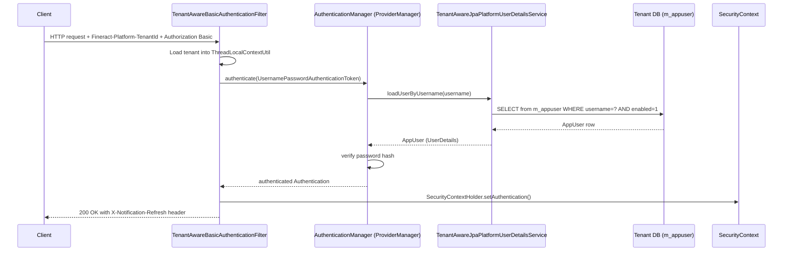

Every inbound API request to Fineract must pass at least two verification steps before the application layer ever runs: the request must carry a valid **tenant identifier** so the platform can route to the correct schema, and it must carry valid **credentials** for a user in that tenant. These two concerns are deliberately decoupled in the codebase — tenant resolution happens in dedicated `OncePerRequestFilter` beans, while credential validation is delegated to Spring Security's standard machinery. The result is three independent, conditionally active filter chains that can be mixed depending on your deployment: classic HTTP Basic Auth (default), Fineract's own OAuth2 Authorization Server, and OIDC Federation for external IdPs like Keycloak, Azure AD, or Auth0.

## Active authentication modes

Each mode is guarded by a `@ConditionalOnProperty`, making them independently deployable:

| Property key | Default | Config class |
|---|---|---|
| `fineract.security.basicauth.enabled` | `true` | `SecurityConfig` |
| `fineract.security.oauth2.enabled` | `false` | `AuthorizationServerConfig` |
| `fineract.security.oidc-federation.enabled` | `false` | `OidcFederationSecurityConfig` |

Setting `basicauth.enabled=false` and `oauth2.enabled=true` switches off Basic Auth entirely and activates the built-in Authorization Server. OIDC federation can run alongside either mode.

<Warning>
Do not enable both `fineract.security.oauth2.enabled` and `fineract.security.oidc-federation.enabled` in production without understanding the filter chain ordering. The OAuth2 chain is `@Order(1-3)` and OIDC federation is `@Order(100)`. If both are active, a Bearer token is first tested against the internal Authorization Server; only unmatched requests fall through to the OIDC resolver.
</Warning>

## HTTP Basic Auth filter chain

When `fineract.security.basicauth.enabled=true`, Spring loads `SecurityConfig` in
`fineract-provider/src/main/java/org/apache/fineract/infrastructure/core/config/SecurityConfig.java`.
The central filter is `TenantAwareBasicAuthenticationFilter`, which extends Spring's `BasicAuthenticationFilter` and is registered before `SecurityContextHolderFilter` in the chain:

```java
// SecurityConfig.java — filterChain bean
http.securityMatcher(API_MATCHER.matcher("/api/**"))
    .addFilterBefore(tenantAwareBasicAuthenticationFilter(), SecurityContextHolderFilter.class)
    ...
    .httpBasic(hb -> hb.authenticationEntryPoint(basicAuthenticationEntryPoint()))
    .sessionManagement(smc -> smc.sessionCreationPolicy(SessionCreationPolicy.STATELESS));
```

`TenantAwareBasicAuthenticationFilter` (in
`fineract-security/src/main/java/org/apache/fineract/infrastructure/security/filter/TenantAwareBasicAuthenticationFilter.java`)
performs two jobs on every non-OPTIONS request:

1. **Tenant resolution** — reads the `Fineract-Platform-TenantId` request header (constant `TENANT_ID_REQUEST_HEADER`). If the header is absent it falls back to the `tenantIdentifier` query parameter. A missing tenant identifier causes an `InvalidTenantIdentifierException`, which is caught in the filter and returns HTTP 400 — the request never reaches Spring Security's credential checking.

2. **Context population** — calls `AuthTenantDetailsService.loadTenantById()` and stores the resulting `FineractPlatformTenant` in `ThreadLocalContextUtil`. Business dates are also loaded here so they are available to all downstream service code within the same request thread.

```java
// TenantAwareBasicAuthenticationFilter.java
String tenantIdentifier = request.getHeader(TENANT_ID_REQUEST_HEADER);
if (org.apache.commons.lang3.StringUtils.isBlank(tenantIdentifier)) {
    tenantIdentifier = request.getParameter("tenantIdentifier");
}
if (tenantIdentifier == null && EXCEPTION_IF_HEADER_MISSING) {
    throw new InvalidTenantIdentifierException("No tenant identifier found: Add request header of '"
        + TENANT_ID_REQUEST_HEADER + "' ...");
}
final FineractPlatformTenant tenant = basicAuthTenantDetailsService.loadTenantById(tenantIdentifier, isReportRequest);
ThreadLocalContextUtil.setTenant(tenant);
```

After tenant setup, `super.doFilterInternal()` delegates back to `BasicAuthenticationFilter`, which Base64-decodes the `Authorization: Basic <credentials>` header and invokes the `AuthenticationManager`. The `AuthenticationManager` is wired as a `ProviderManager` backed by `TemporaryPasswordAwareAuthenticationProvider` (a `DaoAuthenticationProvider` subclass) using `TenantAwareJpaPlatformUserDetailsService` as the `UserDetailsService`.

### UserDetails loading

`TenantAwareJpaPlatformUserDetailsService`
(`fineract-security/.../service/TenantAwareJpaPlatformUserDetailsService.java`)
implements `UserDetailsService` and is registered as the Spring bean `userDetailsService`. It caches results in `usersByUsername` using a composite cache key that includes the current tenant identifier:

```java
@Cacheable(value = "usersByUsername",
    key = "T(org.apache.fineract.infrastructure.core.service.ThreadLocalContextUtil)"
        + ".getTenant().getTenantIdentifier().concat(#username+'ubu')")
public UserDetails loadUserByUsername(final String username) {
    final PlatformUser appUser =
        this.platformUserRepository.findByUsernameAndDeletedAndEnabled(username, false, true);
    if (appUser == null) {
        throw new UsernameNotFoundException(username + ": not found");
    }
    return appUser;
}
```

The `PlatformUser` interface is implemented by `AppUser`
(`fineract-core/src/main/java/org/apache/fineract/useradministration/domain/AppUser.java`),
which is mapped to the `m_appuser` table. Spring Security stores this object as the `Authentication.getPrincipal()` once the password check passes, making it directly available to all service-layer code via `PlatformSecurityContext.authenticatedUser()`.

### Successful authentication response

After successful authentication, `TenantAwareBasicAuthenticationFilter.onSuccessfulAuthentication()` checks for unread user notifications and appends a `X-Notification-Refresh: true/false` response header.

The `/api/v1/authentication` REST endpoint (`AuthenticationApiResource.java`) provides an explicit login step that is active only when `fineract.security.basicauth.enabled=true`. It returns a JSON payload containing the Base64-encoded `base64EncodedAuthenticationKey` along with the user's roles, permissions, office, and a flag `isTwoFactorAuthenticationRequired` for clients that need to prompt for a second factor.

## Authentication flow diagram



## OAuth2 Authorization Server mode

When `fineract.security.oauth2.enabled=true`, `AuthorizationServerConfig`
(`fineract-provider/.../security/config/AuthorizationServerConfig.java`)
registers three ordered filter chains:

- **`@Order(1)` — `publicEndpoints`**: permits Swagger UI, actuator, and legacy docs without authentication.
- **`@Order(2)` — `authorizationServerSecurityFilterChain`**: handles the OAuth2 protocol endpoints (`/oauth2/authorize`, `/oauth2/token`, etc.) using Spring Authorization Server.
- **`@Order(3)` — `protectedEndpoints`**: secures `/api/**` and configures the resource server to validate Bearer JWTs issued by the built-in Authorization Server.

Clients registered in `application.properties` under `fineract.security.oauth2.client.registrations.*` are loaded into an in-memory `RegisteredClientRepository`. The `OAuth2TokenCustomizer<JwtEncodingContext>` bean injects the `tenantId` claim into every issued JWT so that the downstream `TenantAwareAuthenticationFilter` can extract it.

## OIDC Federation mode

When `fineract.security.oidc-federation.enabled=true`, `OidcFederationSecurityConfig`
(`fineract-provider/.../security/config/OidcFederationSecurityConfig.java`)
activates at `@Order(100)`. It configures an `oauth2ResourceServer` backed by `DynamicJwtIssuerAuthenticationManagerResolver`, which resolves an `AuthenticationManager` per request by reading the `iss` claim from the incoming Bearer JWT and matching it against:

1. Per-tenant records in the `m_tenant_oidc_config` master-DB table (via `TenantOidcConfigService`)
2. The static `fineract.security.oidc-federation.issuers[]` YAML list as a fallback

Built `AuthenticationManager` instances are cached in a `ConcurrentHashMap` inside `DynamicJwtIssuerAuthenticationManagerResolver` keyed by `issuerUri`. Call `evictFromCache(issuerUri)` after updating a DB config to force a rebuild.

Tenant resolution for OIDC requests is handled by `OidcTenantAwareFilter`
(`fineract-security/.../filter/OidcTenantAwareFilter.java`), which runs before Spring validates the JWT signature and uses the following priority order:

1. `iss` claim matched against `m_tenant_oidc_config` (DB lookup)
2. `iss` claim matched against `fineract.security.oidc-federation.issuers[]` (YAML)
3. Configurable custom claim (`fineract.security.oidc-federation.tenant-claim-name`, default `fineract_tenant`)
4. `Fineract-Platform-TenantId` HTTP header
5. `tenantIdentifier` query parameter

Once the JWT is validated, `FineractOidcJwtAuthenticationConverter`
(`fineract-security/.../converter/FineractOidcJwtAuthenticationConverter.java`)
converts the `Jwt` to a `FineractJwtAuthenticationToken` by resolving (or optionally auto-creating) a Fineract `AppUser` via `FineractOidcUserService.resolveUser()`.

### OIDC federation properties

```properties
# application.properties
fineract.security.oidc-federation.enabled=${FINERACT_SECURITY_OIDC_FEDERATION_ENABLED:false}
fineract.security.oidc-federation.tenant-claim-name=${FINERACT_SECURITY_OIDC_TENANT_CLAIM:fineract_tenant}
fineract.security.oidc-federation.username-claim=${FINERACT_SECURITY_OIDC_USERNAME_CLAIM:preferred_username}
fineract.security.oidc-federation.auto-create-user=${FINERACT_SECURITY_OIDC_AUTO_CREATE_USER:false}
fineract.security.oidc-federation.default-roles=${FINERACT_SECURITY_OIDC_DEFAULT_ROLES:}
fineract.security.oidc-federation.provider=${FINERACT_SECURITY_OIDC_PROVIDER:generic}
fineract.security.oidc-federation.post-logout-redirect-uri=${FINERACT_SECURITY_OIDC_POST_LOGOUT_URI:}

# Static issuer → tenant mapping (YAML only, no DB record required)
# fineract.security.oidc-federation.issuers[0].issuer-uri=https://keycloak.example.com/realms/myrealm
# fineract.security.oidc-federation.issuers[0].tenant-id=default
# fineract.security.oidc-federation.issuers[0].jwks-uri=https://keycloak.example.com/realms/myrealm/protocol/openid-connect/certs
```

## The AppUser domain object

`AppUser` (`fineract-core/.../useradministration/domain/AppUser.java`) is both a JPA entity (table `m_appuser`) and a Spring Security `UserDetails`. Key fields:

- `roles` — `Set<Role>` — eagerly fetched via `m_appuser_role`; each `Role` holds a `Set<Permission>` via `m_role_permission`
- `office` — `Office` — used for hierarchical access control via `PlatformSecurityContext.validateAccessRights()`
- `passwordResetRequired` / `lastTimePasswordUpdated` — used by `SpringSecurityPlatformSecurityContext.doesPasswordHasToBeRenewed()`
- `failedLoginAttempts` / `loginRetryLimitEnabled` — tracks brute-force state

After successful authentication, `SpringSecurityPlatformSecurityContext.authenticatedUser()` retrieves the `AppUser` from the thread-local `SecurityContext`:

```java
// SpringSecurityPlatformSecurityContext.java
public AppUser authenticatedUser() {
    final Authentication auth = SecurityContextHolder.getContext().getAuthentication();
    if (auth != null) {
        Object principal = auth.getPrincipal();
        if (principal instanceof AppUser appUser) {
            currentUser = appUser;
        }
    }
    if (currentUser == null) throw new UnAuthenticatedUserException();
    if (this.doesPasswordHasToBeRenewed(currentUser)) throw new ResetPasswordException(currentUser.getId());
    return currentUser;
}
```

<Tip>
`getAuthenticatedUserIfPresent()` returns `null` instead of throwing when no user is in the context. Use this in service-layer methods that can be invoked from both the API layer and background batch jobs, which run without a security principal.
</Tip>

## Key application.properties reference

```properties
fineract.security.basicauth.enabled=${FINERACT_SECURITY_BASICAUTH_ENABLED:true}
fineract.security.oauth2.enabled=${FINERACT_SECURITY_OAUTH_ENABLED:false}
fineract.security.2fa.enabled=${FINERACT_SECURITY_2FA_ENABLED:false}
fineract.security.hsts.enabled=${FINERACT_SECURITY_HSTS_ENABLED:false}

fineract.security.cors.enabled=${FINERACT_SECURITY_CORS_ENABLED:true}
fineract.security.cors.allowed-origin-patterns=${FINERACT_SECURITY_CORS_ALLOWED_ORIGIN_PATTERNS:*}
fineract.security.cors.allowed-methods=${FINERACT_SECURITY_CORS_ALLOWED_METHODS:*}
fineract.security.cors.allowed-headers=${FINERACT_SECURITY_CORS_ALLOWED_HEADERS:*}
fineract.security.cors.exposed-headers=${FINERACT_SECURITY_CORS_EXPOSED_HEADERS:*}
fineract.security.cors.allow-credentials=${FINERACT_SECURITY_CORS_ALLOW_CREDENTIALS:true}
```

## Related pages

- [Authorization and Permission Checking](/security/authorization) — how `AppUser.hasSpecificPermissionTo()` and `PlatformSecurityContext` enforce access control
- [OAuth2 Resource Server and Two-Factor Authentication](/security/oauth2-2fa) — JWT validation, 2FA filter, CORS, and HSTS details
- [Multi-Tenancy](/core/multi-tenancy) — how `ThreadLocalContextUtil` stores and clears the per-request tenant context
