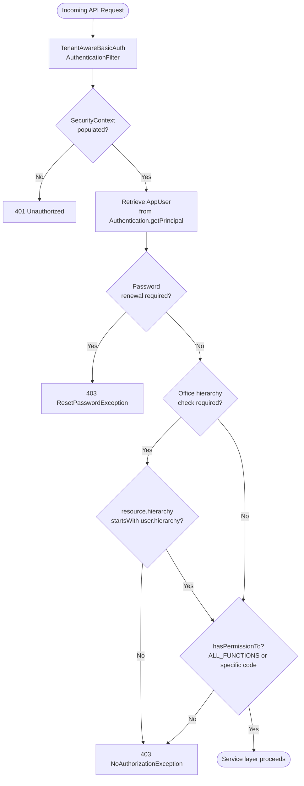

Fineract's authorization model is built on a classic Role-Based Access Control (RBAC) scheme that is entirely tenant-scoped: every authenticated request resolves to an `AppUser` in the active tenant's database schema, and that user's effective permissions are the union of all permissions assigned to their roles. There is no cross-tenant authorization sharing. The model is intentionally simple — no hierarchical role inheritance, no dynamic attribute policies — but it is extended in two directions: a **hierarchical office access check** prevents users from accessing resources belonging to offices outside their own subtree, and a **Maker-Checker workflow flag** on individual permissions enables a four-eyes approval requirement for sensitive write operations.

## Domain objects

### Permission

`Permission` (`fineract-core/src/main/java/org/apache/fineract/useradministration/domain/Permission.java`) is a JPA entity mapped to the `m_permission` table. Each row represents a single atomic capability in the platform:

```java
@Entity
@Table(name = "m_permission")
public class Permission extends AbstractPersistableCustom<Long> implements Serializable {

    @Column(name = "grouping", nullable = false, length = 45)
    private String grouping;            // e.g. "portfolio", "organisation", "special"

    @Column(name = "code", nullable = false, length = 100)
    private String code;               // e.g. "READ_LOAN", "CREATE_CLIENT"

    @Column(name = "entity_name", nullable = true, length = 100)
    private String entityName;         // e.g. "LOAN", "CLIENT"

    @Column(name = "action_name", nullable = true, length = 100)
    private String actionName;         // e.g. "READ", "CREATE", "APPROVE"

    @Column(name = "can_maker_checker", nullable = false)
    private boolean canMakerChecker;   // true → this permission requires checker approval
}
```

The `code` column is the value stored in Spring Security's `GrantedAuthority` and is also what all authorization checks compare against. The constructor enforces the convention `code = actionName + "_" + entityName`, so reading loans produces `READ_LOAN` and creating clients produces `CREATE_CLIENT`.

### Role

`Role` (`fineract-core/src/main/java/org/apache/fineract/useradministration/domain/Role.java`) maps to `m_role` and holds a `Set<Permission>` fetched eagerly via the `m_role_permission` join table:

```java
@Entity
@Table(name = "m_role", uniqueConstraints = { @UniqueConstraint(columnNames = { "name" }) })
public class Role extends AbstractPersistableCustom<Long> implements Serializable {

    @ManyToMany(fetch = FetchType.EAGER)
    @JoinTable(name = "m_role_permission",
        joinColumns = @JoinColumn(name = "role_id"),
        inverseJoinColumns = @JoinColumn(name = "permission_id"))
    private Set<Permission> permissions = new HashSet<>();

    public boolean hasPermissionTo(final String permissionCode) {
        for (final Permission permission : this.permissions) {
            if (permission.hasCode(permissionCode)) return true;
        }
        return false;
    }
}
```

A role can be disabled (`is_disabled = true`), which prevents it from being assigned to new users but does not revoke it from users who already hold it — revoking requires explicit role removal from each user.

### AppUser

`AppUser` (`fineract-core/src/main/java/org/apache/fineract/useradministration/domain/AppUser.java`) is mapped to `m_appuser` and links to roles via the `m_appuser_role` join table. The permission check methods walk the role set at runtime — there is no permission denormalization into a flat column:

```java
@ManyToMany(fetch = FetchType.EAGER)
@JoinTable(name = "m_appuser_role",
    joinColumns = @JoinColumn(name = "appuser_id"),
    inverseJoinColumns = @JoinColumn(name = "role_id"))
private Set<Role> roles;
```

## Permission naming convention

Permission codes follow the pattern `ACTION_ENTITYNAME` where `ACTION` is one of the standard verbs:

| Action prefix | Typical HTTP verb | Example code |
|---|---|---|
| `READ` | GET | `READ_LOAN` |
| `CREATE` | POST | `CREATE_CLIENT` |
| `UPDATE` | PUT | `UPDATE_SAVINGS_PRODUCT` |
| `DELETE` | DELETE | `DELETE_HOOK` |
| `APPROVE` | POST (command) | `APPROVE_LOANRESCHEDULE` |
| `REJECT` | POST (command) | `REJECT_LOANRESCHEDULE` |
| `ALL_FUNCTIONS` | — | Superuser wildcard — bypasses all service-layer and URL-level checks |
| `ALL_FUNCTIONS_READ` | — | Read wildcard — also bypasses service-layer write checks (see note below) |
| `ALL_FUNCTIONS_WRITE` | — | URL-level write wildcard — recognized only in `SecurityConfig` HTTP rules |
| `BYPASS_TWOFACTOR` | — | Skip the 2FA second factor |

`ALL_FUNCTIONS` and `ALL_FUNCTIONS_READ` are both checked inside the private `validateHasPermission` method that backs every `validateHasReadPermission`, `validateHasCreatePermission`, `validateHasUpdatePermission`, and `validateHasDeletePermission` call. This means holding `ALL_FUNCTIONS_READ` is sufficient to pass **all** service-layer imperative checks, including write operations. `ALL_FUNCTIONS_WRITE` is recognized only at the HTTP URL-level in `SecurityConfig` (e.g. `hasAnyAuthority(ALL_FUNCTIONS, ALL_FUNCTIONS_WRITE, "UPDATE_CURRENCY")`) and is never evaluated by `AppUser.validateHasPermission`. `hasAllFunctionsPermission()` — a private helper that tests only `ALL_FUNCTIONS` — is called first inside the private `hasPermissionTo()` method to short-circuit role iteration when the superuser permission is present.

## Runtime permission check paths

### 1. Service-layer imperative checks

The most common pattern is an imperative call on `AppUser` inside a service method after calling `PlatformSecurityContext.authenticatedUser()`:

```java
// Example usage pattern in a service
AppUser currentUser = this.context.authenticatedUser();
currentUser.validateHasReadPermission("LOAN");    // throws NoAuthorizationException if missing
currentUser.validateHasCreatePermission("CLIENT");
currentUser.validateHasUpdatePermission("SAVINGS_PRODUCT");
currentUser.validateHasDeletePermission("HOOK");
```

These convenience methods are defined on `AppUser` and delegate to a private `validateHasPermission(prefix, resourceType)`:

```java
// AppUser.java
private void validateHasPermission(final String prefix, final String resourceType) {
    final String authorizationMessage = "User has no authority to " + prefix + " "
        + resourceType.toLowerCase(java.util.Locale.ROOT) + "s";
    final String matchPermission = prefix + "_" + resourceType.toUpperCase(java.util.Locale.ROOT);

    if (!hasNotPermissionForAnyOf("ALL_FUNCTIONS", "ALL_FUNCTIONS_READ", matchPermission)) {
        return;
    }

    throw new NoAuthorizationException(authorizationMessage);
}
```

For ad-hoc checks (e.g., the Two-Factor bypass check) the direct method is used:

```java
// TwoFactorAuthenticationFilter.java
if (!user.hasSpecificPermissionTo(TwoFactorConstants.BYPASS_TWO_FACTOR_PERMISSION)) {
    // must present Fineract-Platform-TFA-Token header
}
```

`hasSpecificPermissionTo` is identical to `hasPermissionTo` but does **not** short-circuit on `ALL_FUNCTIONS`, making it suitable for internal feature-gate checks where the superuser bypass should not apply.

### 2. URL-level `hasAnyAuthority` rules in SecurityConfig

`SecurityConfig` (`fineract-provider/.../infrastructure/core/config/SecurityConfig.java`) maps HTTP method + URL patterns to specific permission codes using Spring Security's `authorizeHttpRequests` DSL. The `@EnableMethodSecurity` annotation on `SecurityConfig` also activates `@PreAuthorize` support for any bean method in the application:

```java
// SecurityConfig.java — excerpt
auth.requestMatchers(API_MATCHER.matcher(HttpMethod.GET, "/api/*/currencies"))
    .hasAnyAuthority(ALL_FUNCTIONS, ALL_FUNCTIONS_READ, "READ_CURRENCY")
    .requestMatchers(API_MATCHER.matcher(HttpMethod.POST, "/api/*/currencies"))
    .hasAnyAuthority(ALL_FUNCTIONS, ALL_FUNCTIONS_WRITE, "UPDATE_CURRENCY")
    ...
    .requestMatchers(API_MATCHER.matcher("/api/**"))
    .access(allOfRequestManagers(authorizationManagers));
```

The catch-all `.requestMatchers("/api/**").access(allOfRequestManagers(...))` at the end of the chain enforces `fullyAuthenticated()` plus `TWOFACTOR_AUTHENTICATED` (when 2FA is active) for all remaining paths not covered by a more specific matcher.

### 3. `PlatformSecurityContext` and the SecurityContext

`PlatformSecurityContext` (`fineract-core/.../infrastructure/security/service/PlatformSecurityContext.java`) is the application-facing facade over Spring's `SecurityContextHolder`. Its Spring implementation is `SpringSecurityPlatformSecurityContext`:

```java
// SpringSecurityPlatformSecurityContext.java
public AppUser authenticatedUser() {
    final SecurityContext context = SecurityContextHolder.getContext();
    if (context != null) {
        final Authentication auth = context.getAuthentication();
        if (auth != null && auth.getPrincipal() instanceof AppUser appUser) {
            currentUser = appUser;
        }
    }
    if (currentUser == null) throw new UnAuthenticatedUserException();
    if (this.doesPasswordHasToBeRenewed(currentUser)) throw new ResetPasswordException(currentUser.getId());
    return currentUser;
}
```

`authenticatedUser(CommandWrapper)` additionally skips the password-expiry check for the `changeUserPassword` command so that a user whose password has expired can still change it.

## Authorization flow diagram



## Office hierarchy access control

`SpringSecurityPlatformSecurityContext.validateAccessRights(resourceOfficeHierarchy)` checks that the resource belongs to the user's office or one of its descendants:

```java
// SpringSecurityPlatformSecurityContext.java
public void validateAccessRights(final String resourceOfficeHierarchy) {
    final AppUser user = authenticatedUser();
    final String userOfficeHierarchy = user.getOffice().getHierarchy();
    if (!resourceOfficeHierarchy.startsWith(userOfficeHierarchy)) {
        throw new NoAuthorizationException(
            "The user doesn't have enough permissions to access the resource.");
    }
}
```

Office hierarchy strings are dot-separated paths like `.1.2.5.` where each segment is an office ID. A user at office `.1.2.` can access resources at `.1.2.`, `.1.2.5.`, `.1.2.5.7.` etc., but not at `.1.3.`.

## Entity-level access control

Beyond office hierarchy, Fineract supports product-level access restrictions through the `infrastructure.entityaccess` package
(`fineract-provider/.../infrastructure/entityaccess/`).
`FineractEntityAccessType` defines three access types:

```java
// FineractEntityAccessType.java
public static final FineractEntityAccessType OFFICE_ACCESS_TO_LOAN_PRODUCTS =
    new FineractEntityAccessType().setStr("office_access_to_loan_products");
public static final FineractEntityAccessType OFFICE_ACCESS_TO_SAVINGS_PRODUCTS =
    new FineractEntityAccessType().setStr("office_access_to_savings_products");
public static final FineractEntityAccessType OFFICE_ACCESS_TO_CHARGES =
    new FineractEntityAccessType().setStr("office_access_to_fees/charges");
```

When entity access is enabled, product-offering endpoints validate that the requesting user's office has been granted access to the specific loan product, savings product, or fee before allowing the operation. This is stored in the `m_entity_to_entity_access` table.

## Maker-Checker workflow

The `canMakerChecker` column on `Permission` marks whether an action must go through the Maker-Checker approval workflow. When an API command is submitted, `PortfolioCommandSourceWritePlatformService` checks `Permission.hasMakerCheckerEnabled()` and, if true, logs the command as pending rather than executing it immediately. A second privileged user must then approve (check) the command before it takes effect.

To query which permissions have Maker-Checker enabled:

```sql
SELECT code, grouping, entity_name, action_name
FROM m_permission
WHERE can_maker_checker = 1
ORDER BY grouping, entity_name;
```

<Warning>
Maker-Checker is a per-permission flag, not a per-role flag. Enabling it affects **all** users who hold that permission, regardless of their role. Disable it only for permissions where real-time execution is acceptable without dual authorization.
</Warning>

## Managing roles and permissions via the API

The `RoleWritePlatformServiceJpaRepositoryImpl`
(`fineract-provider/.../useradministration/service/RoleWritePlatformServiceJpaRepositoryImpl.java`)
and `PermissionWritePlatformServiceJpaRepositoryImpl` expose create/update/delete operations for roles and their permission assignments. The REST resources are at `/api/v1/roles` and `/api/v1/permissions`. Assigning a role to a user is done through the `AppUserWritePlatformServiceJpaRepositoryImpl` via `PUT /api/v1/users/{userId}` with a `roles` array in the request body.

## Related pages

- [Authentication](/security/authentication) — how the `AppUser` principal is established in `SecurityContextHolder`
- [OAuth2 Resource Server and Two-Factor Authentication](/security/oauth2-2fa) — the `TWOFACTOR_AUTHENTICATED` authority requirement
- [Multi-Tenancy](/core/multi-tenancy) — how office hierarchy and `ThreadLocalContextUtil` interact
