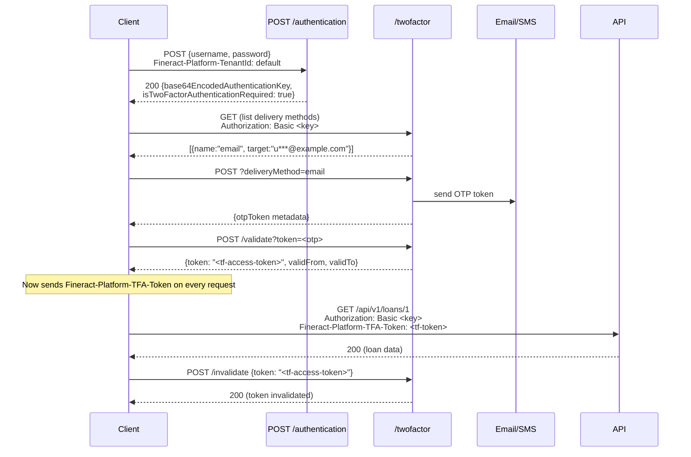

Two separate OAuth2 concerns exist in Fineract and it is important to distinguish them from the start. The first is Fineract acting as its own **Authorization Server** — issuing JWTs to clients that authenticate with username and password (`fineract.security.oauth2.enabled=true`). The second is Fineract acting as an **OAuth2 Resource Server** that accepts Bearer tokens issued by an **external Identity Provider** such as Keycloak, Azure AD, Okta, or Auth0 (`fineract.security.oidc-federation.enabled=true`). Two-Factor Authentication (2FA) is an orthogonal feature that layers an additional OTP verification step on top of either credential scheme.

## Built-in OAuth2 Authorization Server

`AuthorizationServerConfig`
(`fineract-provider/src/main/java/org/apache/fineract/infrastructure/security/config/AuthorizationServerConfig.java`)
is loaded when `fineract.security.oauth2.enabled=true`. It uses **Spring Authorization Server** to expose the standard OAuth2 endpoints and registers three ordered `SecurityFilterChain` beans:

| Order | Bean method | Scope |
|---|---|---|
| 1 | `publicEndpoints` | Swagger UI, actuator, legacy docs — no auth |
| 2 | `authorizationServerSecurityFilterChain` | `/oauth2/authorize`, `/oauth2/token`, etc. |
| 3 | `protectedEndpoints` | All `/api/**` routes — resource server with JWT validation |

```java
// AuthorizationServerConfig.java — @Order(3) protectedEndpoints
http
    .oauth2ResourceServer(resourceServer -> resourceServer
        .jwt(jwt -> jwt.jwtAuthenticationConverter(authenticationConverter())))
    .addFilterAfter(tenantAwareAuthenticationFilter(), SecurityContextHolderFilter.class)
    .formLogin(form -> form.loginPage("/login")
        .authenticationDetailsSource(tenantAuthDetailsSource()).permitAll())
    ...
```

The `formLogin` configuration supports the PKCE Authorization Code flow used in the integration test `OAuth2AuthenticationTest` (`oauth2-tests/src/test/java/org/apache/fineract/oauth2tests/OAuth2AuthenticationTest.java`), where a Selenium-driven browser visits `/oauth2/authorize`, submits credentials, and exchanges the authorization code at `/oauth2/token` for a Bearer JWT.

### Registered client configuration

OAuth2 clients are configured through `application.properties`:

```properties
fineract.security.oauth2.client.registrations.frontend-client.client-id=${FINERACT_SECURITY_OAUTH2_CLIENTS_FRONTEND_ID:frontend-client}
fineract.security.oauth2.client.registrations.frontend-client.scopes=${FINERACT_SECURITY_OAUTH2_CLIENTS_FRONTEND_SCOPES:read,write}
fineract.security.oauth2.client.registrations.frontend-client.authorization-grant-types=${FINERACT_SECURITY_OAUTH2_CLIENTS_FRONTEND_GRANTS:authorization_code,refresh_token}
fineract.security.oauth2.client.registrations.frontend-client.redirect-uris=${FINERACT_SECURITY_OAUTH2_CLIENTS_FRONTEND_REDIRECT:http://localhost:3000/callback}
fineract.security.oauth2.client.registrations.frontend-client.require-authorization-consent=${FINERACT_SECURITY_OAUTH2_CLIENTS_FRONTEND_CONSENT:false}
```

At startup, `AuthorizationServerConfig` iterates these registrations to build `RegisteredClient` objects stored in an `InMemoryRegisteredClientRepository`.

### Tenant ID in JWT tokens

A custom `OAuth2TokenCustomizer<JwtEncodingContext>` injects the tenant ID from the authentication details into every issued token. The downstream `TenantAwareAuthenticationFilter`
(`fineract-security/.../filter/TenantAwareAuthenticationFilter.java`)
reads this `tenant` claim to populate `ThreadLocalContextUtil` before any service code runs:

```java
// TenantAwareAuthenticationFilter.java
String token = resolver.resolve(request);
if (token != null) {
    var jwt = JWTParser.parse(token); // NOTE: not validated here — validation is downstream
    var claims = jwt.getJWTClaimsSet();
    tenantId = (String) claims.getClaim("tenant");
} else {
    tenantId = request.getParameter("tenantId");
}
ThreadLocalContextUtil.setTenant(tenantDetailsService.loadTenantById(tenantId, false));
```

<Warning>
The `TenantAwareAuthenticationFilter` parses the JWT **without signature verification** purely to extract the `tenant` claim early. Actual cryptographic validation happens inside the `oauth2ResourceServer` configuration. Never rely on this early parse for any security decision.
</Warning>

### JWT authentication converter (internal)

`FineractJwtAuthenticationTokenConverter` converts an internally-issued JWT into a `FineractJwtAuthenticationToken` by looking up the `AppUser` via `TenantAwareJpaPlatformUserDetailsService` using the `sub` claim as the username. The resulting `FineractJwtAuthenticationToken` extends `JwtAuthenticationToken` and overrides `getPrincipal()` to return the `AppUser` directly, keeping all downstream `PlatformSecurityContext.authenticatedUser()` calls consistent regardless of whether the request was authenticated via Basic Auth or Bearer JWT.

## OIDC Federation Resource Server

When `fineract.security.oidc-federation.enabled=true`, `OidcFederationSecurityConfig`
(`fineract-provider/.../security/config/OidcFederationSecurityConfig.java`)
activates at `@Order(100)` — after the built-in Authorization Server chains. It configures an `oauth2ResourceServer` backed by `DynamicJwtIssuerAuthenticationManagerResolver`, which selects the correct JWT decoder at request time based on the `iss` claim.

### Multi-issuer dynamic resolver

`DynamicJwtIssuerAuthenticationManagerResolver`
(`fineract-provider/.../security/config/DynamicJwtIssuerAuthenticationManagerResolver.java`)
maintains an in-memory `ConcurrentHashMap<String, AuthenticationManager>` keyed by `issuerUri`. The lookup priority is:

1. `m_tenant_oidc_config` master-DB table — highest priority, supports runtime reconfiguration
2. `fineract.security.oidc-federation.issuers[]` YAML list — dev/CI fallback

```java
// DynamicJwtIssuerAuthenticationManagerResolver.java
private AuthenticationManager buildAuthenticationManager(String issuerUri) {
    Optional<TenantOidcConfig> dbConfig = tenantOidcConfigService.findByIssuerUri(issuerUri);
    if (dbConfig.isPresent()) {
        return buildFromDbConfig(dbConfig.get());
    }
    // YAML fallback
    Optional<OidcIssuerProperties> yamlMatch = yamlIssuers.stream()
        .filter(i -> issuerUri.equals(i.getIssuerUri())).findFirst();
    if (yamlMatch.isPresent()) {
        return buildFromYamlIssuer(yamlMatch.get());
    }
    throw new OAuth2AuthenticationException(
        new OAuth2Error("unknown_issuer", "No OIDC configuration found for issuer: " + issuerUri, null));
}
```

The `NimbusJwtDecoder` is built using either an explicit `jwks-uri` (preferred) or `issuerLocation`-based OIDC discovery. Call `evictFromCache(issuerUri)` after updating a DB record to force the next request to rebuild the decoder.

### Tenant resolution (OIDC)

`OidcTenantAwareFilter`
(`fineract-security/.../filter/OidcTenantAwareFilter.java`)
runs before the JWT is validated and uses a five-level priority chain to determine the tenant:

```mermaid
flowchart TD
    Start([Request with Bearer JWT]) --> ParseJWT[Parse JWT without<br/>signature validation]
    ParseJWT --> IssuerDB{iss in<br/>m_tenant_oidc_config?}
    IssuerDB -- Yes --> SetTenant([setTenant from DB record])
    IssuerDB -- No --> IssuerYAML{iss in<br/>issuers[] YAML?}
    IssuerYAML -- Yes --> SetTenant
    IssuerYAML -- No --> ClaimCheck{tenant-claim-name<br/>present in JWT?}
    ClaimCheck -- Yes --> SetTenant
    ClaimCheck -- No --> Header{Fineract-Platform-TenantId<br/>header present?}
    Header -- Yes --> SetTenant
    Header -- No --> Param{tenantIdentifier<br/>query param?}
    Param -- Yes --> SetTenant
    Param -- No --> NoTenant["No tenant context set — request continues (auth will fail)"]
    SetTenant --> ValidateJWT[Spring validates JWT<br/>signature + claims]
    ValidateJWT --> Convert[FineractOidcJwtAuthenticationConverter<br/>resolves AppUser]
    Convert --> SC([SecurityContext populated])
```

Paths that are excluded from the filter (`shouldNotFilter`): `/swagger-ui/**`, `/actuator/**`, `/login`, `/error`.

### JWT authentication converter (external IdP)

`FineractOidcJwtAuthenticationConverter`
(`fineract-security/.../converter/FineractOidcJwtAuthenticationConverter.java`)
converts an external IdP JWT into a `FineractJwtAuthenticationToken`:

```java
// FineractOidcJwtAuthenticationConverter.java
public FineractJwtAuthenticationToken convert(@NonNull Jwt jwt) {
    String username = oidcUserService.extractUsername(jwt);
    AppUser appUser = oidcUserService.resolveUser(jwt, username);
    return new FineractJwtAuthenticationToken(jwt, appUser.getAuthorities(), appUser);
}
```

`FineractOidcUserService.extractUsername()` reads the claim configured by `fineract.security.oidc-federation.username-claim` (default `preferred_username`), falling back to the `sub` claim.
`resolveUser()` delegates to `OidcAppUserResolutionService.resolveOrCreate()`, which either finds an existing `AppUser` by username or — if `auto-create-user=true` — creates a new one with the default roles specified by `fineract.security.oidc-federation.default-roles`.

### Configuring an external IdP (Keycloak / Azure AD / Auth0)

**Option A — static YAML (single realm or dev environments):**

```yaml
fineract:
  security:
    oidc-federation:
      enabled: true
      username-claim: preferred_username
      tenant-claim-name: fineract_tenant
      auto-create-user: false
      issuers:
        - issuer-uri: https://keycloak.example.com/realms/myrealm
          tenant-id: default
          jwks-uri: https://keycloak.example.com/realms/myrealm/protocol/openid-connect/certs
```

**Option B — database-driven (multi-tenant, runtime reconfiguration):**

Insert a row into `m_tenant_oidc_config` on the **master** database:

```sql
INSERT INTO m_tenant_oidc_config
    (tenant_id, issuer_uri, jwks_uri, client_id, client_secret)
VALUES
    ('acme', 'https://login.microsoftonline.com/TENANT_ID/v2.0',
     'https://login.microsoftonline.com/TENANT_ID/discovery/v2.0/keys',
     'my-app-client-id', '<encrypted-secret>');
```

After inserting, call `DynamicJwtIssuerAuthenticationManagerResolver.evictFromCache(issuerUri)` or restart the server to pick up the new configuration.

| Provider | `issuer-uri` pattern | Notes |
|---|---|---|
| Keycloak | `https://<host>/realms/<realm>` | JWKS discovered via `/.well-known/openid-configuration` |
| Azure AD | `https://login.microsoftonline.com/<tenantId>/v2.0` | JWKS at `…/discovery/v2.0/keys` |
| Auth0 | `https://<domain>/` | JWKS at `<domain>/.well-known/jwks.json` |
| Okta | `https://<org>.okta.com/oauth2/default` | JWKS at `<issuer>/v1/keys` |

## Two-Factor Authentication (2FA)

2FA is activated by `fineract.security.2fa.enabled=true`. When active, `SecurityConfig` appends an extra `hasAuthority("TWOFACTOR_AUTHENTICATED")` requirement to the catch-all `/api/**` matcher, and both `SecurityConfig` and `AuthorizationServerConfig` register `TwoFactorAuthenticationFilter` in the chain.

### TwoFactorAuthenticationFilter

`TwoFactorAuthenticationFilter`
(`fineract-security/.../filter/TwoFactorAuthenticationFilter.java`)
runs after the primary authentication filter and inspects the `Fineract-Platform-TFA-Token` request header:

```java
// TwoFactorAuthenticationFilter.java
if (!user.hasSpecificPermissionTo(TwoFactorConstants.BYPASS_TWO_FACTOR_PERMISSION)) {
    String token = request.getHeader("Fineract-Platform-TFA-Token");
    if (token != null) {
        TFAccessToken accessToken = twoFactorService.fetchAccessTokenForUser(user, token);
        if (accessToken == null || !accessToken.isValid()) {
            response.sendError(HttpServletResponse.SC_UNAUTHORIZED,
                "Invalid two-factor access token provided");
            return;
        }
    } else {
        chain.doFilter(req, res); // no token → let request through to auth check
        return;
    }
}
// Grant TWOFACTOR_AUTHENTICATED authority
List<GrantedAuthority> updatedAuthorities = new ArrayList<>(authentication.getAuthorities());
updatedAuthorities.add(new SimpleGrantedAuthority("TWOFACTOR_AUTHENTICATED"));
context.setAuthentication(createUpdatedAuthentication(authentication, updatedAuthorities));
```

Users holding the `BYPASS_TWOFACTOR` permission (constant `TwoFactorConstants.BYPASS_TWO_FACTOR_PERMISSION`) always receive the `TWOFACTOR_AUTHENTICATED` authority without needing to present a token. This is used to whitelist service accounts and administrative users.

The filter handles both `UsernamePasswordAuthenticationToken` (Basic Auth) and `FineractJwtAuthenticationToken` (OAuth2) by creating an updated token of the same type in `createUpdatedAuthentication()`.

### TFAccessToken domain object

`TFAccessToken` (`fineract-security/.../domain/TFAccessToken.java`) is persisted in `twofactor_access_token` with a unique constraint on `(token, appuser_id)`:

```java
@Entity
@Table(name = "twofactor_access_token",
    uniqueConstraints = @UniqueConstraint(columnNames = { "token", "appuser_id" }))
public class TFAccessToken extends AbstractPersistableCustom<Long> {

    @Column(name = "token", nullable = false, length = 32)
    private String token;

    @Column(name = "valid_from", nullable = false)
    private LocalDateTime validFrom;

    @Column(name = "valid_to", nullable = false)
    private LocalDateTime validTo;

    @Column(name = "enabled", nullable = false)
    private boolean enabled;

    public boolean isValid() {
        return this.enabled
            && !DateUtils.isAfterTenantDateTime(getValidFrom())
            && DateUtils.isAfterTenantDateTime(getValidTo());
    }
}
```

Token lifetime is controlled by `TwoFactorConfigurationService.getAccessTokenLiveTime()` and `getAccessTokenExtendedLiveTime()`, which read from the `c_configuration` table at runtime.

### 2FA REST flow

The `TwoFactorApiResource` (`fineract-security/.../api/TwoFactorApiResource.java`) is active only when `fineract.security.2fa.enabled=true` and exposes four endpoints under `/api/v1/twofactor`:



OTP delivery is configured via `TwoFactorConfigurationService`:
- **Email** — `TwoFactorConstants.EMAIL_DELIVERY_METHOD_NAME = "email"` — sends via the configured SMTP server
- **SMS** — `TwoFactorConstants.SMS_DELIVERY_METHOD_NAME = "sms"` — sends via the configured SMS provider ID

OTP token length and TTL are configurable at runtime through `PUT /api/v1/twofactor/configure` (requires `TWOFACTOR_AUTHENTICATED` authority), as demonstrated in `TwoFactorAuthenticationTest.testTfaConfigSettings()`.

## CORS configuration

CORS is controlled by the `FineractProperties.CorsProperties` group and is applied to all active filter chains when `fineract.security.cors.enabled=true`:

```properties
fineract.security.cors.enabled=${FINERACT_SECURITY_CORS_ENABLED:true}
fineract.security.cors.allowed-origin-patterns=${FINERACT_SECURITY_CORS_ALLOWED_ORIGIN_PATTERNS:*}
fineract.security.cors.allowed-methods=${FINERACT_SECURITY_CORS_ALLOWED_METHODS:*}
fineract.security.cors.allowed-headers=${FINERACT_SECURITY_CORS_ALLOWED_HEADERS:*}
fineract.security.cors.exposed-headers=${FINERACT_SECURITY_CORS_EXPOSED_HEADERS:*}
fineract.security.cors.allow-credentials=${FINERACT_SECURITY_CORS_ALLOW_CREDENTIALS:true}
```

`SecurityConfig`, `AuthorizationServerConfig`, and `OidcFederationSecurityConfig` all guard their `http.cors(Customizer.withDefaults())` call behind `fineractProperties.getSecurity().getCors().isEnabled()`. The Spring `CorsConfigurationSource` bean that backs `withDefaults()` must be provided separately — typically in a `@Bean CorsConfigurationSource` method that reads from the same `FineractProperties`.

<Warning>
The default `allowed-origin-patterns=*` combined with `allow-credentials=true` is the CORS misconfiguration that browsers will reject (the two cannot be used together). In any non-local deployment, set `allowed-origin-patterns` to your actual frontend origin(s) before enabling credentials.
</Warning>

## HSTS configuration

HTTP Strict Transport Security is enabled by `fineract.security.hsts.enabled=true`. When active, `SecurityConfig` adds both `redirectToHttps` and HSTS headers:

```java
// SecurityConfig.java
if (fineractProperties.getSecurity().getHsts().isEnabled()) {
    http.redirectToHttps(Customizer.withDefaults())
        .headers(headers -> headers.httpStrictTransportSecurity(
            hsts -> hsts.includeSubDomains(true).maxAgeInSeconds(31536000)));
}
```

The `max-age` is hardcoded to one year (`31536000` seconds) with `includeSubDomains`. This setting only makes sense behind TLS — ensure `server.ssl.enabled=true` in `application.properties` or at the reverse-proxy level.

## Full security properties reference

```properties
# Core mode switches
fineract.security.basicauth.enabled=true          # default
fineract.security.oauth2.enabled=false            # built-in Authorization Server
fineract.security.oidc-federation.enabled=false   # external IdP resource server
fineract.security.2fa.enabled=false               # two-factor OTP requirement
fineract.security.hsts.enabled=false              # HSTS + HTTPS redirect

# CORS
fineract.security.cors.enabled=true
fineract.security.cors.allowed-origin-patterns=https://app.example.com
fineract.security.cors.allowed-methods=GET,POST,PUT,DELETE,OPTIONS
fineract.security.cors.allowed-headers=*
fineract.security.cors.exposed-headers=X-Notification-Refresh
fineract.security.cors.allow-credentials=true

# OIDC Federation
fineract.security.oidc-federation.enabled=false
fineract.security.oidc-federation.tenant-claim-name=fineract_tenant
fineract.security.oidc-federation.username-claim=preferred_username
fineract.security.oidc-federation.auto-create-user=false
fineract.security.oidc-federation.default-roles=
fineract.security.oidc-federation.provider=generic   # keycloak|azure_ad|okta|auth0|generic
fineract.security.oidc-federation.post-logout-redirect-uri=

# OAuth2 client registration (built-in Authorization Server)
fineract.security.oauth2.client.registrations.frontend-client.client-id=frontend-client
fineract.security.oauth2.client.registrations.frontend-client.scopes=read,write
fineract.security.oauth2.client.registrations.frontend-client.authorization-grant-types=authorization_code,refresh_token
fineract.security.oauth2.client.registrations.frontend-client.redirect-uris=http://localhost:3000/callback
fineract.security.oauth2.client.registrations.frontend-client.require-authorization-consent=false
```

## Related pages

- [Authentication](/security/authentication) — filter chain setup, Basic Auth, tenant resolution
- [Authorization](/security/authorization) — `AppUser`, `Role`, `Permission`, `TWOFACTOR_AUTHENTICATED` authority
- [Multi-Tenancy](/core/multi-tenancy) — `ThreadLocalContextUtil` and per-tenant `DataSource` routing
